> - [x] 题目1： [bfs的两种方法](https://leetcode.cn/problems/binary-tree-level-order-traversal/)
> - [x] 题目2： [锯齿状遍历](https://leetcode.cn/problems/binary-tree-zigzag-level-order-traversal/)
> - [ ] 题目3： [最大特殊宽度](https://leetcode.cn/problems/maximum-width-of-binary-tree/)
> - [ ] 题目4.1： [最大深度](https://leetcode.cn/problems/maximum-depth-of-binary-tree/description/)
> - [ ] 题目4.2：[最小深度](https://leetcode.cn/problems/minimum-depth-of-binary-tree/)
> - [x] 题目5： [先序遍历序列化和反序列化](https://leetcode.cn/problems/serialize-and-deserialize-binary-tree/)
> - [x] 题目6： [层序遍历序列化和反序列化](https://leetcode.cn/problems/serialize-and-deserialize-binary-tree/)
> - [x] 题目7： [先序遍历和中序遍历还原二叉树](https://leetcode.cn/problems/construct-binary-tree-from-preorder-and-inorder-traversal/)
> - [x] 题目8： [判断完全二叉树](https://leetcode.cn/problems/check-completeness-of-a-binary-tree/)
> - [x] 题目9： [求完全二叉树节点个数](https://leetcode.cn/problems/count-complete-tree-nodes/)
> - [ ] 题目10: [普通二叉树上求解LCA](https://leetcode.cn/problems/lowest-common-ancestor-of-a-binary-tree/description/)
> - [ ] 题目11：[搜索二叉树上求解LCA](https://leetcode.cn/problems/lowest-common-ancestor-of-a-binary-search-tree/description/)
> - [ ] 题目12：[收集累加和为`k`的所有路径](https://leetcode.cn/problems/path-sum-ii/)
> - [ ] 题目13：[判断平衡二叉树](https://leetcode.cn/problems/balanced-binary-tree/)
> - [ ] 题目14：[判断搜索二叉树](https://leetcode.cn/problems/validate-binary-search-tree/)
> - [ ] 题目15：[修剪搜索二叉树](https://leetcode.cn/problems/trim-a-binary-search-tree/description/)
> - [ ] 题目16：[二叉树上的打家劫舍问题](https://leetcode.cn/problems/house-robber-iii/description/)

-----

### 二叉树的层序遍历

> 题目1： [bfs的两种方法](https://leetcode.cn/problems/binary-tree-level-order-traversal/)

主要介绍使用`队列`一次遍历一层的解法

| 算法图解                                                     | 解释                                                         |
| ------------------------------------------------------------ | ------------------------------------------------------------ |
|  | 从根节点开始遍历<br />创建一个和节点个数一样多的队列         |
| <br /><br /><br /> | 首先将根节点加入队列，同时记录队列的长度<br />执行`n`次如下操作，n为上一步记录的长度<br />1. 弹出队尾元素，加入这一层的答案数组中<br />2. 有左孩子则把左孩子加入队列<br />3.有右孩子则把右孩子加入队列 |
|  |                                                              |

<div style="top: 10px; left: 10px; max-width: 80%; background: #f8f9fa; border-left: 4px solid #e67e22; border-radius: 4px; font-family: Arial, sans-serif; box-shadow: 0 2px 4px rgba(0,0,0,0.1); display: inline-block;">
  <div style="padding: 8px 12px; font-weight: bold; color: #e67e22; white-space: nowrap;">提示</div>
  <div style="padding: 8px 12px; padding-top: 0; color: #333;">
    <p style="margin: 0;">对于算法竞赛或者面试一般不是用库自带的队列，而是用数组模拟队列，具体看[入门]阶段的课程。</p>
  </div>
</div>

### 锯齿形层序遍历

<div style="top: 10px; left: 10px; max-width: 80%; background: #f8f9fa; border-left: 4px solidrgb(57, 130, 179); border-radius: 4px; font-family: Arial, sans-serif; box-shadow: 0 2px 4px rgba(0,0,0,0.1); display: inline-block;">
  <div style="padding: 8px 12px; font-weight: bold; color: #3498db; white-space: nowrap;">测试链接</div>
  <div style="padding: 8px 12px; padding-top: 0; color: #333;">
      <a href="https://leetcode.cn/problems/binary-tree-zigzag-level-order-traversal/description/">leetcode 103.二叉树的锯齿形层序遍历</a>
  </div>
</div>
<br>

<div style=" top: 10px; left: 10px; max-width: 80%; background: #f8f9fa; border-left: 4px solid #e67e22; border-radius: 4px; font-family: Arial, sans-serif; box-shadow: 0 2px 4px rgba(0,0,0,0.1); display: inline-block;">
  <div style="padding: 8px 12px; font-weight: bold; color: #e67e22; white-space: nowrap;">提示</div>
  <div style="padding: 8px 12px; padding-top: 0; color: #333;">
    <p style="margin: 0;">这道题和上一道题思路上一致，只是需要注意每轮左右子树的加入顺序要交替</p>
  </div>
</div>

方法一：完全按照上题的做法，只是在读入答案的时候判断一下是从左往右的读还是从右往左读，如果是从右往左读，就反转一下`list`数组，其他什么都不需要改

```cpp
// false 表示 从左 往右读入
// true 表示 从右往左读入
bool flag = false; 
......;
if (flag) reserve(list.begin(), list.end());
flag = !flag;
ans.push_back(list);
```

方法二：先收集list再把左右节点加入队列

```cpp
// reverse == false, 左 -> 右， l....r-1, 收集size个
// reverse == true,  右 -> 左， r-1....l, 收集size个
// 左 -> 右, i = i + 1
// 右 -> 左, i = i - 1
for (int i = reverse ? r - 1 : l, j = reverse ? -1 : 1, k = 0; k < size; i += j, k++) {
    list.push_back(q[i]->val);
}
// 加入左右节点
```

----

### 最大特殊宽度

----

### 前序遍历的序列化和反序列化

<div style="top: 10px; left: 10px; max-width: 80%; background: #f8f9fa; border-left: 4px solid rgb(57, 130, 179); border-radius: 4px; font-family: Arial, sans-serif; box-shadow: 0 2px 4px rgba(0,0,0,0.1); display: inline-block;">
  <div style="padding: 8px 12px; font-weight: bold; color: #3498db; white-space: nowrap;">测试链接</div>
  <div style="padding: 8px 12px; padding-top: 0; color: #333;">
      <a href="https://leetcode.cn/problems/serialize-and-deserialize-binary-tree/description/">leetcode297.二叉树的序列化和反序列化</a>
      <br>
      <br>
      <p>
          序列化是将一个数据结构或者对象转换为连续的比特位的操作，进而可以将转换后的数据存储在一个文件或者内存中，同时也可以通过网络传输到另一个计算机环境，采取相反方式重构得到原数据。
   		<br><br>
          二叉树的前序和后序都可以完成序列化但中序并不能唯一确定！
      </p>
  </div>
</div>

操作倒是简单这道题感觉不是算法题是`coding`能力测试题

- 对该二叉树进行一次先序遍历
- 对于非空节点`x`记录其为字符串`x,` 
- 对于空节点记录为`#,` 
- 注意某一节点若其左右子树为空也需要记录为`#,` 

| 算法图解                                                     | 解释                                                         |
| ------------------------------------------------------------ | ------------------------------------------------------------ |
| 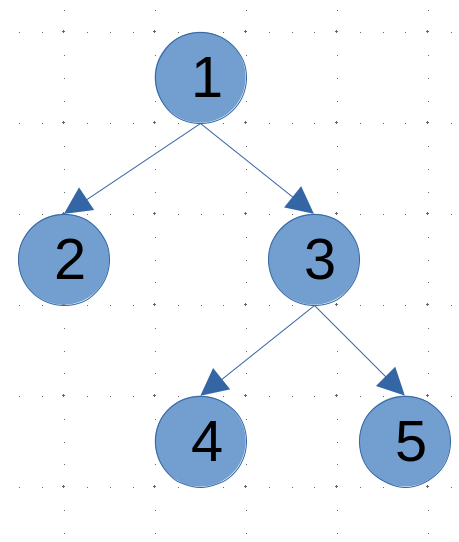 |                                                              |
| 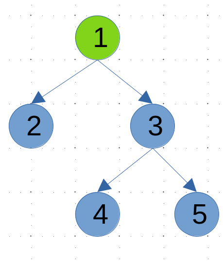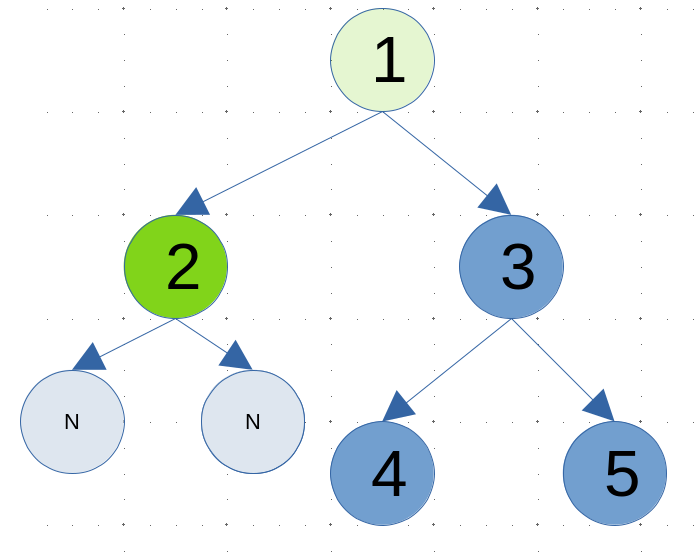 | 记录`1`为 `1, `<br /><br />记录`2`为`2,`同时记录其子结点为`#, #,` |
|                                                              | 其余节点同理处理即可<br />最终字符串为`1,2,#,#,3,4,#,#,5,#,#`<br />反序列化就比较简单了遍历上述字符串即可 |

<div style="top: 10px; left: 10px; max-width: 80%; background: #f8f9fa; border-left: 4px solid #e67e22; border-radius: 4px; font-family: Arial, sans-serif; box-shadow: 0 2px 4px rgba(0,0,0,0.1); display: inline-block;">
  <div style="padding: 8px 12px; font-weight: bold; color: #e74c3c;">技巧</div>
  <div style="padding: 8px 12px; padding-top: 0; color: #333;">可以使用 istringstream类型把字符串转化为流输出，进而可以用>>直接过滤空格</div>
</div>

```cpp
// 感觉这道题考语法？
class Codec {
public:
    // Encodes a tree to a single string.
    string serialize(TreeNode* root) {
        if (!root) return "# ";
        return to_string(root->val) + " " + serialize(root->left) + serialize(root->right);
    }

    // Decodes your encoded data to tree.
    TreeNode* deserialize(string data) {
        istringstream iss(data); // 使用字符串流简化解析
        return buildTree(iss);
    }

private:
    TreeNode* buildTree(istringstream &iss) {
        string val;
        iss >> val; // 自动跳过空格
        if (val == "#") return nullptr;
        TreeNode* node = new TreeNode(stoi(val)); // 处理多位数
        node->left = buildTree(iss);
        node->right = buildTree(iss);
        return node;
    }
};
```

----

### 层序遍历的序列化和反序列化

<div style="top: 10px; left: 10px; max-width: 80%; background: #f8f9fa; border-left: 4px solid rgb(57, 130, 179); border-radius: 4px; font-family: Arial, sans-serif; box-shadow: 0 2px 4px rgba(0,0,0,0.1); display: inline-block;">
  <div style="padding: 8px 12px; font-weight: bold; color: #3498db; white-space: nowrap;">测试链接</div>
  <div style="padding: 8px 12px; padding-top: 0; color: #333;">
      <a href="https://leetcode.cn/problems/serialize-and-deserialize-binary-tree/description/">leetcode297.二叉树的序列化和反序列化</a>
  </div>
</div>

-----

### 通过先序遍历和中序遍历复原二叉树 

<div style="top: 10px; left: 10px; max-width: 80%; background: #f8f9fa; border-left: 4px solid rgb(57, 130, 179); border-radius: 4px; font-family: Arial, sans-serif; box-shadow: 0 2px 4px rgba(0,0,0,0.1); display: inline-block;">
  <div style="padding: 8px 12px; font-weight: bold; color: #3498db; white-space: nowrap;">测试链接</div>
  <div style="padding: 8px 12px; padding-top: 0; color: #333;">
      <a href="https://leetcode.cn/problems/construct-binary-tree-from-preorder-and-inorder-traversal/">leetcode105.从前序遍历与中序遍历构造二叉树</a>
  </div>
</div>

这个题的知识点倒是考研经常会考的:joy: 

关键思路

- 通过`前序遍历`确定根节点
- 通过`中序遍历`确定左右子树
- 递归这个过程就能还原出原二叉树

这道题的关键是理解这个边界图

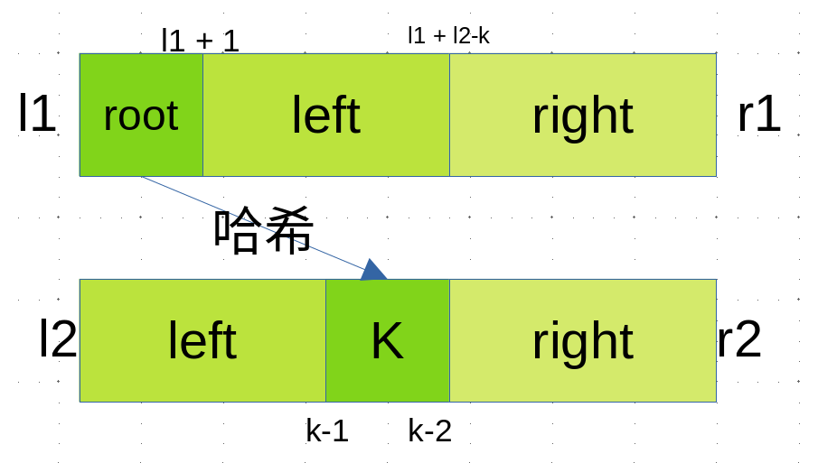

<div style="top: 10px; left: 10px; max-width: 80%; background: #f8f9fa; border-left: 4px solid rgb(10, 243, 37); border-radius: 4px; font-family: Arial, sans-serif; box-shadow: 0 2px 4px rgba(0,0,0,0.1); display: inline-block;">
  <div style="padding: 8px 12px; font-weight: bold; color:rgb(85, 219, 52); white-space: nowrap;">额外</div>
  <div style="padding: 8px 12px; padding-top: 0; color: #333;">
      <p>
          还有两个类似的题目，但要注意如果单纯通过前序和后序是无法唯一还原二叉树的！
      </p>
      <a href="https://leetcode.cn/problems/construct-binary-tree-from-preorder-and-inorder-traversal/">leetcode106.从中序遍历和后序遍历构造二叉树</a>
      <br>
     <a href="https://leetcode.cn/problems/construct-binary-tree-from-preorder-and-postorder-traversal/description/">leetcode889.根据前序遍历和后序遍历复原二叉树</a>
  </div>
</div>

| 算法图解                                                     | 解释                                                         |
| ------------------------------------------------------------ | ------------------------------------------------------------ |
| 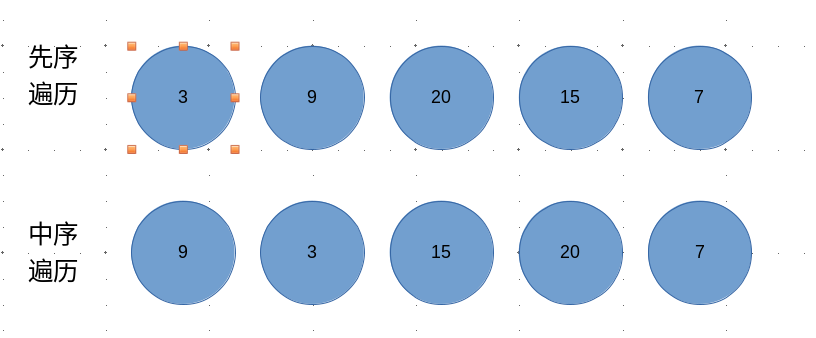 | 先序:`3 9 20 15 7`<br />中序:`9 3 15 20 7`                   |
| 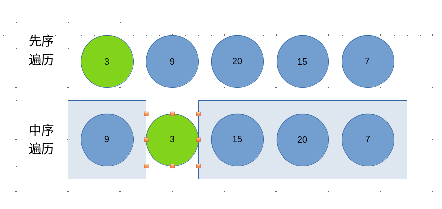 | 首先通过先序遍历找到整颗树的根`3`<br />同时在中序中找到对应的节点<br />其左边就是左子树`9`<br />右边就是右子树 `15 20 7` |
| 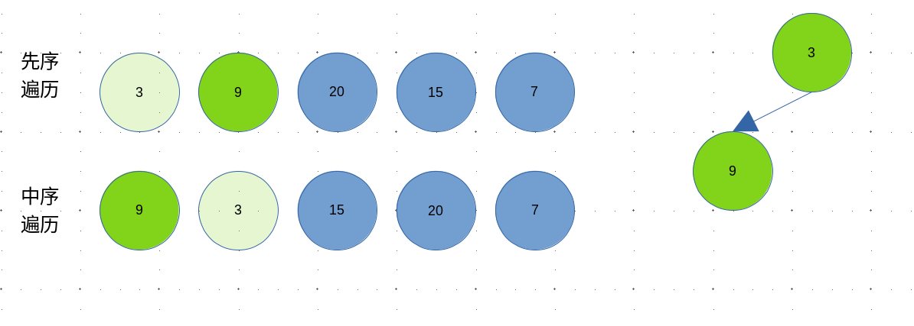<br />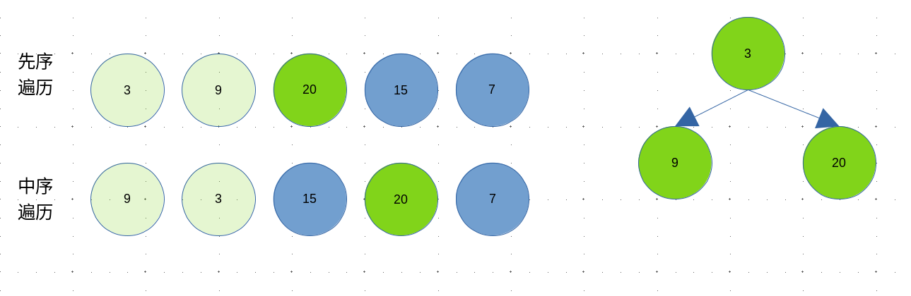<br />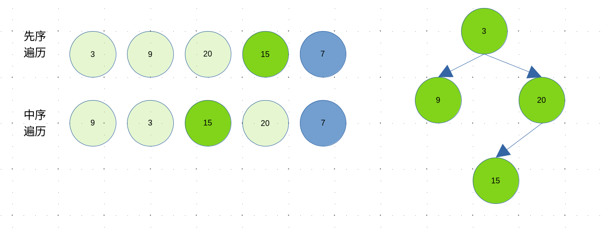<br />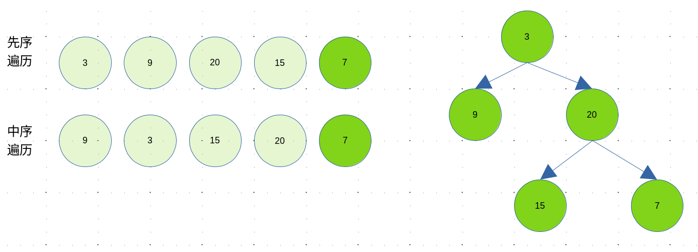 | 然后递归处理左右子树                                         |

<div style="top: 10px; left: 10px; max-width: 80%; background: #f8f9fa; border-left: 4px solid #e67e22; border-radius: 4px; font-family: Arial, sans-serif; box-shadow: 0 2px 4px rgba(0,0,0,0.1); display: inline-block;">
  <div style="padding: 8px 12px; font-weight: bold; color: #e74c3c;">技巧</div>
  <div style="padding: 8px 12px; padding-top: 0; color: #333;">这里找对应节点的时候可以用哈希表</div>
</div>


----

### 判断完全二叉树

<div style="top: 10px; left: 10px; max-width: 80%; background: #f8f9fa; border-left: 4px solid rgb(57, 130, 179); border-radius: 4px; font-family: Arial, sans-serif; box-shadow: 0 2px 4px rgba(0,0,0,0.1); display: inline-block;">
  <div style="padding: 8px 12px; font-weight: bold; color: #3498db; white-space: nowrap;">测试链接</div>
  <div style="padding: 8px 12px; padding-top: 0; color: #333;">
      <a href="https://leetcode.cn/problems/check-completeness-of-a-binary-tree/description/">leetcode958.二叉树完全性的验证</a>
  </div>
</div>

**算法步骤**

- 使用`层序遍历`

- 如果一个节点左右子树齐全，则无需处理遍历下一个即可
- 如果一个节点有右子树，而左子树缺失则直接返回`false`
- 如果一个节点缺少右孩子，则记录之，遍历之后的节点
- 如果之后遍历的节点不全为叶子节点，则返回`false`
- 否则 返回`true`

----

###  完全二叉树的节点个数

<div style="top: 10px; left: 10px; max-width: 80%; background: #f8f9fa; border-left: 4px solidrgb(57, 130, 179); border-radius: 4px; font-family: Arial, sans-serif; box-shadow: 0 2px 4px rgba(0,0,0,0.1); display: inline-block;">
  <div style="padding: 8px 12px; font-weight: bold; color: #3498db; white-space: nowrap;">测试链接</div>
  <div style="padding: 8px 12px; padding-top: 0; color: #333;">
      <a href="https://leetcode.cn/problems/count-complete-tree-nodes/description/">leetcode222.完全二叉树的节点个数</a>
  </div>
</div>

 如果不考虑任何特性，遍历一边二叉树经过O(N) 的时间就能获得答案，所以这道题的难度为`Easy`。但人肯定还是得有点追求的啦，如何在`< O(N)`的时间内获得节点数目呢？

考虑完全二叉树的特性

- 一个完全二叉树，必然是由一个`满二叉子树`和一个`完全二叉子树`或`满二叉子树`构成

具体算法图解如下

| 算法图解                                                     |                                                              |
| ------------------------------------------------------------ | ------------------------------------------------------------ |
| 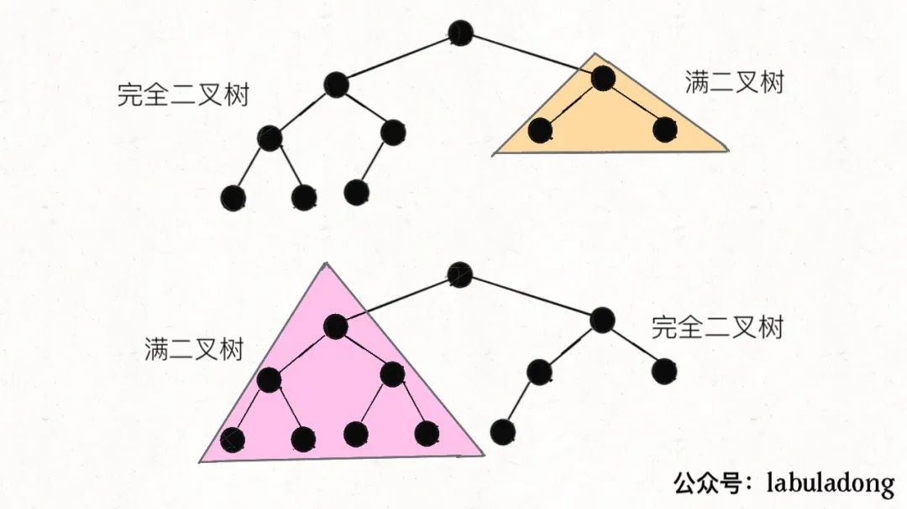 | 对于当前节点，检查其右子树的最左节点是否能到达整棵树的最底层 如果可以，说明左子树是满二叉树，直接计算左子树节点数(`2^(h-level)`)，然后递归处理右子树 如果不可以，说明右子树是满二叉树(但少一层)，直接计算右子树节点数(`2^(h-level-1)`)，然后递归处理左子树 |

由于是递归算法还是比较抽象的！
