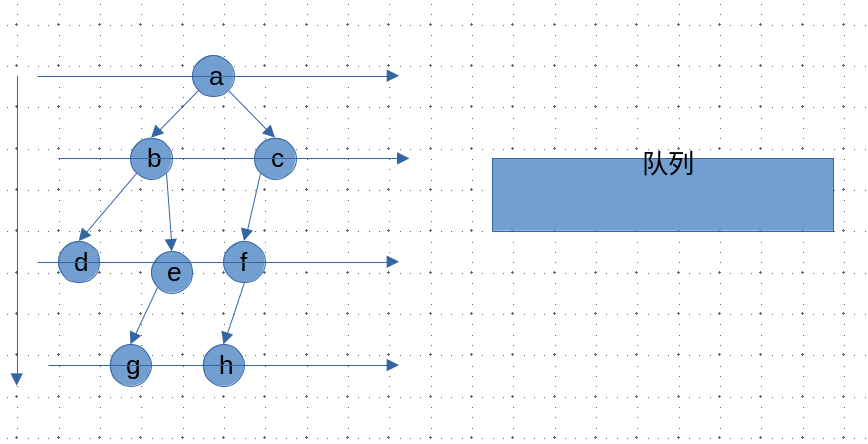
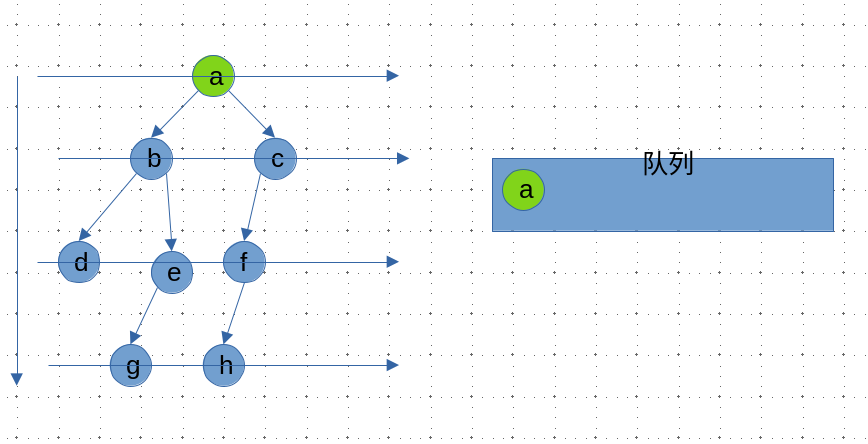
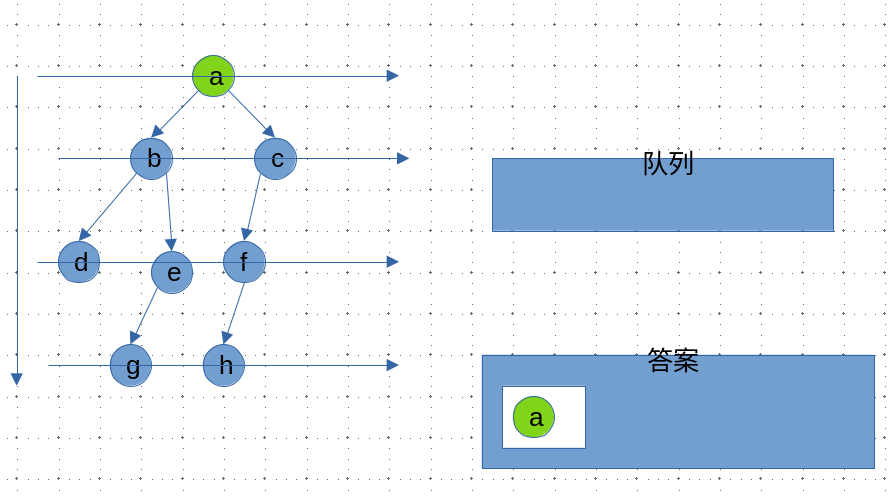
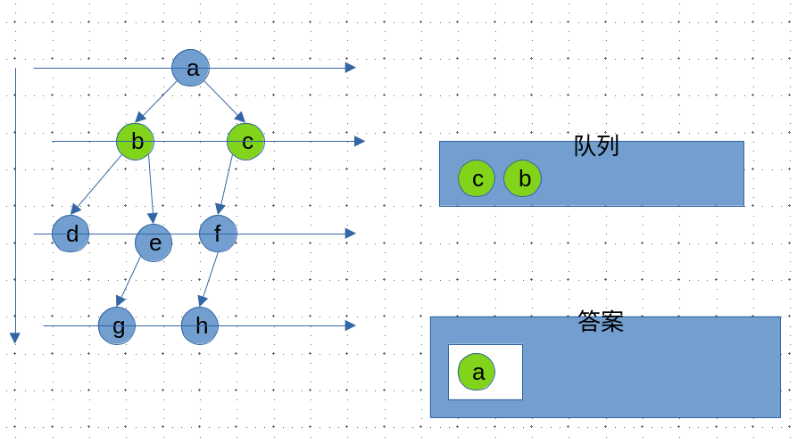
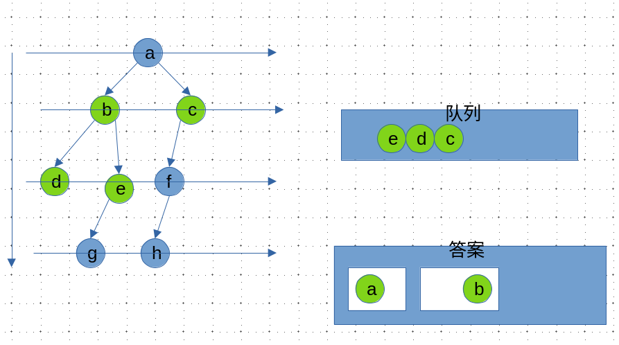
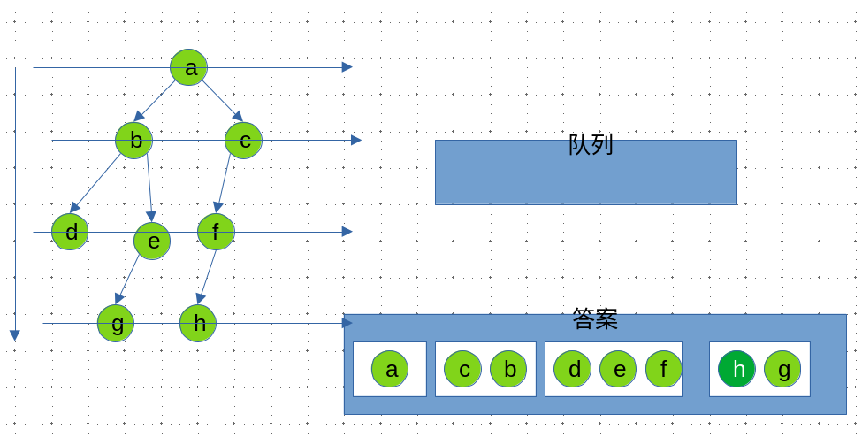

> - [x] 题目1： [bfs的两种方法](https://leetcode.cn/problems/binary-tree-level-order-traversal/)
> - [x] 题目2： [锯齿状遍历](https://leetcode.cn/problems/binary-tree-zigzag-level-order-traversal/)
> - [ ] 题目3： [最大特殊宽度](https://leetcode.cn/problems/maximum-width-of-binary-tree/)
> - [ ] 题目4.1： [最大深度](https://leetcode.cn/problems/maximum-depth-of-binary-tree/description/)
> - [ ] 题目4.2:[最小深度](https://leetcode.cn/problems/minimum-depth-of-binary-tree/)
> - [ ] 题目5： [先序遍历序列化和反序列化](https://leetcode.cn/problems/serialize-and-deserialize-binary-tree/)
> - [ ] 题目6： [层序遍历序列化和反序列化](https://leetcode.cn/problems/serialize-and-deserialize-binary-tree/)
> - [ ] 题目7： [先序遍历和中序遍历还原二叉树](https://leetcode.cn/problems/construct-binary-tree-from-preorder-and-inorder-traversal/)
> - [ ] 题目8： [判断完全二叉树](https://leetcode.cn/problems/check-completeness-of-a-binary-tree/)
> - [ ] 题目9： [求完全二叉树节点个数](https://leetcode.cn/problems/count-complete-tree-nodes/)
> - [ ] 题目10: [普通二叉树上求解LCA](https://leetcode.cn/problems/lowest-common-ancestor-of-a-binary-tree/description/)
> - [ ] 题目11：[搜索二叉树上求解LCA](https://leetcode.cn/problems/lowest-common-ancestor-of-a-binary-search-tree/description/)
> - [ ] 题目12：[收集累加和为`k`的所有路径](https://leetcode.cn/problems/path-sum-ii/)
> - [ ] 题目13：[判断平衡二叉树](https://leetcode.cn/problems/balanced-binary-tree/)
> - [ ] 题目14：[判断搜索二叉树](https://leetcode.cn/problems/validate-binary-search-tree/)
> - [ ] 题目15：[修剪搜索二叉树](https://leetcode.cn/problems/trim-a-binary-search-tree/description/)
> - [ ] 题目16：[二叉树上的打家劫舍问题](https://leetcode.cn/problems/house-robber-iii/description/)

-----

### 二叉树的层序遍历

> 题目1： [bfs的两种方法](https://leetcode.cn/problems/binary-tree-level-order-traversal/)

主要介绍使用`队列`一次遍历一层的解法

| 算法图解                                                     | 解释                                                         |
| ------------------------------------------------------------ | ------------------------------------------------------------ |
|  | 从根节点开始遍历<br />创建一个和节点个数一样多的队列         |
| <br /><br /><br /> | 首先将根节点加入队列，同时记录队列的长度<br />执行`n`次如下操作，n为上一步记录的长度<br />1. 弹出队尾元素，加入这一层的答案数组中<br />2. 有左孩子则把左孩子加入队列<br />3.有右孩子则把右孩子加入队列 |
|  |                                                              |

<div style="top: 10px; left: 10px; max-width: 80%; background: #f8f9fa; border-left: 4px solid #e67e22; border-radius: 4px; font-family: Arial, sans-serif; box-shadow: 0 2px 4px rgba(0,0,0,0.1); display: inline-block;">
  <div style="padding: 8px 12px; font-weight: bold; color: #e67e22; white-space: nowrap;">提示</div>
  <div style="padding: 8px 12px; padding-top: 0; color: #333;">
    <p style="margin: 0;">对于算法竞赛或者面试一般不是用库自带的队列，而是用数组模拟队列，具体看[入门]阶段的课程。</p>
  </div>
</div>

### 锯齿形层序遍历

<div style="top: 10px; left: 10px; max-width: 80%; background: #f8f9fa; border-left: 4px solid #3498db; border-radius: 4px; font-family: Arial, sans-serif; box-shadow: 0 2px 4px rgba(0,0,0,0.1); display: inline-block;">
  <div style="padding: 8px 12px; font-weight: bold; color: #3498db; white-space: nowrap;">测试链接</div>
  <div style="padding: 8px 12px; padding-top: 0; color: #333;">
      <a href="https://leetcode.cn/problems/binary-tree-zigzag-level-order-traversal/description/">leetcode 103.二叉树的锯齿形层序遍历</a>
  </div>
</div>
<br>
<div style=" top: 10px; left: 10px; max-width: 80%; background: #f8f9fa; border-left: 4px solid #e67e22; border-radius: 4px; font-family: Arial, sans-serif; box-shadow: 0 2px 4px rgba(0,0,0,0.1); display: inline-block;">
  <div style="padding: 8px 12px; font-weight: bold; color: #e67e22; white-space: nowrap;">提示</div>
  <div style="padding: 8px 12px; padding-top: 0; color: #333;">
    <p style="margin: 0;">这道题和上一道题思路上一致，只是需要注意每轮左右子树的加入顺序要交替</p>
  </div>
</div>

方法一：完全按照上题的做法，只是在读入答案的时候判断一下是从左往右的读还是从右往左读，如果是从右往左读，就反转一下`list`数组，其他什么都不需要改

```cpp
// false 表示 从左 往右读入
// true 表示 从右往左读入
bool flag = false; 
......;
if (flag) reserve(list.begin(), list.end());
flag = !flag;
ans.push_back(list);
```

方法二：先收集list再把左右节点加入队列

```cpp
// reverse == false, 左 -> 右， l....r-1, 收集size个
// reverse == true,  右 -> 左， r-1....l, 收集size个
// 左 -> 右, i = i + 1
// 右 -> 左, i = i - 1
for (int i = reverse ? r - 1 : l, j = reverse ? -1 : 1, k = 0; k < size; i += j, k++) {
    list.push_back(q[i]->val);
}
// 加入左右节点
```

----

### 最大特殊宽度


