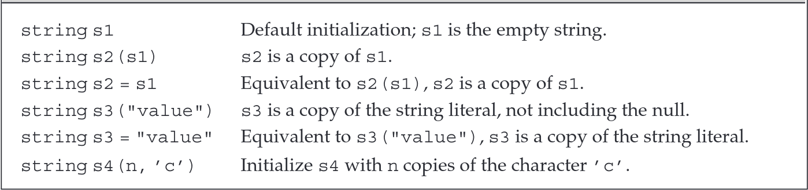
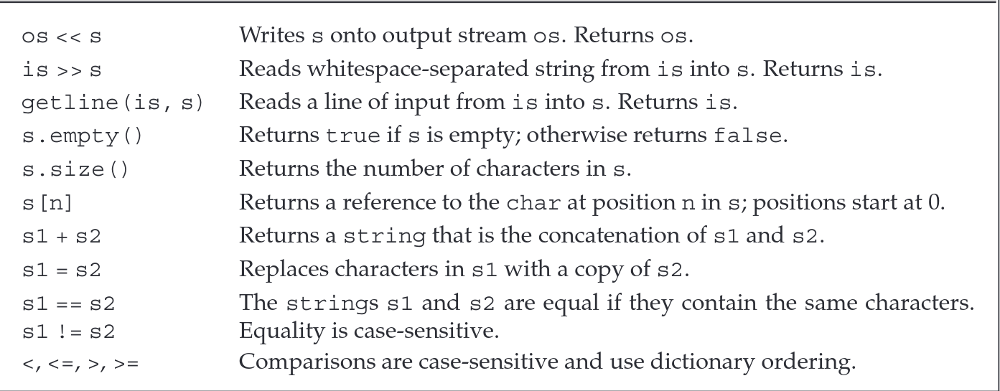
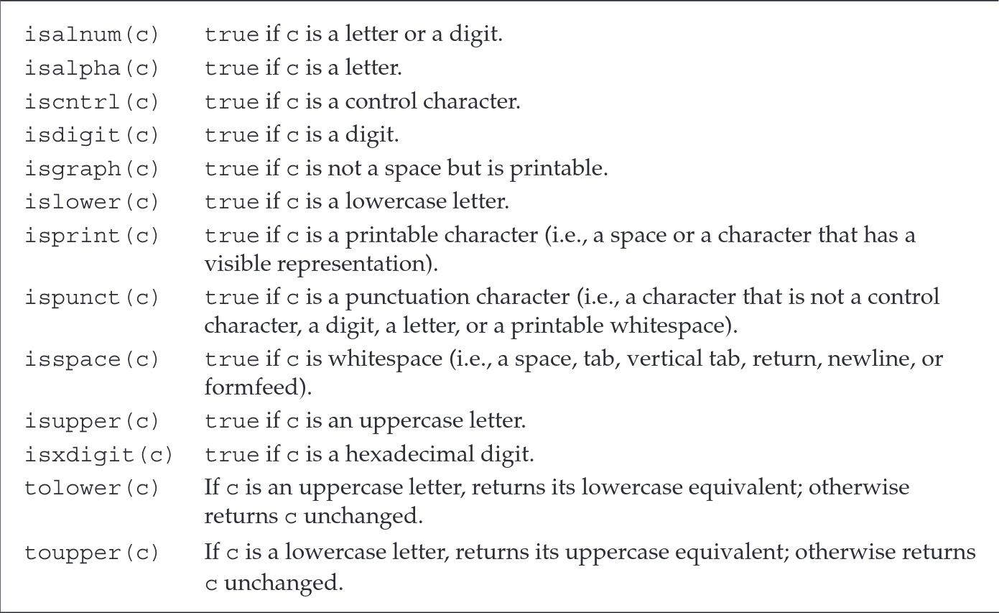
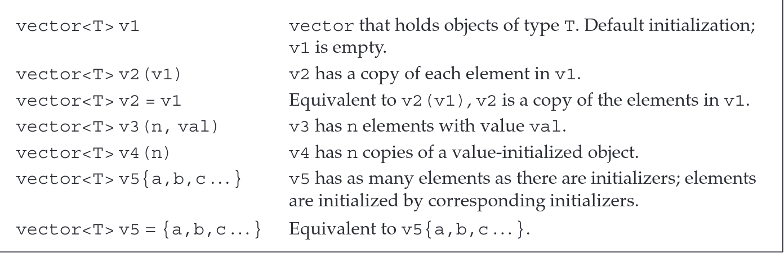
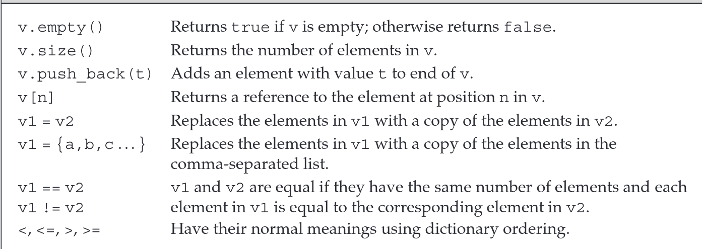
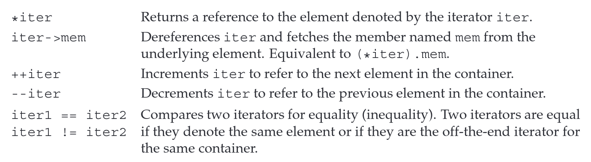
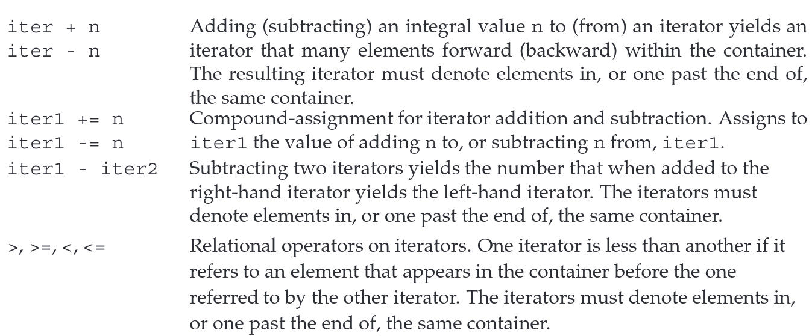

### Namespace `using` Declarations (命名空间使用声明)

```cpp
using namespace::name; // the safest way 
```

使用`using`可以避免重复使用`std::xxx`只需要在`#include`之后`main`函数之前声明需要使用的内容即可。

```cpp
#include <iostream>

using std::cin;

int mian() {
    int i;
    cin >> i;
    cout << i; // error 
    std::cout << i;
    return 0;
}
```

使用不同的类型需要单独使用`using`

```cpp
#include <iostream>

using std::cin;
using std::cout;
int mian() {
    int i;
    cin >> i;
    cout << i; // ok
    std::cout << i;
    return 0;
}
```

注意这种是非法的, 不允许公用一个`using`

```cpp
using std::cin, std::cout; // error
using std::cin; using std::cout; // ok
```

### Library `string` type (`string`类型)

`string` is a `variable-length` sequence of characters.

- `#include <string>`
- `using std::string`

#### Defining and Initializing strings `string`的定义与初始化

> 初始化 `string`的方式
>
> ```cpp
> string s1; // defalut initialization; s1 is the empty string 默认初始化
> string s2 = s1; // s2 is a copy of s1 拷贝初始化
> string s3 = "hiya"; // s3 is a copy of the string literal 字符串字面值初始化
> string s4(10, 'c'); // s4 is cccccccccc 
> ```
>
> 注意`s3`并不包含最后字符串字面值的`\0`结束符

注意`=`和`()`初始化是不一样的

```cpp
string s3 = "hiya";
string s3(hiya);
```

- `=`是`copy initialization` 拷贝初始化
- `()`是`direct initializaiton` 直接初始化

| Ways to Initialize a `string`                                |
| ------------------------------------------------------------ |
|  |

#### Operations on strings `string`的操作

| `string` Operations                                          |
| ------------------------------------------------------------ |
|  |

- `os`: output streams
- `is`: input steams

> `>>` 和 `<<`
>
> ```cpp
> int main() {
>     string s;
>     cin >> s; // 读入的时候会忽略所有前置的空白,直到下一个读入的空白
>     cout << s << endl;
>     return 0;
> }
> ```
>
> 和内置类型的输入和输出一样处理
>
> - 返回的也是左操作数
>   - `>>` 返回`std::istream`
>   - `<<`返回 `std::ostream`
> -  使用`>>`读入会忽略空格

> `getline()`
>
> ```cpp
> std::istream& getline(std::istream& is, std::string& str); // 函数签名
> ```
>
> - 注意`getline()`并非`string`的成员函数，而是自由函数。
>
> `getline` 函数接受一个输入流和一个字符串作为参数。它会从输入流中读取内容，直到遇到第一个换行符（包括该换行符），然后将读取的内容（**不包含换行符本身**）存储到指定的字符串参数中。
>
> 当 `getline` 遇到换行符时，无论它是输入中的第一个字符还是其他位置的字符，都会立即停止读取并返回。
> 如果输入的第一个字符就是换行符，那么最终存储的字符串将是一个​**​空字符串​**​。

```cpp
int main() {
    string line;
    while (getline(cin, line))
        cout << line << endl;
    return 0;
}
```

> `empty()` and `size()` 
>
> 基本功能
>
> - `empty()` 返回`bool`值，判断该`string`是否为空
> - `size()`返回`string::size_type`值，计算该`string`的长度
>   - 使用`string::size_type`的目的是为了实现与机器无关
>   - 但可以肯定的时候其一定是一个**无符号类型**
>     - 要注意和`int`计算的时候，`int`会被强制转换为`unsigned int`

Comparing `string `: ==, !=, >, >=, <. <= 

- 大小写敏感
- 按照字典序比较
- 比较的基本规则
  - 若两字符串长度不同，且较短字符串中的每个字符均与较长字符串中对应位置的字符相同，则较短字符串小于较长字符串。
  - 若两字符串在任意对应位置上的字符存在差异，则字符串比较的结果由首个不同字符的比较结果决定。

> string类的赋值与`+` 
>
> - `string`可以和`bulit-in`类型一样直接用一个string给另一个string赋值
>
> ```cpp
> string s1 = "happy", s2;
> s2 = s1; // now, s1 and s2 are "happy";
> ```
>
> - `string`类允许`+`和`+=`操作，和内置类型保持一样的逻辑
>
> ```cpp
> string s1 = "happy", s2 = "world";
> string s3 = s1 + s2; // now s3 is "happyworld";
> s1 += s2; // now s1 is "happyworld";
> ```
>
> - `string`类与字符串字面值的加法(注意)
>   - 必须有一个操作数为`string`才合法
>
> ```cpp
> string s4 = s1 + ", "; // ok
> string s5 = "hello" + ", "; // error: no string operand
> string s6 = s1 + ", " + "world"; // ok
> string s7 = "hello" + ", " + s2; // error
> ```
>
> `s7`不可以的原因为，其实际上可以认为是如下两部分的组合
>
> ```cpp
> string s7 = ("hello" + ", ") + s2; 
> ```
>
> 而第一部分是两个字面值相加，其操作非法

#### Dealing with the Characters in a `string`

> C++从C标准库继承而来的库，一般会使用`c+name`的名字命名且移去后缀`.h`，同时其所有内容都位于命名空间`std`中，但如果使用`.h`的方式导入，则不保证所有的函数\变量位于`std`的命名空间内。所以，对于所有从C继承而来的库，都应该按照`cname`的方式导入。

| `cctype`Functions                                            |
| ------------------------------------------------------------ |
|  |

<hr>
<div style="top: 10px; left: 10px; max-width: 80%; background: #f8f9fa; border-left: 4px solid #e67e22; border-radius: 4px; font-family: Arial, sans-serif; box-shadow: 0 2px 4px rgba(0,0,0,0.1); display: inline-block;">
  <div style="padding: 8px 12px; font-weight: bold; color: #e67e22; white-space: nowrap;">C11特性</div>
  <div style="padding: 8px 12px; padding-top: 0; color: #333;">
      范围for循环
  </div>
</div>


`C11` --- `Range-Based for`

```cpp
for (declaration : expression)
statement;
```

对于`string`对象，可以按照如下方式遍历每一个字符

```cpp
stirng str("some string");
for (auto c : str)
cout << c << endl;
```

一个更复杂的例子

```cpp
string s("Hello World!!!");  // 定义字符串s并初始化
// punct_cnt的类型与s.size()返回类型相同（参见第2.5.3节第70页）
decltype(s.size()) punct_cnt = 0;  // 标点计数器初始化

// 统计字符串s中的标点符号数量
for (auto c : s)        // 遍历s中的每个字符
 if (ispunct(c))     // 若当前字符是标点符号
     ++punct_cnt;    // 标点计数器自增

// 格式化输出结果
cout << punct_cnt << " punctuation characters in " << s << endl;

```

- 使用`decltype`推断表达式`s.size()`的返回值类型`string::size_tyep`

使用`reference`和范围for循环修改string的每一个字符

```cpp
string str("hello world");
for (auto &c : str)
    c = toupper(c);
cout << str << endl; 

// The output of this code is 
HELLO WORLD
```

注意点

- 虽然看上去是`c`每次重新绑定了`str[i]`，但引用是不支持重新绑定的，所有其实是
  ```cpp
  {
      auto &c = str[0];
      ....
  }
  {
      auto &c = str[1];
      .....
  }
  .....
  ```

  每次迭代的`c`都是全新的`c`
  
  <hr>

### Library `vector` template (`vector`模板)

> - `vector` is a collection of objects, all of which **have the same type.**
>
> ```cpp
> #include <vector>
> using std::vector;
> ```
>
> `vector`是模板(class template)，可以通过如下方式进行实例化(instantiation)
>
> ```cpp
> vector<int> ivec; // ivec holds objects of type int
> vector<Sales_item> Sales_vec; // Sales_vec holds objects of type Sales_item
> vector<vector<string>> file; // vector whose elemnets are vectors
> ```
>
> - 注意`vector`是模板(template)但`vector<int>`是类型(type)
>
> - 注意由于`reference`并非一个对象，所以不存在使用引用实例化的`vector`
> - `vector`支持变长

一个旧标准和新标准的细微差距

```cpp
// 使用vector实例化另一个vector的区别
vector<vector<int> >; // 旧标准需要一个空格
vector<vector<int>> ; // C++11之后并不强制要求
```

####  Defining and Initializing vectors 定义和初始化`vector`

```cpp
vector<string> svec; // 默认初始化，全空
```

```cpp
vector<int> ivec;
vector<int> ivec2(ivec); // 拷贝初始化
vector<string> svec(ivec2); // error: 类型不匹配
```

```cpp
// C++11
vector<string> articles = {"a", "an", "the"}; // 列表初始化
vector<string> articlse{"a", "an", "the"}; // ok
vector<string> articlse("a", "an", "the"); // error: 不能使用()进行列表初始化
```

```cpp
// 创建含有指定初始容量和初始内容的vector
vector<int> ivec(10, -1); // 十个元素，没个元素都是-1
vector<string> svec(10, "hi!"); // 十个元素，每个元素都是hi!
```

```cpp
// 创建指定初始容量但不指定初始内容的vector
vector<int> ivec(10); // 十个元素，全都是0
vector<string> svec(10); // 十个元素，全都是空字符串
```

- 部分类需要明确的显示初始化才可以

注意这个初始化是非法的

```cpp
vector<int> vi = 10; // error: must use direct initialization to supply a size
```

| 总结：`vector`的初始化方法                                   |
| ------------------------------------------------------------ |
|  |

#### Adding Elements to a vector

`push_back()`操作

```cpp
vector<int> v2;
for (int i = 0; i < 100; i++) {
    v2.push_back(i);
}
```

<div style="top: 10px; left: 10px; background: #f8f9fa; border-left: 4px solid #e67e22; border-radius: 4px; font-family: Arial, sans-serif; box-shadow: 0 2px 4px rgba(0,0,0,0.1); display: inline-block;">
  <div style="padding: 8px 12px; font-weight: bold; color: #e67e22; white-space: nowrap;">提示</div>
  <div style="padding: 8px 12px; padding-top: 0; color: #333;">
      vector支持动态添加元素的本质是支持动态扩容，而动态扩容就要用程序员能够把握vector大小的变化。
      <br>
      特别需要注意：在范围for循环中，并不允许使用push_back()动态扩容！具体原因见p188 Lterative Statements
  </div>
</div>

#### Other `vector` Operations

| `vector` Operations                                          |
| ------------------------------------------------------------ |
|  |

注意和`string`类一样`size()`返回的类型并非是单纯的`int`或者其他内置类型而是`vector<T>::size_type` 

<div style="top: 10px; left: 10px; max-width: 80%; background: #f8f9fa; border-left: 4px solid #e74c3c; border-radius: 4px; font-family: Arial, sans-serif; box-shadow: 0 2px 4px rgba(0, 0, 0, 0.1); display: inline-block;">
  <div style="padding: 8px 12px; font-weight: bold; color: #e74c3c;">重要</div>
  <div style="padding: 8px 12px; padding-top: 0; color: #333;">一般来说这里的模板类型不能省略！
    <br>
      英文原文为：To use size_type, we must name the type in which it is defined. A vector type always includes its element type.
    </div>
</div>

在大部分情况下都可以使用`[]`+下标的方式访问`vector`内的元素，但要注意这种方法并不会进行动态扩容，需要动态扩容只能使用`push_back()`或者手动调整`vector`的大小(resize)。

```cpp
vector<int> ivec;
for (decltype(ivec.size()) ix = 0; ix < 10; ix++) ivec[ix] = ix; // error
for (decltype(ivec.size()) ix = 0; ix < 10; ix++) ivec.push_back(ix); // ok
```

### Introducing Iterators(引入迭代器)

迭代器与指针

- 都是间接访问元素
- 在如下两种情况都是有效的
  - 指向一个元素
  - 指向一个一个元素的后一个位置
- 但迭代器不可以指向空，而指针可以指向空

#### Using Iterators

一般获取迭代器并不通过取地址获得，而是通过含有迭代器的容器提供的方法，比如说`begin()`和`end()`

```cpp
vector<int> v;
auto b = v.begin();
auto e = v.end();
// b and e have the same tyep
```

<div style="top: 10px; left: 10px; background: #f8f9fa; border-left: 4px solid #e67e22; border-radius: 4px; font-family: Arial, sans-serif; box-shadow: 0 2px 4px rgba(0,0,0,0.1); display: inline-block;">
  <div style="padding: 8px 12px; font-weight: bold; color: #e67e22; white-space: nowrap;">提示</div>
  <div style="padding: 8px 12px; padding-top: 0; color: #333;">
  	注意begin()返回的是指向第一个元素的迭代器，而end()返回的是指向最后一个元素下一个位置的迭代器。
      <br>
      如果容器为空，则begin()和end()返回相同的迭代器，均为off-the-end iterators
  </div>
</div>

| Standard Container Iterator Operations                       |
| ------------------------------------------------------------ |
|  |

------

**一个习惯问题**

>原文
>
>Programmers coming to C++ from C or Java might be surprised that we used != rather than < in our for loops such as the one above and in the one on page 94. C++ programmers use != as a matter of habit. They do so for the same reason that they use iterators rather than subscripts: This coding style applies equally well to various kinds of containers provided by the library. As we’ve seen, only a few library types, vector and string being among them, have the subscript operator. Similarly, all of the library containers have iterators that define the == and != operators. Most of those iterators do not have the < operator. By routinely using iterators and !=, we don’t have to worry about the precise type of container we’re processing.
>
>简单来说就是C++程序多使用`!=`而非`<`来作为for循环判断的条件，原因为C++程序员多习惯使用迭代器而非下标（大部分容器其实没有下标访问，但都有迭代器），而大部分迭代器并不支持`<`运算符，但都支持`!=`运算符。

-----

关于`begin()`和`end()`的类型

- 若原容器不含`const`则迭代器类型也不含
- 否则迭代也会是带`const`

```cpp
vecotr<int> v;
const vector<int> cv;
auto it1 = v.begin(); // it1 has type vecotr<int>::iterator
auto it2 = cv.begin();// it2 has type vecotr<int>::const_iterator
```

<div style="top: 10px; left: 10px; max-width: 80%; background: #f8f9fa; border-left: 4px solid #e67e22; border-radius: 4px; font-family: Arial, sans-serif; box-shadow: 0 2px 4px rgba(0,0,0,0.1); display: inline-block;">
  <div style="padding: 8px 12px; font-weight: bold; color: #e67e22; white-space: nowrap;">C11特性</div>
  <div style="padding: 8px 12px; padding-top: 0; color: #333;">
      可以使用cbegin()和cend()替换begin()和end()来保证迭代器一定是const修饰的
  </div>
</div>

```cpp
auto it3 = v.cbegin(); // its has tyep vector<int>::const_iterator
```

迭代器和`.`成员运算符的优先级问题

```cpp
(*it).empty(); // 先解引用再使用empty()
*it.empty(); //先使用empty()再解引用 error
```

使用箭头`->`运算符

```cpp
for (auto it = text.cbegin(); it != text.cend() && !it->empty(); it++)
    cout << *it << endl;
```

<div style="top: 10px; left: 10px; max-width: 80%; background: #f8f9fa; border-left: 4px solid #e74c3c; border-radius: 4px; font-family: Arial, sans-serif; box-shadow: 0 2px 4px rgba(0, 0, 0, 0.1); display: inline-block;">
  <div style="padding: 8px 12px; font-weight: bold; color: #e74c3c;">重要</div>
  <div style="padding: 8px 12px; padding-top: 0; color: #333;">
      任何可能改变 vector 大小的操作（如 push_back）都可能导致指向该 vector 的所有迭代器失效。
      <br>
      如果循环中使用了迭代器，就绝不能向该迭代器所指向的容器添加元素。
    </div>
</div>

#### Iterator Arithmetic(迭代器算术)

| Operations Supported by vector and string Iterators          |
| ------------------------------------------------------------ |
|  |

<div style="top: 10px; left: 10px;background: #f0fff4; border-left: 4px solid #2ecc71; border-radius: 4px; font-family: Arial, sans-serif; box-shadow: 0 2px 4px rgba(0, 0, 0, 0.1);">
  <div style="padding: 8px 12px; font-weight: bold; color: #2ecc71;">💡 迭代器的差</div>
  <div style="padding: 8px 12px; padding-top: 0; color: #333;"></div>
</div>

`iter1 - iter2`其值类型为`difference_type`表面的是第一个迭代器需要经过多少次`++`或者`--`操作才能达到第二个迭代器

- `difference_type`是有符号类型

------

<div style="top: 10px; left: 10px;background: #f5f5f5; border-left: 4px solid #7f8c8d; border-radius: 4px; font-family: Arial, sans-serif; box-shadow: 0 2px 4px rgba(0, 0, 0, 0.1);">
  <div style="padding: 8px 12px; font-weight: bold; color: #7f8c8d;">💻 示例代码</div>
  <div style="padding: 8px 12px; padding-top: 0; color: #333;">使用迭代器实现二分查找</div>
</div>

```cpp
// text must be sorted
// beg and end will denote the range we're searching
auto beg = text.begin(), end = text.end();
auto mid = text.begin() + (end - beg) / 2;  // original midpoint

// while there are still elements to look at and we haven't yet found 'sought'
while (mid != end && *mid != sought) {
    if (sought < *mid) {      // is the element we want in the first half?
        end = mid;            // if so, adjust the range to ignore the second half
    } else {                  // the element we want is in the second half
        beg = mid + 1;        // start looking with the element just after mid
    }
    mid = beg + (end - beg) / 2;  // new midpoint
}

```

----

### Arrays(数组)

数组是从`c`继承而来的，性质大部分相同。

<div style="top: 10px; left: 10px;  background: #f0faf0; border-left: 4px solid #27ae60; border-radius: 4px; font-family: Arial, sans-serif; box-shadow: 0 2px 4px rgba(0, 0, 0, 0.1); display:">
  <div style="padding: 8px 12px; font-weight: bold; color: #27ae60;">⚡ 提示</div>
  <div style="padding: 8px 12px; padding-top: 0; color: #333;">如果不能确切知道要多少元素，使用vector</div>
</div>

#### Defining and Initializing Built-in Arrays

**Arrays are a compound type**

数组一般按照`a[d]`的样子进行初始化，其中`a`为数组类型，`d`为数组容量。注意`d`必须是得在编译期间就能确定的常量有两种方法实现

- 使用`constexpr`定义变量，强制其在编译期确定值
  ```cpp
  constexpr v = 100;
  int arr[v]; // ok
  ```

- 使用`const`并用字面值初始化该变量
  ```cpp
  const int N = 110;
  int arr[N]; // ok
  const int N1 = rand(); 
  int arr1[N1]; // error
  ```

<div style="top: 10px; left: 10px;background: #fff0f0; border-left: 4px solid #c0392b; border-radius: 4px; font-family: Arial, sans-serif; box-shadow: 0 2px 4px rgba(0, 0, 0, 0.1);">
  <div style="padding: 8px 12px; font-weight: bold; color: #c0392b;">❌ 字符数组初始化问题</div>
  <div style="padding: 8px 12px; padding-top: 0; color: #333;">使用字符串字面值初始化字符数组千万要记得最后的\0，这和用其初始化string不一样</div>
</div>

```cpp
const char str[6] = "Daniel"; // error: no space for the null!
```

<div style="top: 10px; left: 10px;background: #fff0f0; border-left: 4px solid #c0392b; border-radius: 4px; font-family: Arial, sans-serif; box-shadow: 0 2px 4px rgba(0, 0, 0, 0.1); display:">
  <div style="padding: 8px 12px; font-weight: bold; color: #c0392b;">❌ 不允许使用一个数组复制给/赋值给另一个数组</div>
</div>

```cpp
int a[] = {0, 1, 2};
int a2[] = a;// error: cannot initialize one array with another
a2 = a; // error: cannot assign one array to another
```

<div style="top: 10px; left: 10px;background: #f0f7ff; border-left: 4px solid #3498db; border-radius: 4px; font-family: Arial, sans-serif; box-shadow: 0 2px 4px rgba(0, 0, 0, 0.1);">
  <div style="padding: 8px 12px; font-weight: bold; color: #3498db;">🔍 数组、指针、引用</div>
  <div style="padding: 8px 12px; padding-top: 0; color: #333;">通常方案是从数组名字开始从内往外解读类型
    </div>
</div>

```cpp
int &refs[10]; // error: no arrays of references
// 数组内的元素必须是对象
int *ptrs[10]; // ok: 存放了10个int*的数组
// 数组本身是一个对象可以被指针指向也可以被引用
int (*Parray)[10] = &arr; // ok: 指向一个存有10个元素的int数组
int (&arrRef)[10] = arr; // ok: 对一个int数组的引用 
```

 ```cpp
 int *(&arry)[10] = ptrs; 
 // array ---> 名字
 // & ---> 引用
 // [10] --->数组
 // int * --->int指针
 // 组合起来就是：arry是一个引用，对一个容量为10给int *类型的数组的引用。
 ```

#### Accessing the Elements of Array

- 支持`[]`访问
  - 但编译器不保证访问范围的合理性，需要程序员自己保证！
- 支持`范围for`循环

#### Pointers and Arrays

C++毕竟是从C发展而来，也继承了指针和数组的关系

- 数组名为指向数组首元素的地址

```cpp
string nums = {"one", "two", "three"};
string *p1 = &nums[0];
// 与下面是等效的
string *p2 = nums;
```

<div style="top: 10px; left: 10px;background: #f9f0ff; border-left: 4px solid #9b59b6; border-radius: 4px; font-family: Arial, sans-serif; box-shadow: 0 2px 4px rgba(0, 0, 0, 0.1); display:">
  <div style="padding: 8px 12px; font-weight: bold; color: #9b59b6;">🔄 数组自动推导类型</div>
  <div style="padding: 8px 12px; padding-top: 0; color: #333;">auto和decltype在对一个数组对象的类型推导上的不同</div>
</div>

```cpp
auto sa1(nums); // sa1的类型是 string *
decltype(nums) sa2; // sa2是一个包含三个元素的string数组
```

- `[]`操作本质是指针运算
  - 即是指针运算的语法糖罢了

```cpp
string one = nums[0];
// 等价于
string one = *(nums);
string two = nums[1];
//等价于
string tow = *(nums + 1);
```

<div style="top: 10px; left: 10px;background: #f9f0ff; border-left: 4px solid #9b59b6; border-radius: 4px; font-family: Arial, sans-serif; box-shadow: 0 2px 4px rgba(0, 0, 0, 0.1);">
  <div style="padding: 8px 12px; font-weight: bold; color: #9b59b6;">🔄 C11</div>
  <div style="padding: 8px 12px; padding-top: 0; color: #333;">引入了begin()和end()两个函数</div>
</div>

```cpp
int ia[] = {0,1,2,3,4,5,6,7,8,9}; // ia is an array of ten ints 
int *beg = begin(ia); // pointer to the first element in ia 
int *last = end(ia); // pointer one past the last element in ia
```

和迭代器的`begin()`和`end()`行为一致，`begin()`返回指向第一个元素的指针，`end()`返回指向最后一个元素下一个位置的指针。

<div style="top: 10px; left: 10px;background: #f0fff4; border-left: 4px solid #2ecc71; border-radius: 4px; font-family: Arial, sans-serif; box-shadow: 0 2px 4px rgba(0, 0, 0, 0.1);">
  <div style="padding: 8px 12px; font-weight: bold; color: #2ecc71;">💡 提示</div>
  <div style="padding: 8px 12px; padding-top: 0; color: #333;">数组的索引可以是负数，而vector和string不可以</div>
</div>

```cpp
int *p = &ia[2]; // p points to the element indexed by 2 
int j = p[1]; // p[1] is equivalent to *(p + 1), 
             // p[1] is the same element as ia[3] 
int k = p[-2]; // p[-2] is the same element as ia[0]
```

原因在于数组的下标元素是指针运算，其由C++决定，而`vector`和`string`由其库决定，而库内规定了索引必须是非负数。

#### Interfacing to Older Code

任何以`\0`结尾的字符数组，都可以当作字符串字面值使用

- 可以通过该数组初始化string
- 可以作为操作数与string进行加减操作

可以使用`c_str()`函数将返回一个指向`string`的`C-style`风格的指针，但需要注意其有如下注意事项

- 返回的类型为`const char *`
  - 不可以通过该指针修改`string`的内容
- 如果`string`内容发生修改，该指针将会无效

----

**可以使用array初始化一个vector**

使用`begin()`和`end()`两个指针确定array的有效范围

```cpp
int int_arr[] = {0, 1, 2, 3, 4, 5};  
// ivec has six elements; each is a copy of the corresponding element in 
int_arr vector<int> ivec(begin(int_arr), end(int_arr));
```

当然也可以按如下方法使用数组的某一部分初始化vector

```cpp
// copies three elements: int_arr[1], int_arr[2], int_arr[3] 
vector<int> subVec(int_arr + 1, int_arr + 4);
```

<div style="top: 10px; left: 10px; background: #fff8f0; border-left: 4px solid #e67e22; border-radius: 4px; font-family: Arial, sans-serif; box-shadow: 0 2px 4px rgba(0, 0, 0, 0.1); ;">
  <div style="padding: 8px 12px; font-weight: bold; color: #e67e22;">🔹 风格建议</div>
  <div style="padding: 8px 12px; padding-top: 0; color: #333;">现代c++程序员不应该使用C-style的数组而应该使用string,不应该使用原生数组和指针而应该使用vector和迭代器</div>
</div>

### Multidimensional Arrays(多维数组)

并没有啥多维数组，有的只有数组嵌套。

<div style="top: 10px; left: 10px;background: #f0fff4; border-left: 4px solid #2ecc71; border-radius: 4px; font-family: Arial, sans-serif; box-shadow: 0 2px 4px rgba(0, 0, 0, 0.1);">
  <div style="padding: 8px 12px; font-weight: bold; color: #2ecc71;">💡 提示</div>
  <div style="padding: 8px 12px; padding-top: 0; color: #333;">范围for循环的&</div>
</div>

|    循环层级    |     控制变量类型     |                             原因                             |
| :------------: | :------------------: | :----------------------------------------------------------: |
|     最外层     |   引用（`auto &`）   |                   避免外层数组退化为指针。                   |
| 中间层（如有） |   引用（`auto &`）   |              保持嵌套数组结构，确保内层可遍历。              |
|     最内层     | 可引用或值（`auto`） | 最内层是基本类型（如`int`），是否引用取决于是否需要修改元素。 |

```cpp
int cube[2][3][4];
for (auto &layer : cube)       // 引用：避免退化为int(*)[3][4]
    for (auto &row : layer)    // 引用：避免退化为int*
        for (auto &elem : row) // 可引用或值（int&或int）
            elem = 0;          // 修改元素
```

但如下代码就错误了

```cpp
for (auto row : ia) // row退化为int*
    for (auto col : row) // 非法：int*不能用于范围for
```

