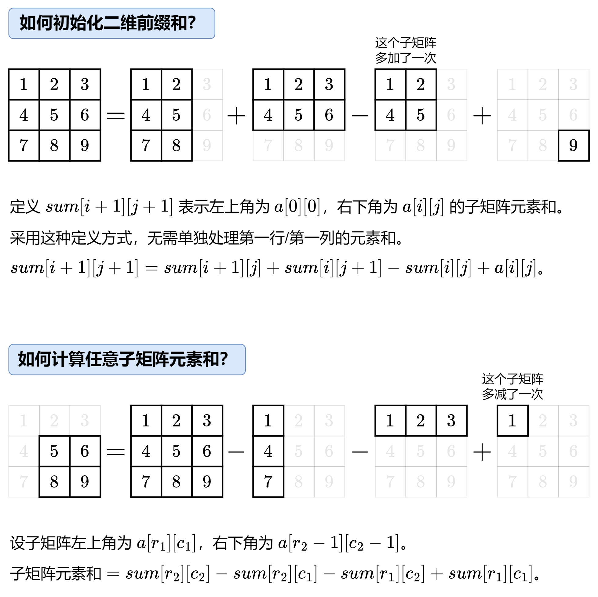

# 差分
!!! abstract "简介"
	在算法和数据处理中，差分（Difference Array） 是一种用于高效处理区间更新的技术。它通过将原始数组转换为差分数组，将区间操作（如批量增减）转化为单点操作，从而将时间复杂度从 O(n) 优化至 O(1)，特别适用于频繁区间修改+最终查询的场景。

## 一维差分与等差数列差分
!!! question "相关习题"
	[leetcode 1109.航班预订统计](https://leetcode.cn/problems/corporate-flight-bookings/description/)

	[洛谷P4231 三步必杀](https://www.luogu.com.cn/problem/P4231)

	[洛谷P5026 Lycanthropy](https://www.luogu.com.cn/problem/P5026)

## 一维差分

假设要在一个数组的[left, right]上进行n次操作

- 只在`left`位置加`x`而在`right + 1`位置减`x`
  - 相当于标记作用范围
- 通过前缀和还原出真正的结果

具体推导过程如等差数列差分
!!! warning "局限性"
	注意一维差分无法实现在操作的过程中{==查询==}的操作

	想要实现查询操作，请参考`advanced`标签下的`segment tree(线段树)`

??? danger "一维差分模板"
	```cpp
	arr[left] += x;
	arr[right + 1] -= y;

	for (int i = 1; i < arr.size(); i++) arr[i] += arr[i - 1];
	```

### 等差数列差分

!!! warning "提醒"
	等差数列差分在面试中并不常见，但在比赛中还是比较常见的

!!! Info "问题描述"
	一开始1-n范围上的数字都是0。接下来一共有m个操作。每次操作：l-r范围上依次加上首项s、末项e、公差d的数列
	最终1-n范围上的每个数字都要正确得到


具体的推导过程如下(通过最终状态反推参数)


??? danger "等差数列差分模板"
	```cpp
	// 等差数列差分模板
	void set(int l, int r, int s ,int e, int d) {
		arr[l] += s;
		arr[l + 1] += d - s;
		arr[r + 1] -= d + e;
		arr[r + 2] += e;
	}

	void build() {
		// 两次前缀和
		for (int i = 1; i <= n; i++) arr[i] += arr[i - 1];
		for (int i = 1; i <= n; i++) arr[i] += arr[i - 1];
	}
	```


## 二维前缀和
!!! note "参考习题"

	<div style="padding: 8px 12px; padding-top: 0; color: #333;">
		<a href="https://leetcode.cn/problems/range-sum-query-2d-immutable/description/">leetcode 304.二维区域和检索-矩阵不可变(二维前缀和模板)</a><br>
		<a href="https://leetcode.cn/problems/largest-1-bordered-square/description/">leetcode 1139.最大以1为边界的正方形</a>
	</div>

详细的数学推导见[Oi-wiki:前缀和&差分](https://oi-wiki.org/basic/prefix-sum/)
!!! note "二维前缀和的时空复杂度"
	时间复杂度$O(nm)$
	空间复杂度$O(nm)$

??? tip "一个小技巧"
	如果创建一个和原数组一般大小的`sum`数组，则单独讨论第`0`行和第`0`列边界条件
	但是我们可以按照如图的方式扩大`sum`数组避免边界条件的讨论 
	

!!! note "一张图了解二维前缀和"
    

??? danger "二维前缀和模板"
	```cpp
	class NumMatrix {
	public:
		NumMatrix(vector<vector<int>>& matrix) {
			int n = matrix.size();
			int m = matrix[0].size();
			// 设置sum大小为(n + 1, m + 1)避免边界讨论
			sum.resize(n + 1, vector<int>(m + 1));

			for (int a = 1, c = 0; c < n; a++, c++) {
				for (int b = 1, d = 0; d < m; b++, d++) {
					// 将matrix的元素对应的拷贝进sum
					// a -> c + 1
					// b -> d + 1
					sum[a][b] = matrix[c][d];
				}
			}

			for (int i = 1; i <= n; i++) 
				for (int j = 1; j <= m; j++)
					// 前缀和等于 上 + 左 + 自己 - 左上
					sum[i][j] += sum[i][j - 1] + sum[i - 1][j] - sum[i - 1][j - 1];
		}
		
		int sumRegion(int a, int b, int c, int d) {
			// a 子矩阵左上角行索引
			// b 子矩阵左上角列索引
			// c 子矩阵右下角行索引
			// d 子矩阵右下角列索引
			// [c + 1][d + 1]为大矩形
			// [c + 1][b]为上方小矩阵
			// [a][d + 1]为左侧小矩形
			// [a][b]为多减的小矩阵
			return sum[c + 1][d + 1] - sum[c + 1][b] - sum[a][d + 1] + sum[a][b];
		}
	private:
		vector<vector<int>> sum;
	};
	```
### 最大以1为边界的正方形(前缀和解法)
基本流程：枚举所有正方形$O(n*m*min(n, m))$,验证每个正方形是否是满足要求的正方形。

枚举过程无法优化，只能优化{==验证==}过程.
??? note "优化方案"
	对于给定的正方形(a,b)-(c,d)可以计算其前缀和求得在其中所有元素之和，若减去其内部(a+1, b+1)-(c-1,d-1)的小正方形元素之和，则剩下的就是边上那一圈元素之和。此时只需要判断其是否等于周长即可。
	如图

??? success "参考实现"
	```cpp
	// 考虑复用原数组则时间复杂度为O(nm*min(n,m)) 空间复杂度为O(1)
	class Solution {
	public:
		int largest1BorderedSquare(vector<vector<int>>& grid) {
			int n = grid.size();
			int m = grid[0].size();

			// 构建前缀和数组
			// 自己+左+上-左上
			for (int i = 0; i < n; i++)
				for (int j = 0; j < m; j++)
					grid[i][j] += Get(grid, i, j - 1) + Get(grid, i - 1, j) - Get(grid, i - 1, j - 1);
			// 不含有1
			if (sum(grid, 0, 0, n - 1, m - 1) == 0) return 0;
			
			// 外圈全为1的边长
			int ans = 1;
			for (int a = 0; a < n; a++) {
				for (int b = 0; b < m; b++) {
					// 上面两个for循环为枚举左上角点的可能性
					for (int c = a + ans, d = b + ans, k = ans + 1; c < n && d < m; c++, d++, k++) {
						// 上面这个循环为枚举可能满足更长答案的右下角点
						// 通过直接+ans实现了减少枚举的个数
						if (sum(grid, a, b, c, d) - sum(grid, a + 1, b + 1, c - 1, d - 1) == ((k - 1) << 2)) {
							ans = k;
						}
					}
				}
			}
			return ans * ans;
		}
	private:
		// 边界判断
		int Get(vector<vector<int>> &grid, int a, int b) {
			return (a < 0 || b < 0) ? 0 : grid[a][b];
		}
		// 求给定正方形(a,b)-(c,d)的区间和
		int sum(vector<vector<int>> &g, int a, int b, int c, int d) {
			return a > c  ? 0 : (g[c][d] - Get(g, c, b - 1) - Get(g, a - 1, d) + Get(g, a - 1, b - 1));
		}
	};
	```
## 二维差分

!!! note "参考习题"
	<div style="padding: 8px 12px; padding-top: 0; color: #333;">
		<a href="https://www.luogu.com.cn/problem/P3397">洛谷P3397地毯(二维差分模板)</a>
		<br>
		<a href="https://leetcode.cn/problems/stamping-the-grid/description/">leetcode2132.用邮票贴满网格图</a>
		</div>

!!! note "问题描述"
	类似于一维差分，对于二维数组，如果经历如下操作
	- 每个操作都有独立的`a、b、c、d`确定两个点(a,b)和(c,d)
	- 每次对该区域内的所有数字进行一次`+`或者`-`某个数的操作
	- 问最后的二维数组应该是啥样子的
!!! warning "局限性"
	和一维差分一样，二维差分只能保证最终结果正确而不能对中间状态进行查询。

作为一维差分的推广，通过在四个点`+\-`对于元素来抵消这次操作对其他范围内数字的影响，再通过一次{==前缀和==}计算得到最终的结果。

??? danger "二维差分模板"
	```cpp
	// 操作一次差分数组
	void add(int a, int b, int c, int d, int v) {
		diff[a][b] += v; // 左上角加v
		diff[c + 1][b] -= v; // 左下角的下方格子-v
		diff[a][d + 1] -= v; // 右上角的右方格子-v
		diff[c + 1][d + 1] += v; // 右下角的下方格子+v
	}
	// 通过差分数组构建出最终的答案
	void build() {
		for (int i = 1; i <= n; i++)
			for (int j = 1; j <= n; j++)
				diff[i][j] +=diff[i - 1][j] + diff[i][j - 1] - diff[i - 1][j - 1];
	}
	```
参考前缀和计算，如果采用原大小的数组构建差分数组则需要进行各种边界判断。因为差分数组会都四个角周围的元素进行操作，所以只需要在原数组外面围一圈`0`则无论是进行`add`操作还是`build`操作都不需要进行边界检查了。

### 洛谷P3397
模板题，注意数组大小即可。
### 牛客 [模板]二维差分
注意如果数组本来就不全为0,需要对每一个初始元素进行一次单独的`add`操作，来保证最终结果的正确性
??? success "参考代码"
	```cpp
	#include <iostream>
	#include <array>
	using namespace std;

	const int N = 1002;
	// 使用long long防止数据溢出
	array<array<long long, N>, N> diff;

	void add(int a,int b, int c, int d, long long v) {
		diff[a][b] += v;
		diff[c + 1][d + 1] += v;
		diff[a][d + 1] -= v;
		diff[c + 1][b] -= v;
	}
	int main() {
		int n, m, q;
		scanf("%d %d %d", &n, &m, &q);
		for (int i = 1; i <= n; i++) 
			for (int j = 1; j <= m; j++) {
				int x = 0;
				scanf("%d ", &x);
				add(i, j, i, j, x);
			}
		while (q--) {
			int a, b, c, d, v;
			scanf("%d %d %d %d %d", &a, &b, &c, &d, &v);
			add(a, b, c, d, v);
		}

		// 还原
		for (int i = 1; i <= n; i++) {
			for (int j = 1; j <= m; j++) {
				diff[i][j] += diff[i - 1][j] + diff[i][j - 1] - diff[i - 1][j - 1];
				printf("%lld ", diff[i][j]);
			}
			printf("\n");
		}
		return 0;
	}
	```

### 用邮票贴满网格图
{==难度: 困难==}

!!! note "算法思路"
	要判断某一个空白位置`0`是否至少存在一个大小为邮票大小且形状和邮票一致的相邻全零区域如果含有`1`则会有啥不同呢？

	若能找到，肯定要标记该区域用于与原矩阵对比而判断答案，但如何标记呢？

??? note "解法"
	通过前缀和计算某一区域是否为`0`进而确认该位置是否可以贴邮票，并且不再原数组上进行标记。而是采用一个
	差分数组，记录每次贴邮票的操作。最终只需要对比差分数组和原数组，若存在两者均为`0`的格子则说明无法贴全。

??? success "参考代码"
	```cpp
	class Solution {
	public:
		typedef vector<vector<int>> vvi;
		bool possibleToStamp(vector<vector<int>>& grid, int stampHeight, int stampWidth) {
			int n = grid.size();
			int m = grid[0].size();
			vii sum(n + 1, vector<int>(m + 1, 0));
			vii diff(n + 2, vector<int>(m + 2, 0));

			// 计算前缀和
			for (int i = 1; i <= n; ++i) {
				for (int j = 1; j <= m; ++j) {
					sum[i][j] = grid[i - 1][j - 1] + sum[i - 1][j] + sum[i][j - 1] - sum[i - 1][j - 1];
				}
			}

			// 检查每个可能放置邮票的区域
			for (int a = 1; a + stampHeight <= n + 1; a++) {
				for (int b = 1; b + stampWidth<= m + 1; b++) {
					// 注意减1
					int c = a + stampHeight - 1;
					int d = b + stampWidth - 1;
					if (sumRegion(a, b, c, d, sum) == 0) {
						// 更新差分数组
						diff[a][b] += 1;
						diff[a][d + 1] -= 1;
						diff[c + 1][b] -= 1;
						diff[c + 1][d + 1] += 1;
					}
				}
			}

			// 计算差分数组的前缀和
			for (int i = 1; i <= n; ++i) {
				for (int j = 1; j <= m; ++j) {
					diff[i][j] += diff[i - 1][j] + diff[i][j - 1] - diff[i - 1][j - 1];
					// 注意偏移量
					if (grid[i - 1][j - 1] == 0 && diff[i][j] == 0) {
						return false;
					}
				}
			}

			return true;
		}

	private:
		int sumRegion(int a,int b,int c,int d, vvi &g) {
			return g[c][d] - g[a - 1][d] - g[c][b - 1] + g[a - 1][b - 1];
		}
	};
	```
## 离散化技巧
!!! note "参考习题"
	<div style="padding: 8px 12px; padding-top: 0; color: #333;">
		<a href="https://leetcode.cn/problems/xepqZ5/description/">leetcode LCP74.最强祝福力场</a>
	</div>

一句话说清离散化，对于稀疏数据的{==有序关系==}的一种映射

例如leetcode这道题，力场的可能范围非常大但我们并不需要一个矩形边长上的全部数据只需要四个角的数据即可。通过合理的映射可以简单的把数据长度长但内容稀疏的数据集转换为数据长度小且密集的数据集。

!!! tip "编码技巧"
	可以使用`std::erase`和`std::unique`对有序数组进行去重

	使用`lower_bound`返回最早出现大于等于参数的迭代器

??? success "参考实现"
	```cpp
	class Solution {
	public:
		int fieldOfGreatestBlessing(vector<vector<int>>& forceField) {
			// 避免出现0.5
			vector<long long> xs, ys;
			for (auto &f : forceField) {
				long long x = f[0], y = f[1], side = f[2];
				xs.push_back(2 * x - side); // 左边界
				xs.push_back(2 * x + side); // 右边界
				ys.push_back(2 * y - side); // 上边界
				ys.push_back(2 * y + side); // 下边界
			}
			// 排序数组并去重
			sort(xs.begin(), xs.end());
			// unique将相邻重复元素移动到末尾并返回新结尾的迭代器
			// erase(it, end)删除it->end的元素
			xs.erase(unique(xs.begin(), xs.end()), xs.end());
			sort(ys.begin(), ys.end());
			ys.erase(unique(ys.begin(), ys.end()), ys.end());

			// 离散化
			int n = xs.size(), m = ys.size(), diff[n + 2][m + 2];
			memset(diff, 0, sizeof diff);
			for (auto &f : forceField) {
				long long x = f[0], y = f[1], side = f[2];
				// +1别忘了，diff是从1开始的!
				int a = lower_bound(xs.begin(), xs.end(), 2 * x - side) - xs.begin() + 1; // 左边界的相对序号
				int c = lower_bound(xs.begin(), xs.end(), 2 * x + side) - xs.begin() + 1; // 右边界的相对序号
				int b = lower_bound(ys.begin(), ys.end(), 2 * y - side) - ys.begin() + 1; // 上边界的相对序号
				int d = lower_bound(ys.begin(), ys.end(), 2 * y + side) - ys.begin() + 1; // 下边界的相对序号
				// 二维差分
				diff[a][b] += 1;
				diff[c + 1][d + 1] += 1;
				diff[c + 1][b] -= 1;
				diff[a][d + 1] -= 1;
			}

			// 前缀和还原差分数组的结果，并计算最大值
			int ans = 0;
			for (int i = 1; i <= n; i++) {
				for (int j = 1; j <= m; j++) {
					diff[i][j] += diff[i - 1][j] + diff[i][j - 1] - diff[i - 1][j - 1];
					ans = max(ans, diff[i][j]);
				}
			}

			return ans;
		}
	};
	```