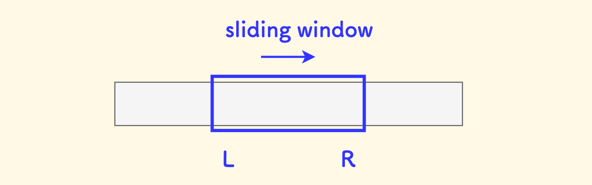

# 滑动窗口与相关习题
!!! abstract "主要内容"
    通过维护一个动态窗口（通常为数组/字符串的子区间）来高效解决连续区间问题。核心思想是{==双指针遍历==}，根据条件调整窗口左右边界，避免重复计算。适用于**子数组/子串的最值、定和、覆盖等问题**（如最长无重复子串、最小覆盖子串）。关键点包括窗口收缩/扩展的触发条件、哈希表辅助统计等，时间复杂度通常为O(n)。

示意图：
    

??? danger "相关习题"
    [leetcode209.长度最小的子数组](https://leetcode.cn/problems/minimum-size-subarray-sum/)

    [leetcode3.无重复字符的最长子串](https://leetcode.cn/problems/longest-substring-without-repeating-characters/)

    [leetcode76.最小覆盖子串](https://leetcode.cn/problems/minimum-window-substring/)

    [leetcode134.加油站](https://leetcode.cn/problems/gas-station/)

    [leetcode1234.替换子串得到平衡字符串](https://leetcode.cn/problems/replace-the-substring-for-balanced-string/)

    [leetcode992.K个不同整数的子数组](https://leetcode.cn/problems/subarrays-with-k-different-integers/)

    [leetcode395.至少有K个重复字符的最长子串](https://leetcode.cn/problems/longest-substring-with-at-least-k-repeating-characters/)

## Question 1 : 长度最小的子数组
!!! info "问题描述"
    给定一个含有 n 个正整数的数组和一个正整数 target 。

    找出该数组中满足其总和大于等于 target 的长度最小的 子数组 [numsl, numsl+1, ..., numsr-1, numsr] ，并返回其长度。如果不存在符合条件的子数组，返回 0 。

这道题比较简单了，由于都是正数具有范围增大和必然增大，范围减少和必然减少的单调性，可以考虑用滑动窗口实现。
??? success "参考实现"
    === "滑动窗口O(N)"
        ```cpp
        // 滑动窗口
        class Solution {
        public:
            int minSubArrayLen(int target, vector<int>& nums) {
                int i = 0, j = 0, sum = 0, ans = 0x0fffff;
                for (; i < nums.size(); i++) {
                    sum += nums[i];
                    while (sum >= target) {
                        ans = min(ans, i - j + 1);  // 记录当前窗口大小
                        sum -= nums[j++];           
                    }
                }
                return ans == 0x0fffff ? 0 : ans;
            }
        };
        ```

    === "前缀和与二分O(NlogN)"
        ```cpp
        class Solution {
        public:
            // 寻找子数组>=target的最短子数组长度
            int minSubArrayLen(int target, vector<int>& nums) {
                vector<int> prefix_sum(nums.size() + 1, 0);
                // O(NlogN)
                for (int i = 0; i < nums.size(); i++)
                    prefix_sum[i + 1] = prefix_sum[i] + nums[i];
                // 使用二分查找对于每个i查找一个最小的j O(N log N)
                int min_len = 0x0fffff;
                for (int i = 0; i <= nums.size(); i++) {
                    int find = prefix_sum[i] + target;
                    auto j = lower_bound(prefix_sum.begin(), prefix_sum.end(), find);
                    if (j != prefix_sum.end()) {
                        int len = j - prefix_sum.begin() - i;
                        min_len = min(len, min_len);
                    }
                }

            return min_len != 0x0fffff ? min_len : 0;
            }
        };
        ```

## Question 2 : 无重复字符的最长子串
!!! note "问题描述"
    给定一个字符串 `s` ，请你找出其中不含有重复字符的最长子串的长度。

这道题也比较简单(或者说常见)，通过一个哈希表记录那些元素已经被包括与子串中，若新加入的元素在哈希set内，则通过调整左指针并删除对应的哈希记录，直到左指针走到早先出现的这个元素的后一个元素。

??? success "参考实现"
    ```cpp
    class Solution {
    public:
        int lengthOfLongestSubstring(string s) {
            unordered_set<char> set;
            int ans = 0;
            for (int i = 0, j = 0; i < s.size(); i++) {
                while (set.count(s[i]) != 0) {
                    set.erase(s[j++]);
                }
                set.insert(s[i]);
                ans = max(ans, i - j + 1);
            }
            return ans;
        }
    };
    ```
## Question 3 : 最小覆盖子串

这道题虽然是{~~~>hard~~}但相对来说比较简单的{~~~>hard~~}题
!!! note "问题描述"
    给你一个字符串 s 、一个字符串 t 。返回 s 中涵盖 t 所有字符的最小子串。如果 s 中不存在涵盖 t 所有字符的子串，则返回空字符串 "" 。
    
    - 对于重复字符，寻找的子串必须包含不少于`t`中字符的数量
    
    - 题目保证答案唯一
本题可以看作{==负债与还债模型==}，同时采用滑动窗口即可。
!!! tip "负债与还债模型"
    对于某些特殊元素记为债务，并加入债务表，同时记录这些元素的个数为`-x`。

    当遍历到非选定的元素时候，加入该元素进债务表并`++val`但总债务不变；遍历到特殊元素的时候增加债务表
    中对应元素的val,同时减少总债务。
!!! note "具体的算法描述"
    - 初始化一个`256`大小的全零数组，用于债务表
    - 读入`t`的所有元素，并记入对应元素进入债务表, 总债务 = `t.size()`
    - 滑动窗口的`left`和`right`开始遍历`s`
    - 如果s[r]的元素是负债表中的值为负数的元素(负债元素)则减少总债务，同时将值+1
    - 如果不是，则只需要将债务表中的值+1即可
    - 当总债务为0的时候(`debt == 0`) 移动左边界
        - 直到移动左边界会使得债务表中的`val<0`为止 
        - 记录一次子串长度与起始位置
    - 最终只需通过`substr`返回最短的`len`和`start`确定的子串即可
??? success "参考实现"
    ```cpp
    class Solution {
    public:
        string minWindow(string s, string t) {
            // 负债与还债模型
            // 债务表
            vector<int> cnts(256, 0);
            for (auto c : t) cnts[c]--;

            int len = INT_MAX;
            int start = 0;
            int debt = t.size(); // 总债务
            for (int l = 0, r = 0; r < s.size(); r++) {
                if (cnts[s[r]]++ < 0) debt--;
                if (debt == 0) {
                    while(cnts[s[l]] > 0) cnts[s[l++]]--;
                    if (r - l + 1 < len) {
                        len = r- l + 1;
                        start = l;
                    }
                }
            }
            return len == INT_MAX ? "" : s.substr(start, len);
        }
    };
    ```
## Question 4 : 加油站
!!! note "题目描述"
    在一条环路上有 n 个加油站，其中第 i 个加油站有汽油 gas[i] 升。

    你有一辆油箱容量无限的的汽车，从第 i 个加油站开往第 i+1 个加油站需要消耗汽油 cost[i] 升。你从其中的一个加油站出发，开始时油箱为空。

    给定两个整数数组gas和cost如果你可以按顺序绕环路行驶一周，则返回出发时加油站的编号，否则返回 -1 。如果存在解，则保证它是唯一的。

这道题的思路可以一步一步优化，进而得到最终最优的解法。

- 首先肯定是要算`gas[i] - cost[i]`
    - 如果不进行任何优化，每次都枚举一个节点在遍历`x -- x`的全程和，则时间复杂度是$O(n^2)$
- 考虑第一个优化，由于是环形数组，每次要从`x, x + 1, ... n, 0, 1, ..., x - 1` 这里要进行一次条件判断，这样的花编码不好看。考虑`拷贝`一份原数组接到后面，让其变成`0, 1.. n, n + 1, n + 2, .... 2n` 此时只需要正常遍历即可。
    - 当然也不需要真的`拷贝`一份数组，只需要进行`x % gas.size()`即可
- 考虑第二个优化，每次都需要重新从下一个节点开始枚举吗？其实不然，假设从`a`点开始遍历，遍历到`b`点发现累加和`<= 0` 则可以直接从`b`开始遍历，而不需要从`a + 1`
    - 由于$\sum_{i = a}^{i = b} <= 0$ 则 $\sum_{i = a+i}^{i = b}, i \in [a+1, b]$也必然不满足条件
    - 考虑到$a>0$才会从`a`开始遍历，而$\sum_{i = a}^{i = b} <= 0$,则$\sum_{i = a + 1}^{i = b} = \sum_{i = a}^{i = b} - a <= 0$ ,其余元素同理

??? success "参考实现"
    ```cpp
    class Solution {
    public:
        int canCompleteCircuit(vector<int>& gas, vector<int>& cost) {
            int n = gas.size();
            for (int l = 0, r = 0, sum = 0; l < gas.size(); l = r + 1, r = l)  {
                sum = 0;
                while (sum + gas[r % n] - cost[r % n] >= 0) {
                    if (r - l + 1 == n) return l;
                    sum += gas[r % n] - cost[r % n];
                    r++;
                }
            }
            return -1;
        }
    };
    ```

## Question 5 : 替换子串得到平衡字符串
!!! note "题目描述"
    有一个只含有 'Q', 'W', 'E', 'R' 四种字符，且长度为 n 的字符串。

    假如在该字符串中，这四个字符都恰好出现 n/4 次，那么它就是一个「平衡字符串」。
   
    给你一个这样的字符串 s，请通过「替换一个子串」的方式，使原字符串 s 变成一个「平衡字符串」。

    你可以用和「待替换子串」长度相同的 任何 其他字符串来完成替换。

    请返回待替换子串的最小可能长度。

    如果原字符串自身就是一个平衡字符串，则返回 0。

这道题可以通过如下转换，转换为Q3

- 统计原字符串中`Q``W``E``R`出现的次数
- 假设`Q`出现`q`此，`W`出现`w`次，其他类似
    - 只需要找出`qwer`中次数大于`s.size()/4`的元素即可
    - 此时只需要找出最小的能够覆盖多余元素组成的字符串的原字符子串即可

例如对于`40`个元素的字符串，若`Q出现4次`、`W出现12次`、`E出现14此`、`R出现10次`，问题转换为寻找能覆盖`WWEEEE`的最小子串问题,只需要考虑多出来的元素即可，因为不需要考虑转换为具体哪个元素。

??? success "参考实现"
    ```cpp
    class Solution {
    public:
        int balancedString(string s) {
            vector<int> cnts(4, 0);
            vector<int> str(s.size(), 0);
            // 统计`QWER`各自的词频
            for (int i = 0; i < s.size(); i++) {
                str[i] = s[i] == 'W' ? 1 : (s[i] == 'E' ? 2 : (s[i] == 'R' ? 3 : 0));
                cnts[str[i]]++;
            }

            // 将多出的`QWER`转换为债务
            int debt = 0;
            for (int i = 0; i < 4; i++) {
                if (cnts[i] < s.size() /4 ) cnts[i] = 0;
                else {
                    cnts[i] = s.size() / 4 - cnts[i];
                    debt -= cnts[i];
                }
            }
            if (debt == 0) return 0;
            // Q3的代码
            int ans = INT_MAX;
            for (int l = 0, r = 0; r < s.size(); r++) {
                if (cnts[str[r]]++ < 0) debt--;
                if (debt == 0) {
                    while(cnts[str[l]] > 0) cnts[str[l++]]--;
                    ans = min(ans, r - l + 1);
                }
            }
            return ans;
        }
    };
    ```
## Question 6 : K个不同整数的子数组
!!! note "题目描述"
    给定一个正整数数组 nums和一个整数 k，返回 nums 中 「好子数组」 的数目。

    如果 nums 的某个子数组中不同整数的个数恰好为 k，则称 nums 的这个连续、不一定不同的子数组为 「好子数组 」。

    例如，[1,2,3,1,2] 中有 3 个不同的整数：1，2，以及 3。

## Question 7 : 至少有k个重复字符的最长子串
!!! note "题目描述"
    给你一个字符串 s 和一个整数 k ，请你找出 s 中的最长子串， 要求该子串中的每一字符出现次数都不少于 k 。返回这一子串的长度。

    如果不存在这样的子字符串，则返回 0。
## 滑动窗口问题的总结

