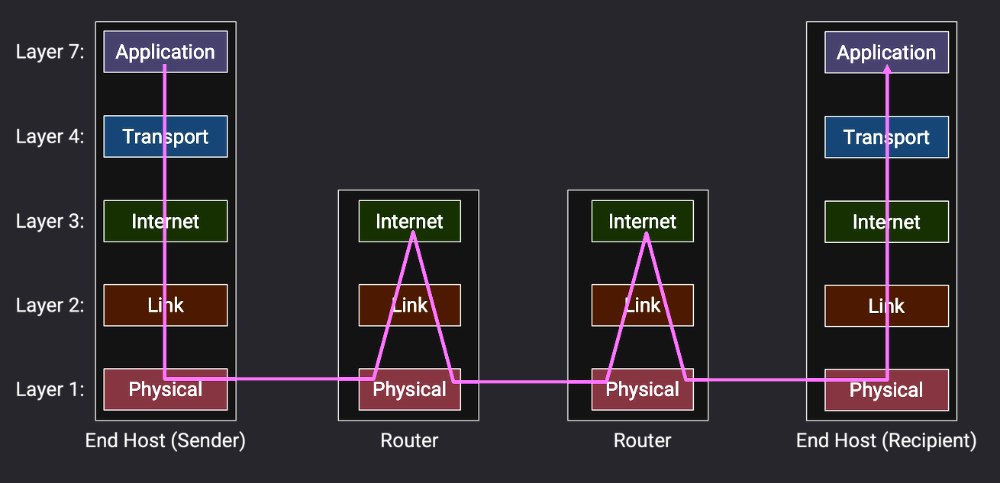

# Introduction to the Internet

## Intro 1:Layers of the Internet

### What is the Internet?
*[protocols]: 协议
*[syntax]: 语法
*[semantics]: 语义
*[RFC]: Request For Comments
*[LAN]: local area network
*[frames]: group bits into units of data called packets in Link layers

{++protocols++}:specify how entities exchange in communication.

- syntax:How to do  
- semantics:what to do

### Layers of the Internet(TCP/IP 5 layers)
Physical Layer --- Link Layer --- Internet Layer --- Transport --- Application

#### {++Physical Layer++}
!!! info "Core function"
    Transmits raw bit streams over physical media (cable/fiber/wireless).

#### {++Link Layer++} 
!!! info "Core function"
    Reliably delivers frames between directly connected nodes (e.g., Ethernet/Wi-Fi).

#### {++Internet Layer++}
!!! info "Core function"
    Routes and forwards IP packets across networks (e.g., router operations).

**End hosts**: machines(e.g. serves, laptops, phones)communicating over the Internet.

**Switch(aka router)**: a machine that isn't sending or receiving its own data, but exists to help the end hosts communicate withe each other.

#### {++Transport++}
!!! info "Core function"
    Provides end-to-end data delivery (TCP reliable/UDP efficient).

#### {++Application++}
!!! info "Core function"
    Offers network services to applications (e.g., HTTP/DNS/Email).

### Headers 

## Intro 2:Design Principles

## Intro 3:Links

