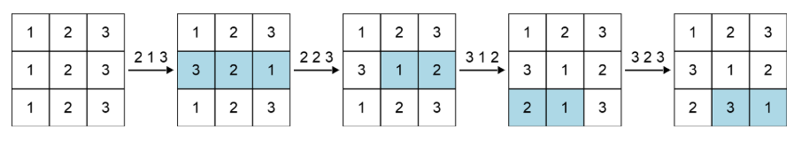

!!! abstract 
    参加时间：2025-6-12 10PM

    完成情况：
    A :white_check_mark:
    B :x:
    C :x:
    D :x:
    E :x:
    F :x:

    补题记录：
    B :x:
    C :x:
    D :x:
    E :x:
    F :x:
# Codeforces Round 1030 (Div. 2)
## A题 Equal Subsequences
!!! danger "限制"
    time limit per test: 1 second

    memory limit per test: 256 megabytes

    input: standard input

    output: standard output
We call a bitstring$^{\text{∗}}$ perfect if it has the same number of $\mathtt{101}$ and $\mathtt{010}$ subsequences$^{\text{†}}$. Construct a perfect bitstring of length $n$ where the number of $\mathtt{1}$ characters it contains is exactly $k$.

It can be proven that the construction is always possible. If there are multiple solutions, output any of them.

$^{\text{∗}}$A bitstring is a string consisting only of the characters $\mathtt{0}$ and $\mathtt{1}$.

$^{\text{†}}$A sequence $a$ is a subsequence of a string $b$ if $a$ can be obtained from $b$ by the deletion of several (possibly zero or all) characters.

{==Input==}

Each test contains multiple test cases. The first line contains the number of test cases $t$ ($1 \le t \le 500$). The description of the test cases follows.

The first line of each test case contains two integers $n$ and $k$ ($1 \le n \le 100$, $0 \le k \le n$) — the size of the bitstring and the number of $\mathtt{1}$ characters in the bitstring.

{==Output==}

For each test case, output the constructed bitstring. If there are multiple solutions, output any of them.

```
input
5
4 2
5 3
5 5
6 2
1 1
```

```
output
1010
10110
11111
100010
1
```
??? note "案例解释"
    In the first test case, the number of $\mathtt{101}$ and $\mathtt{010}$ subsequences is the same, both being $1$, and the sequence contains exactly two $\mathtt{1}$ characters.

    In the second test case, the number of $\mathtt{101}$ and $\mathtt{010}$ subsequences is the same, both being $2$, and the sequence contains exactly three $\mathtt{1}$ characters.

    In the third test case, the number of $\mathtt{101}$ and $\mathtt{010}$ subsequences is the same, both being $0$, and the sequence contains exactly five $\mathtt{1}$ characters.
??? note "算法思路"
    1. It is somehow difficult to count the number of such subsequences in an arbitrary string. Can you think of strings where it is trivial?
    2. The number of such subsequences can be $0$.
    3. **Key observation:** A bitstring where all $\mathtt{1}$ bits come before all $\mathtt{0}$ bits is perfect as it has no $\mathtt{101}$ or $\mathtt{010}$ subsequences.

        You can fix the number of $\mathtt{1}$ bits to be $k$ and then put $n-k$ $\mathtt{0}$ bits after them. This achieves a perfect bitstring with the number of $\mathtt{1}$ bits being $k$.
??? success "参考实现"
    ```cpp
    #include <string>
    #include <iostream>

    int main() {
        int n = 0;
        scanf("%d", &n);
        while (n--) {
            int len, ones;
            scanf("%d %d", &len, &ones);
            std::string ans(len, '0');
            for (int i = 0; i < ones; i++) {
                ans[i] = '1';
            }
            std::cout << ans << std::endl;
        }

        return 0;
    }
    ```
!!! tip "收获"
    A|B题给的案例并不一定是最好的答案！
## B题 Make It Permutation
!!! danger "限制"
    time limit per test: 1 second

    memory limit per test: 256 megabytes

    input: standard input

    output: standard output
There is a matrix $A$ of size $n\times n$ where $A_{i,j}=j$ for all $1 \le i,j \le n$.

In one operation, you can select a row and reverse any subarray$^{\text{∗}}$ in it.

Find a sequence of at most $2n$ operations such that every column will contain a permutation$^{\text{†}}$ of length $n$.

It can be proven that the construction is always possible. If there are multiple solutions, output any of them.

$^{\text{∗}}$An array $a$ is a subarray of an array $b$ if $a$ can be obtained from $b$ by deleting zero or more elements from the beginning and zero or more elements from the end.

$^{\text{†}}$A permutation of length $n$ is an array consisting of $n$ distinct integers from $1$ to $n$ in arbitrary order. For example, $[2,3,1,5,4]$ is a permutation, but $[1,2,2]$ is not a permutation ($2$ appears twice in the array), and $[1,3,4]$ is also not a permutation ($n=3$ but there is $4$ in the array).

{==Input==}

Each test contains multiple test cases. The first line contains the number of test cases $t$ ($1 \le t \le 100$). The description of the test cases follows.

The first line of each test case contains one integer $n$ ($3 \le n \le 5000$) — denoting the number of rows and columns in the matrix.

It is guaranteed that the sum of $n$ over all test cases does not exceed $5000$.

{==Output==}

For each test case, on the first line, print an integer $k$ $(0 \le k \le 2n)$, the number of operations you wish to perform. On the next lines, you should print the operations.

To print an operation, use the format "$i\;l\;r$" ($1 \leq l \leq r \leq n$ and $1 \leq i \leq n$) which reverses the subarray $A_{i, l}$, $A_{i, l+1}$, $\ldots$, $A_{i, r}$.
```
input
2
3
4
```

```
4
2 1 3
2 2 3
3 1 2
3 2 3
5
2 1 4
3 1 3
3 2 4
4 3 4
4 1 2
```
??? note "案例解释"
    

!!! note "算法思路"

??? success "参考实现"

!!! tip "收获"
## C题 Make It Beautiful
!!! danger "限制"
    time limit per test: 2 seconds

    memory limit per test: 512 megabytes

    input: standard input

    output: standard output
You are given an array $a$ of $n$ integers. We define the $\text{beauty}$ of a number $x$ to be the number of $1$ bits in its binary representation. We define the beauty of an array to be the sum of beauties of the numbers it contains.

In one operation, you can select an index $i$ $(1 \le i \le n)$ and increase $a_i$ by $1$.

Find the maximum beauty of the array after doing **at most** $k$ operations.

{==Input==}

Each test contains multiple test cases. The first line contains the number of test cases $t$ ($1 \le t \le 5000$). The description of the test cases follows.

The first line of each test case contains two integers $n$ and $k$ ($1 \le n \le 5000$, $0 \le k \le 10^{18}$) — the length of the array and the maximal number of operations.

The second line of each test case contains $n$ integers $a_1, a_2, \ldots a_n$ ($0 \le a_i \le 10^9$) —denoting the array $a$.

It is guaranteed that the sum of $n$ over all test cases does not exceed $5000$.

{==Output==}

For each test case, output a single integer, the maximum beauty after at most $k$ operations.

```
input
5
5 2
0 1 7 2 4
5 3
0 1 7 2 4
1 1
3
3 0
2 0 3
1 100000000000
0
```

```
output
8
9
2
3
36
```

??? note "案例解释"
    The beauty of this array is . One of the other valid solutions with the same beauty is .
    
    **Note**

    In the first test case, $a = [0, 1, 7, 2, 4]$.

    -   apply the first operation at $i = 1$, the new array is $a = [1, 1, 7, 2, 4]$
    -   apply the second operation at $i = 4$, the new array is $a = [1, 1, 7, 3, 4]$

    The beauty of this array is $1 + 1 + 3 + 2 + 1 = 8$. One of the other valid solutions with the same beauty is $[0, 1, 7, 3, 5]$.

    In the third test case, $a = [3]$. Since you are not required to use exactly $k$ operations, it is optimal to do none.
## D题 Red Light, Green Light(hard version)
!!! danger "限制"
    time limit per test: 4 seconds

    memory limit per test: 512 megabytes

    input: standard input

    output: standard output
You are given a strip of length $10^{15}$ and a constant $k$. There are exactly $n$ cells that contain a traffic light; each has a position $p_i$ and an initial delay $d_i$ for which $d_i < k$. The $i$\-th traffic light works the following way:

-   it shows red at the $l \cdot k + d_i$\-th second, where $l$ is an integer,
-   it shows green otherwise.

At second $0$, you are initially positioned at some cell on the strip, facing the positive direction. At each second, you perform the following actions in order:

-   If the current cell contains a red traffic light, you turn around.
-   Move one cell in the direction you are currently facing.

You are given $q$ different starting positions. For each one, determine whether you will eventually leave the strip within $10^{100}$ seconds.

{==Input==}

Each test contains multiple test cases. The first line contains the number of test cases $t$ ($1 \le t \le 2\cdot10^5$). The description of the test cases follows.

The first line of each test case contains two integers $n$, $k$ ($\mathbf{1 \le n \le 2\cdot10^5}$ and $\mathbf{1 \le k \le 10^{15}}$) — the number of traffic lights and the length of the period.

The second line of each test case contains $n$ integers $p_1, p_2, \ldots p_n$ ($1 \le p_1 < p_2 < \ldots < p_n \le 10^{15}$) — the positions of the traffic lights.

The third line of each test case contains $n$ integers $d_1, d_2, \ldots d_n$ ($0 \le d_i < k$) — the delays of the traffic lights.

The fourth line of each test case contains one integer $q$ ($\mathbf{1 \le q \le 2\cdot10^5}$) — the number of queries.

The fifth line of each test case contains $q$ integers $a_1, a_2, \ldots, a_q$ ($1 \leq a_i \leq 10^{15}$) — the starting positions.

**It is guaranteed that the sum of $n$ and $q$ over all test cases does not exceed $\mathbf{2\cdot10^5}$.**

{==Output==}

For each test case, output $q$ lines. Each line should contain "YES" if you will eventually leave the strip and "NO" otherwise. You can output the answer in any case (upper or lower). For example, the strings "yEs", "yes", "Yes", and "YES" will be recognized as positive responses.

```
input
4
2 2
1 4
1 0
3
1 2 3
9 4
1 2 3 4 5 6 7 8 9
3 2 1 0 1 3 3 1 1
5
2 5 6 7 8
4 2
1 2 3 4
0 0 0 0
4
1 2 3 4
3 4
1 2 3
3 1 1
3
1 2 3
```

```
output
YES
NO
YES
YES
YES
YES
NO
NO
YES
YES
NO
NO
YES
NO
YES
```

??? note "案例解释"
    In the first test case, the following happens at starting positions $1$, $2$, and $3$:

    

    And the following in the second test case at starting position $2$:

    

!!! note "算法思路"

??? success "参考实现"

!!! tip "收获"
## E题 Grid Coloring
!!! danger "限制"
    time limit per test: 2 seconds

    memory limit per test: 256 megabytes

    input: standard input

    output: standard output
There is a $n\times m$ grid with each cell initially white. You have to color all the cells one-by-one. After you color a cell, all the **colored cells** furthest from it receive a penalty. Find a coloring order, where no cell has more than $3$ penalties.

**Note that $n$ and $m$ are both odd.**

The distance metric used is the [chessboard distance](https://en.wikipedia.org/wiki/Chebyshev_distance) while we decide ties between cells with [Manhattan distance](https://en.wikipedia.org/wiki/Taxicab_geometry#Formal_definition). Formally, a cell $(x_2, y_2)$ is further away than $(x_3, y_3)$ from a cell $(x_1, y_1)$ if one of the following holds:

-   $\max\big(\lvert x_1 - x_2 \rvert, \lvert y_1 - y_2 \rvert\big)>\max\big(\lvert x_1 - x_3 \rvert, \lvert y_1 - y_3 \rvert\big)$
-   $\max\big(\lvert x_1 - x_2 \rvert, \lvert y_1 - y_2 \rvert\big)=\max\big(\lvert x_1 - x_3 \rvert, \lvert y_1 - y_3 \rvert\big)$ **and** $\lvert x_1 - x_2 \rvert + \lvert y_1 - y_2 \rvert>\lvert x_1 - x_3 \rvert + \lvert y_1 - y_3 \rvert$

It can be proven that at least one solution always exists.

 Example showing penalty changes after coloring the center of a $5 \times 5$ grid. The numbers indicate the penalty of the cells.

{==Input==}

Each test contains multiple test cases. The first line contains the number of test cases $t$ ($1 \le t \le 100$). The description of the test cases follows.

The first line of each test case contains two **odd** integers $n$ and $m$ ($1 \le n, m \le 4999$) — the number of rows and columns.

It is guaranteed that the sum of $n \cdot m$ over all test cases does not exceed $5000$.

{==Output==}

For each test case, output $n \cdot m$ lines where the $i$\-th line should contain the coordinates of the $i$\-th cell in your coloring order. If there are multiple solutions, print any of them.

The empty lines in the example output are just for increased readability. You're not required to print them.

```
input
3
3 3
1 1
1 5
```

```
output
2 1
2 3
2 2
1 1
3 2
3 3
3 1
1 3
1 2

1 1

1 2
1 4
1 5
1 1
1 3
```

??? note "案例解释"
    In the first test case, the grid can be colored as follows:

     The numbers indicate the penalty of the cells.

!!! note "算法思路"

??? success "参考实现"

!!! tip "收获"
## F题 Shifts and Swaps
!!! danger "限制"
    time limit per test: 6 seconds

    memory limit per test: 512 megabytes

    input: standard input

    output: standard output

You are given arrays $a$ and $b$ of length $n$ and an integer $m$.

The arrays only contain integers from $1$ to $m$, and both arrays contain all integers from $1$ to $m$.

You may repeatedly perform either of the following operations on $a$:

-   cyclic shift$^{\text{∗}}$ the array to the left
-   swap two neighboring elements if their difference is at least $2$.

Is it possible to transform the first array into the second?

$^{\text{∗}}$A left cyclic shift of a zero-indexed array $p$ of length $n$ is an array $q$ such that $q_i = p_{(i + 1) \bmod n}$ for all $0 \le i < n$.

**Input**

Each test contains multiple test cases. The first line contains the number of test cases $t$ ($1 \le t \le 10^5$). The description of the test cases follows.

The first line of each test case contains two integers $n$ and $m$ ($2 \le m \le n \le 5\cdot10^5$) — the length of the arrays and the number of distinct elements in $a$.

The second line contains $n$ integers $a_1, a_2, \ldots, a_n$ ($1 \le a_i \le m$) — denoting the array $a$.

The third line contains $n$ integers $b_1, b_2, \ldots, b_n$ ($1 \le b_i \le m$) — denoting the array $b$.

It is guaranteed that both arrays contain all integers from $1$ to $m$.

It is guaranteed that the sum of $n$ over all test cases does not exceed $5\cdot10^5$.

**Output**

For each test case, output "YES" if it is possible to transform the first array into the second and "NO" otherwise. You can output the answer in any case (upper or lower). For example, the strings "yEs", "yes", "Yes", and "YES" will be recognized as positive responses.

```
input
8
3 3
1 2 3
3 2 1
4 3
1 1 2 3
1 2 2 3
4 4
1 3 2 4
2 3 4 1
6 3
1 1 2 1 2 3
2 1 1 2 3 1
5 4
2 3 4 1 1
3 2 1 1 4
9 7
2 4 6 7 3 1 5 4 6
6 7 3 5 6 4 2 4 1
9 8
8 3 5 6 5 4 1 7 2
7 5 3 5 8 4 6 2 1
8 6
2 1 5 4 6 3 5 4
6 1 5 2 4 5 3 4
```

```
output
YES
NO
YES
NO
YES
YES
NO
NO
```

??? note "案例解释"
    In the first test case, you can transform array $a$ into array $b$ with the following steps:

    -   \[$1$, $2$, $3$\] — shift to the left
    -   \[$2$, $3$, $1$\] — swap indices $2$ and $3$
    -   \[$2$, $1$, $3$\] — shift to the left
    -   \[$1$, $3$, $2$\] — shift to the left
    -   $[3, 2, 1]$

    In the second test case, it can be proven that it is impossible to transform array $a$ into array $b$ with the given operations.

!!! note "算法思路"

??? success "参考实现"

!!! tip "收获"