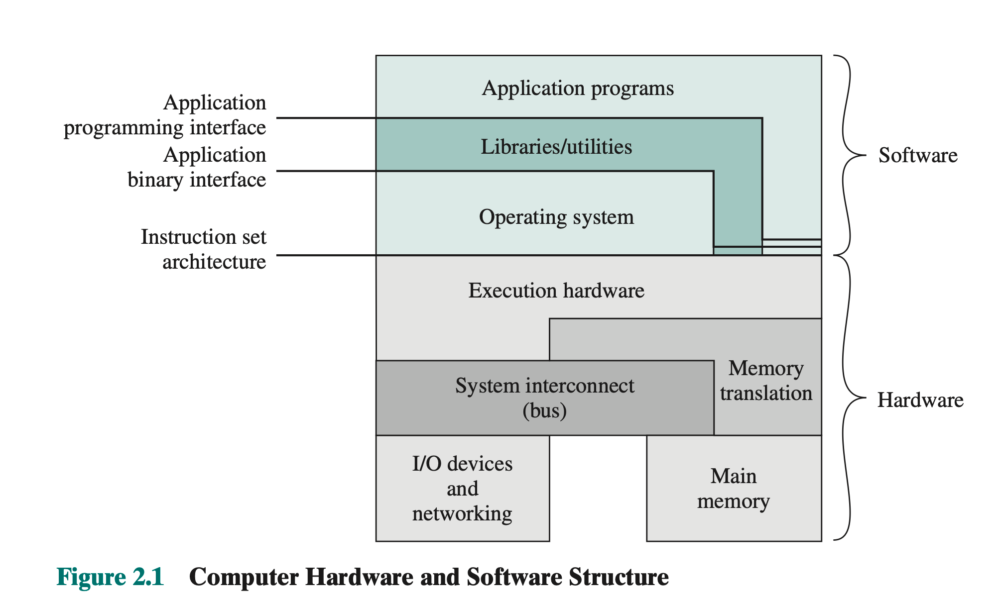
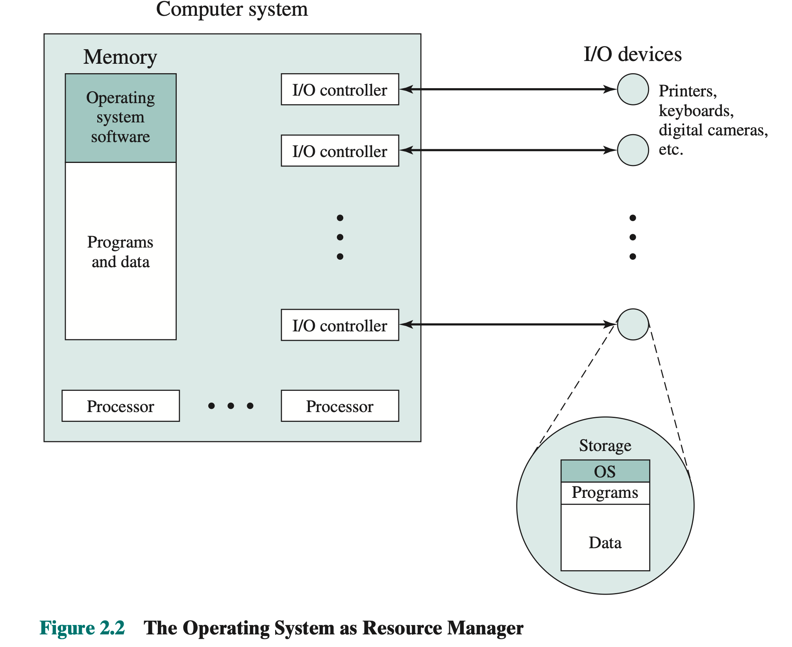
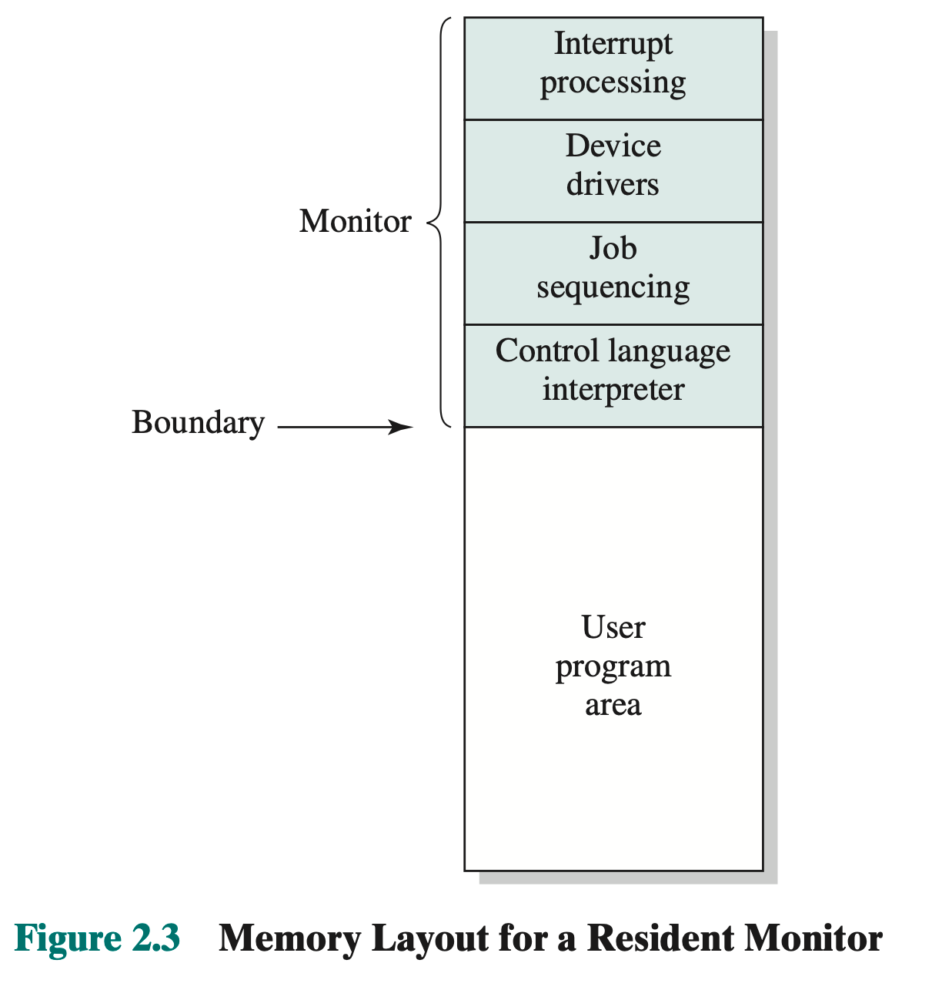
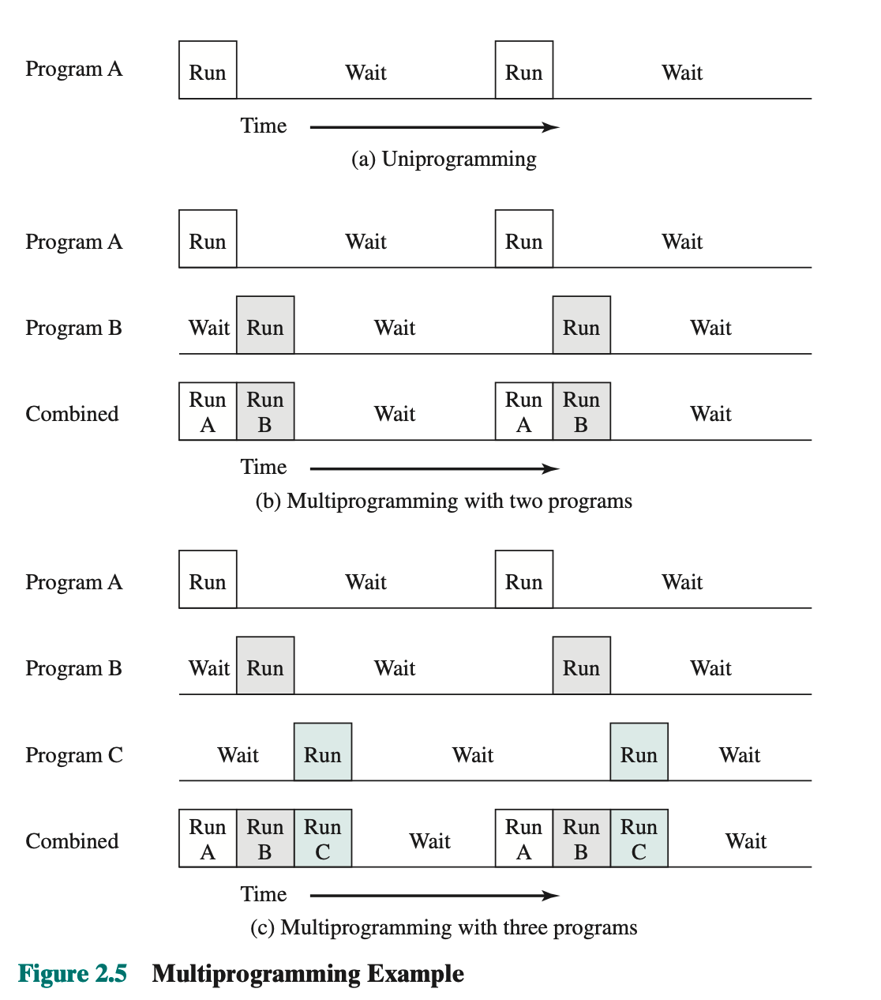

# 操作系统概述

## 操作系统的目标和功能
^^操作系统^^ 控制应用程序执行的{==程序==},是应用程序和计算机硬件直接的接口.

### 作为用户/计算机结构的操作系统
!!! note "操作系统提供的服务"
    - 程序开发:编译器和调试
    - 程序运行:指令加载\内存管理
    - I/O设备访问
    - 文件访问控制
    - 系统访问
    - 错误检错和响应
    - 记账 统计各种数据
^^指令系统体系结构ISA^^ 定义计算机遵循的机器语言指令系统,该结构是硬件和软件的分界线

^^应用程序二进制结构ABI^^ 定义了程序间二进制课移值的标准,定义了操作系统的系统调用接口,以及在系统中通过ISA能使用的硬件资源和服务

^^应用程序编程结构API^^ 允许程序访问系统的硬件资源和服务,这些服务由ISA和高级语言程序库(HHL)调用来提供.

### 作为资源管理器的操作系统

位于内存的操作系统的那一部分被称为"内核程序(kernel)",包含操作系统最基本最常用的功能.

图中描述了操作系统能够管理的各种资源 -- 文件管理 | I\O管理 | 文件系统的管理 | CPU调度

## 操作系统的演化
### 串行处理
^^串行处理^^ 用户必须按照顺序访问计算机

### 简单的批处理系统

简单的批处理系统没有中断这一功能,但有运行模式的概念.

监控程序以系统模式(内核模式)运行,可以执行特权指令;普通程序以用户模式运行,有些内存区域是被保护的用户模式的程序无法访问.

{++用户程序和监控程序交替运行++}

### 多道批处理程序

^^单道程序设计^^ 仅有一个程序可以进行作业,当系统进行I\O的时候CPU将会闲置,浪费较大

^^多道程序设计(多任务处理)^^ 当一个用户程序等待I\O的时候,可以切换另一个用户程序进行作业.

注意多道批处理系统就需要引入"I\O中断机制", 并且同时引入了DMA(直接内存访问)

### 分时系统
分时系统的出现就是为了响应用户的交互要求,通过`分时`技术,让多个用户分享处理器时间.

在分时操作系统,多个用户可以同时通过终端访问系统,由操作系统控制每个用户程序在{++很短的时间++}交替进行.

## 后续内容的综述

### 进程
!!! note "进程的定义"
    - 一个正在执行的程序
    - 计算机中正在运行的一个程序的实例
    - 可分配给处理器并由处理器执行的一个实体
    - 由一个单一顺序线程,一个当前状态和一组相关系统资源所表征的活动单元

### 内存管理