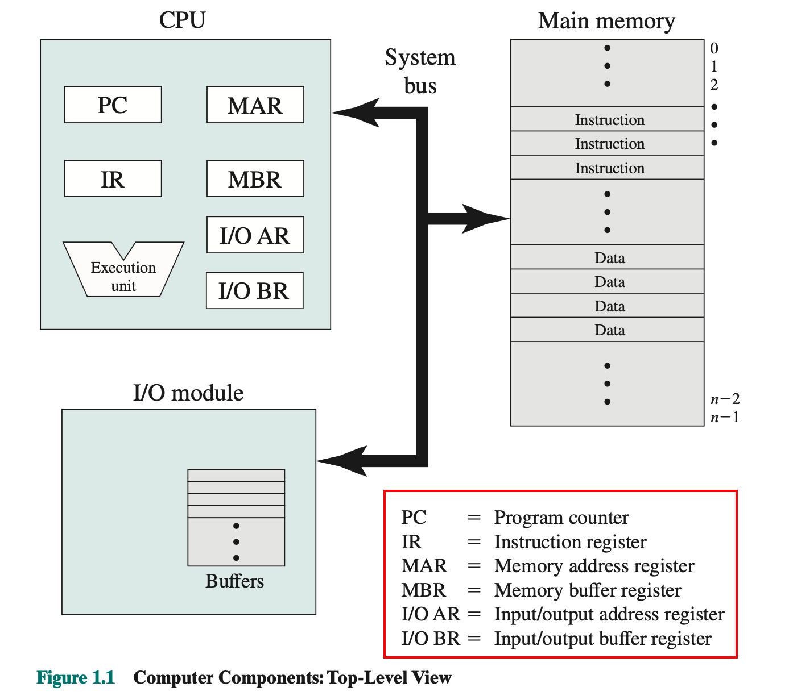
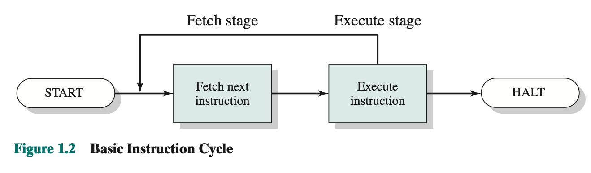

# 计算机系统概述
!!! abstract "本章学习目标"
    - 了解计算机系统的各个基本组成部分及它们间的内部关系
    - 了解处理器执行一条指令时的每个步骤
    - 掌握中断的概念，以及处理器如何及为何利用中断
    - 列举并描述典型计算机存储体系的每一层
    - 理解多处理器系统和多核计算机的基本特性
    - 讨论局部性概念，分析多级存储体系的性能
    - 掌握栈的操作，以及栈对过程调用和返回的支持
  
## 基本组成
在硬件层面，计算机由五大(四大)部分组成分别为`处理器` `存储系统` `输入\输出系统` `系统总线` 基本架构如下所示

注: MBR = MDR(Memory Date Register, 内存数据寄存器)

## 指令的执行
!!! note "基本指令周期"
    

## 中断

## 存储器的层次结构

## 高速缓存(Cache)

## 直接内存存取(DMA)

## 多处理器和多核计算机组织架构

## 总结

## 补充

