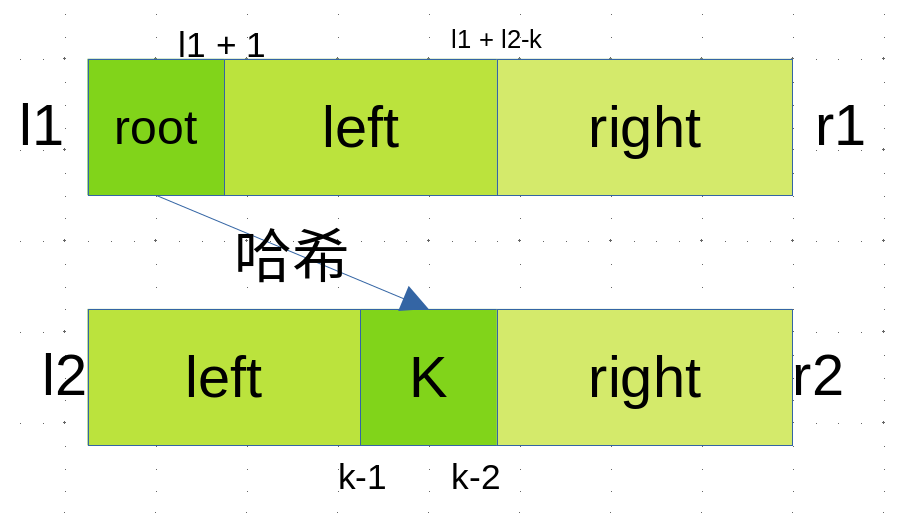

# 二叉树

!!! abstract "简介"
    在计算机科学领域，二叉树（Binary Tree） 是最基础且强大的数据结构之一。它以层次化分支结构模拟了现实世界中大量存在的分治关系，成为算法设计中递归思维的完美载体。从操作系统文件管理到数据库索引优化，从游戏决策树到机器学习模型，二叉树的变体和应用无处不在。

    基础阶段只包括二叉树的基本概念与递归定义，前中后序(递归与非递归实现)与层序遍历，以及二叉树的重要数学结论。

??? question "相关习题"
    [bfs的两种方法](https://leetcode.cn/problems/binary-tree-level-order-traversal/)

    [锯齿状遍历](https://leetcode.cn/problems/binary-tree-zigzag-level-order-traversal/)

    [最大特殊宽度](https://leetcode.cn/problems/maximum-width-of-binary-tree/)

    [最大深度](https://leetcode.cn/problems/maximum-depth-of-binary-tree/description/)

    [最小深度](https://leetcode.cn/problems/minimum-depth-of-binary-tree/)

    [先序遍历序列化和反序列化](https://leetcode.cn/problems/serialize-and-deserialize-binary-tree/)

    [层序遍历序列化和反序列化](https://leetcode.cn/problems/serialize-and-deserialize-binary-tree/)

    [先序遍历和中序遍历还原二叉树](https://leetcode.cn/problems/construct-binary-tree-from-preorder-and-inorder-traversal/)

    [判断完全二叉树](https://leetcode.cn/problems/check-completeness-of-a-binary-tree/)

    [求完全二叉树节点个数](https://leetcode.cn/problems/count-complete-tree-nodes/)

    [普通二叉树上求解LCA](https://leetcode.cn/problems/lowest-common-ancestor-of-a-binary-tree/description/)

    [搜索二叉树上求解LCA](https://leetcode.cn/problems/lowest-common-ancestor-of-a-binary-search-tree/description/)

    [收集累加和为`k`的所有路径](https://leetcode.cn/problems/path-sum-ii/)

    [判断平衡二叉树](https://leetcode.cn/problems/balanced-binary-tree/)

    [判断搜索二叉树](https://leetcode.cn/problems/validate-binary-search-tree/)

    [修剪搜索二叉树](https://leetcode.cn/problems/trim-a-binary-search-tree/description/)

    [二叉树上的打家劫舍问题](https://leetcode.cn/problems/house-robber-iii/description/)


## 二叉树的基本概念

!!! note "基本参数"
    {==深度与高度==}

    节点的高度(height):从根节点到该节点经过的边数。
    二叉树的深度(depth):从距离该节点最远的叶节点到该节点所需要经过的边树。
    注意，不同的题、教材对于根叶节点的高度、深度从0还是从1开始并不统一。
    但一般而言，说根节点的深度为0，叶子节点的高度为0


## 二叉树的层序遍历

主要介绍使用`队列`一次遍历一层的解法

!!! tip "关于队列" 
    若比赛且队列可能是算法的{==瓶颈==}尽量用静态数组实现的版本，否则用stl库中的队列就可以了。

## 锯齿形层序遍历
!!! question "测试链接"
    [leetcode 103.二叉树的锯齿形层序遍历](https://leetcode.cn/problems/binary-tree-zigzag-level-order-traversal/description/)

??? note "算法提示"
    这道题和上一道题思路上一致，只是需要注意每轮左右子树的加入顺序要交替


??? success "参考实现"
    === "方法1，按照上题解法"
        ```cpp
        // 方法一：完全按照上题的做法，只是在读入答案的时候判断一下
        // 是从左往右的读还是从右往左读，如果是从右往左读，就反转一
        //下`list`数组，其他什么都不需要改
        // false 表示 从左 往右读入
        // true 表示 从右往左读入
        bool flag = false; 
        ......;
        if (flag) reserve(list.begin(), list.end());
        flag = !flag;
        ans.push_back(list);
        ```
        

    === "方法二：先收集list再把左右节点加入队列"
        ```cpp
        // reverse == false, 左 -> 右， l....r-1, 收集size个
        // reverse == true,  右 -> 左， r-1....l, 收集size个
        // 左 -> 右, i = i + 1
        // 右 -> 左, i = i - 1
        for (int i = reverse ? r - 1 : l, j = reverse ? -1 : 1, k = 0; k < size; i += j, k++) {
            list.push_back(q[i]->val);
        }
        // 加入左右节点
        ```
## 最大特殊宽度
## 前序遍历的序列化和反序列化

!!! info "序列化与反序列化"
    序列化是将一个数据结构或者对象转换为连续的比特位的操作，进而可以将转换后的数据存储在一个文件或者内存中，同时也可以通过网络传输到另一个计算机环境，采取相反方式重构得到原数据。

    {==二叉树的前序序列和后序序列都可以完成序列化但中序序列并不能唯一确定西序列化的结果==}
!!! question "测试链接"
    [leetcode297.二叉树的序列化和反序列化](https://leetcode.cn/problems/serialize-and-deserialize-binary-tree/description/)


操作倒是简单这道题感觉不是算法题是`coding`能力测试题

- 对该二叉树进行一次先序遍历
- 对于非空节点`x`记录其为字符串`x,` 
- 对于空节点记录为`#,` 
- 注意某一节点若其左右子树为空也需要记录为`#,` 

!!! tip "编码技巧"
    可以使用 `istringstream`类型把字符串转化为流输出，进而可以用>>直接过滤空格

??? success "参考实现"
    ```cpp
    // 感觉这道题考语法？
    class Codec {
    public:
        // Encodes a tree to a single string.
        string serialize(TreeNode* root) {
            if (!root) return "# ";
            return to_string(root->val) + " " + serialize(root->left) + serialize(root->right);
        }

        // Decodes your encoded data to tree.
        TreeNode* deserialize(string data) {
            istringstream iss(data); // 使用字符串流简化解析
            return buildTree(iss);
        }

    private:
        TreeNode* buildTree(istringstream &iss) {
            string val;
            iss >> val; // 自动跳过空格
            if (val == "#") return nullptr;
            TreeNode* node = new TreeNode(stoi(val)); // 处理多位数
            node->left = buildTree(iss);
            node->right = buildTree(iss);
            return node;
        }
    };
    ```
## 层序遍历的序列化和反序列化

!!! question "测试链接"
    [leetcode297.二叉树的序列化和反序列化](https://leetcode.cn/problems/serialize-and-deserialize-binary-tree/description/)

## 通过先序遍历和中序遍历复原二叉树 

!!! question "测试链接"
    [leetcode105.从前序遍历与中序遍历构造二叉树](https://leetcode.cn/problems/construct-binary-tree-from-preorder-and-inorder-traversal/)

关键思路

- 通过`前序遍历`确定根节点
- 通过`中序遍历`确定左右子树
- 递归这个过程就能还原出原二叉树

这道题的关键是理解这个边界图


!!! question "额外练习"
    还有两个类似的题目，但要注意如果单纯通过前序和后序是无法唯一还原二叉树的！

    [leetcode106.从中序遍历和后序遍历构造二叉树](https://leetcode.cn/problems/construct-binary-tree-from-preorder-and-inorder-traversal/)

    [leetcode889.根据前序遍历和后序遍历复原二叉树](https://leetcode.cn/problems/construct-binary-tree-from-preorder-and-postorder-traversal/description/)

## 判断完全二叉树

!!! question "测试链接"
    [leetcode958.二叉树完全性的验证](https://leetcode.cn/problems/check-completeness-of-a-binary-tree/description/)


**算法步骤**

- 使用`层序遍历`

- 如果一个节点左右子树齐全，则无需处理遍历下一个即可
- 如果一个节点有右子树，而左子树缺失则直接返回`false`
- 如果一个节点缺少右孩子，则记录之，遍历之后的节点
- 如果之后遍历的节点不全为叶子节点，则返回`false`
- 否则 返回`true`


##  完全二叉树的节点个数

!!! question "测试链接"
    [leetcode222.完全二叉树的节点个数](https://leetcode.cn/problems/count-complete-tree-nodes/description/)


 如果不考虑任何特性，遍历一边二叉树经过O(N) 的时间就能获得答案，所以这道题的难度为`Easy`。但人肯定还是得有点追求的啦，如何在`< O(N)`的时间内获得节点数目呢？

??? tip "完全二叉树特性"
    一个完全二叉树，必然是由一个`满二叉子树`和一个`完全二叉子树`或`满二叉子树`构成

| 算法图解                                                     |                                                              |
| ------------------------------------------------------------ | ------------------------------------------------------------ |
|  | 对于当前节点，检查其右子树的最左节点是否能到达整棵树的最底层 如果可以，说明左子树是满二叉树，直接计算左子树节点数(`2^(h-level)`)，然后递归处理右子树 如果不可以，说明右子树是满二叉树(但少一层)，直接计算右子树节点数(`2^(h-level-1)`)，然后递归处理左子树 |

## 普通二叉树求LCA问题
!!! note "LAC问题"
    {==LCA问题(Lowest Common Ancestor， 最近公共祖先)==}

    其中最近公共祖先的定义为：“对于有根树 T 的两个节点 p、q，最近公共祖先表示为一个节点 x，满足 x 是 p、q 的祖先且 x 的深度尽可能大（一个节点也可以是它自己的祖先）。”

分类讨论

- `p`或者`q`包含于另一颗树中
  - 则为`p`或者`q` （父节点）
- `p`和`q`分属于两颗树

算法思路

- 如果当前节点是`p`或者`q`或者`空` 则返回该节点
- 否则递归遍历该节点的左右子树
- 如果左子树返回了`nullpter`，则返回右子树的结果
- 反正若右子树返回了`nullpter`则返回左子树的结果
- 如果都非空则当前节点是`p、q`的最近公共祖先

??? success "参考实现"    
    ```cpp
    class Solution {
    public:
        TreeNode* lowestCommonAncestor(TreeNode* root, TreeNode* p, TreeNode* q) {
            // 如果找到p、q或者节点为空则返回
            if (root == nullptr || root == p || root == q) return root;
            // 左树遍历结果
            TreeNode *l = lowestCommonAncestor(root->left, p, q); 
            // 右树遍历结果
            TreeNode *r = lowestCommonAncestor(root->right, p, q);
            
            // 左右子树各有p或者q，则当前节点为公共祖先
            if (l != nullptr && r != nullptr) return root;
            // 左右子树都没找到，返回空
            if (l == nullptr && r == nullptr) return nullptr;
            // 否则，返回p或者q对应情况1
            return l != nullptr ? l : r;
        }
    };
    ```

## 搜索二叉树的LCA问题
和上一道题一样，但这里可以利用其{==左子树<根节点<右子树==}的特性，一次筛选出不少点。

- 如果`root == p`或者`root == q`则直接就是答案
- 如果`root.val > max(p.val, q.val)` `p和q`必然位于`root->left`中
- 如果`root.val < min(p.val, q.val)` `p和q`必然位于`root->right`中
- 如果`root.val`位于`p.val`和`q.val`直接，则直接返回`root`为答案

??? success "参考实现"
    ```cpp
    class Solution {
    public:
        TreeNode* lowestCommonAncestor(TreeNode* root, TreeNode* p, TreeNode* q) {
            while (root->val != p->val && root->val != q->val) {
                if (min(p->val, q->val) < root->val && root->val < max(p->val, q->val)) break;
                root = root->val < min(p->val, q->val) ? root->right : root->left;
            }
            return root;
        }
    };
    ```

## 收集路径和为k的路径
??? success "参考实现"
    ```cpp
    class Solution {
    public:
        vector<vector<int>> pathSum(TreeNode* root, int targetSum) {
            if (root == nullptr) return {};
            target = targetSum;
            dfs(root, 0);
            return ans;
        }
    private:
        vector<int> path;
        vector<vector<int>> ans;
        int target = 0;
        void dfs(TreeNode *root, int sum) {
            path.push_back(root->val); // 将当前节点加入路径
            if (root->left == nullptr && root->right == nullptr) {
                if ((sum + root->val) == target) {
                    ans.push_back(path); // 找到一条路径，加入答案
                }
            }
            if (root->left != nullptr) {
                dfs(root->left, sum + root->val); // 递归左子树
                path.pop_back();
            }
            if (root->right != nullptr) {
                dfs(root->right, sum + root->val); // 递归右子树
                path.pop_back();
            }
        }
    };
    ```
## 判断一个树是否为平衡二叉树
!!! tip "平衡二叉树的特性"
    
??? success "参考实现"
    ```cpp
    class Solution {
    public:
        bool isBalanced(TreeNode* root) {
            hight(root);
            return balance;
        }
    private:
        bool balance = true;
        int hight(TreeNode *root) {
            // 如果已经不平衡直接返回
            // 空节点返回0
            if (!balance || root == nullptr) return 0;

            // 递归计算左子树的高度
            int l_size = hight(root->left);
            // 递归计算右子树的高度
            int r_size = hight(root->right);

            // 判断左右子树的高度差
            if (abs(l_size - r_size) > 1) balance = false;
            // 返回树的高度
            return max(l_size, r_size) + 1;
        }
    };
    ```

## 判断一个树是否为搜索二叉树


