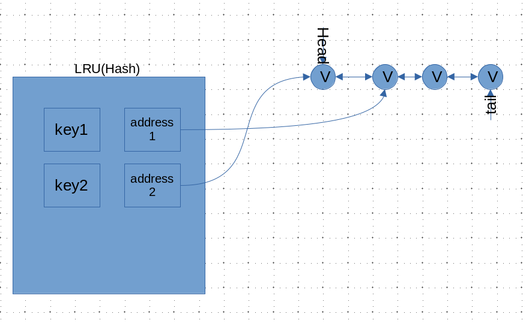

# 数据结构设计习题

  
重点

  

      <a href="https://github.com/juanniaoxx/zuo_Algorithm/tree/main/zuo_035%20Date%20Structure%20Design%20Question" target="_block">参考实现</a>
  

 
> 主要内容
>
> - [x] 题目1: [`setAll`功能的哈希表](https://www.nowcoder.com/practice/7c4559f138e74ceb9ba57d76fd169967)
> - [x] 题目2: [实现`LRU`结构](https://leetcode.cn/problems/lru-cache/)
> - [ ] 题目3: [插删随$O(1)$的结构](https://leetcode.cn/problems/insert-delete-getrandom-o1/)
> - [ ] 题目4: [插删随$O(1)$的结构加强版](https://leetcode.cn/problems/insert-delete-getrandom-o1-duplicates-allowed/description/)
> - [ ] 题目5: [快速获得数据流的中位数 ](https://leetcode.cn/problems/find-median-from-data-stream/)
> - [ ] 题目6: [最大频率栈](https://leetcode.cn/problems/maximum-frequency-stack/)
> - [ ] 题目7: [全是O(1)的结构](https://leetcode.cn/problems/all-oone-data-structure/)

### `setAll`功能的哈希表

> 测试链接 [牛客. 设计有`setAll`功能的哈希表](https://www.nowcoder.com/practice/7c4559f138e74ceb9ba57d76fd169967)

提示:C++选手若有需要可以使用unordered_map替换map来将复杂度从O(log n)降为O(1)

设计思路

- 将 `key-value`改成`key - pair<value, time>` 

- 设置三个全局变量`setAllTime` 和 `setAllValue` 与 `cnt`
  - 每次加入加入一对`key-value` `cnt++` ,并且将`time = cnt`
  - 每次执行`setAll`的时候设置`setAllTime = cnt` 和 `setAllValue = 要修改的值` ,并且`cnt++`
    - 注意，这一步并不会修改`key-value`
  - 执行`get()`操作的时候，检查`time`与`setAllTime`若`time < setAllTime`则修改`value = setAllvalue`否则直接获得值

----

### 实现`LRU`结构

> 测试链接 [leetcode 146.`LRU`缓存 mid](https://leetcode.cn/problems/lru-cache/)

设计思路

`双向链表 + 哈希表`

- 插入`key-value`的时候创建一个`双向链表节点` ,并且`value`为指向该节点的指针
- 利用全局指针`head`和`tail`定位链表的头节点和尾节点
- 每次添加、修改、查询时候将对应节点移动到`tail`的后面，并让`tail`指向该节点
  - `tail`指向的永远是最新被操作的数据
  - `head`指向永远是最最旧未被使用的数据
- 容量不够的时候，释放`head`对应的节点，并移动`head = head->next`,同时去除哈希表中`k-v`对

### O(1)时间插入、删除和获取随机元素

> 测试链接： [leetcode 380. O(1) 时间插入、删除和获取随机元素](https://leetcode.cn/problems/insert-delete-getrandom-o1/)

设计思路

- 肯定会有一个哈希表，同时申请一个动态数组(vector)存输入的数据
  - 哈希表为了去重
  - 动态数组为了random操作
- 考虑`remove`操作，如果仅仅是删除哈希表的记录，而不对数组进行任何处理，空余的位置将会越来越多从而十分影响`random`操作
  - 解决办法：使用最后一个元素覆盖被`remove`的元素，同时更新哈希表记录即可

