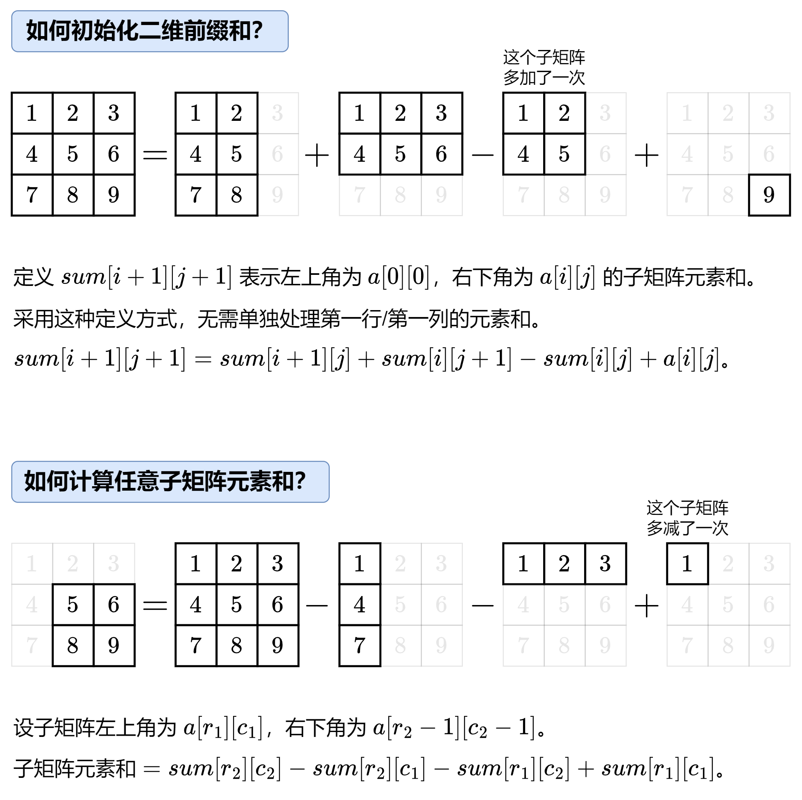

### 一维差分与等差数列差分

<div style="top: 10px; left: 10px; background: #f5f5f5; border-left: 4px solid #7f8c8d; border-radius: 4px; font-family: Arial, sans-serif; box-shadow: 0 2px 4px rgba(0, 0, 0, 0.1); ;">
  <div style="padding: 8px 12px; font-weight: bold; color: #7f8c8d;">💻 相关习题</div>
  <div style="padding: 8px 12px; padding-top: 0; color: #333;">
    <a href="https://leetcode.cn/problems/corporate-flight-bookings/description/">
        
        leetcode 1109.航班预订统计</a><br>
      <a href="https://www.luogu.com.cn/problem/P4231">
          
          洛谷P4231 三步必杀</a><br>
      <a href="https://www.luogu.com.cn/problem/P5026">
  
  洛谷P5026 Lycanthropy
</a>
    </div>
</div>
#### 一维差分

假设要在一个数组的[left, right]上进行n次操作

- 只在`left`位置加`x`而在`right + 1`位置减`x`
  - 相当于标记作用范围
- 通过前缀和还原出真正的结果

注意一维差分无法实现在操作的过程中 **查询**的操作

??? tip "一维差分模板"
	```cpp
	arr[left] += x;
	arr[right + 1] -= y;

	for (int i = 1; i < arr.size(); i++) arr[i] += arr[i - 1];
	```

#### 等差数列差分

!!! danger "提醒"
	等差数列差分在面试中并不常见，但在比赛中还是比较常见的

!!! Info "问题描述"
	一开始1-n范围上的数字都是0。接下来一共有m个操作。每次操作：l-r范围上依次加上首项s、末项e、公差d的数列
	最终1-n范围上的每个数字都要正确得到


具体的推导过程如下(通过最终状态反推参数)


??? tip "等差数列差分模板"
	```cpp
	// 等差数列差分模板
	void set(int l, int r, int s ,int e, int d) {
		arr[l] += s;
		arr[l + 1] += d - s;
		arr[r + 1] -= d + e;
		arr[r + 2] += e;
	}

	void build() {
		// 两次前缀和
		for (int i = 1; i <= n; i++) arr[i] += arr[i - 1];
		for (int i = 1; i <= n; i++) arr[i] += arr[i - 1];
	}
	```


### 二维前缀和

<div style="top: 10px; left: 10px; background: #f5f5f5; border-left: 4px solid #7f8c8d; border-radius: 4px; font-family: Arial, sans-serif; box-shadow: 0 2px 4px rgba(0, 0, 0, 0.1); ;">
  <div style="padding: 8px 12px; font-weight: bold; color: #7f8c8d;">💻 相关习题</div>
  <div style="padding: 8px 12px; padding-top: 0; color: #333;">
    <a href="https://leetcode.cn/problems/range-sum-query-2d-immutable/description/">
        leetcode 304.二维区域和检索-矩阵不可变(二维前缀和模板)</a><br>
      <a href="https://leetcode.cn/problems/largest-1-bordered-square/description/">leetcode 1139.最大以1为边界的正方形</a>
    </div>
</div>
二维前缀和的[基本原理](https://oi-wiki.org/basic/prefix-sum/)
!!! note "二维前缀和的时空复杂度"
	时间复杂度$O(nm)$
	空间复杂度$O(nm)$

??? tip "一个小技巧"
	如果创建一个和原数组一般大小的`sum`数组，则单独讨论第`0`行和第`0`列边界条件
	但是我们可以按照如图的方式扩大`sum`数组避免边界条件的讨论 
	

!!! note "一张图了解二维前缀和"
    

??? tip "二维前缀和模板"
	```cpp
	class NumMatrix {
	public:
		NumMatrix(vector<vector<int>>& matrix) {
			int n = matrix.size();
			int m = matrix[0].size();
			// 设置sum大小为(n + 1, m + 1)避免边界讨论
			sum.resize(n + 1, vector<int>(m + 1));

			for (int a = 1, c = 0; c < n; a++, c++) {
				for (int b = 1, d = 0; d < m; b++, d++) {
					// 将matrix的元素对应的拷贝进sum
					// a -> c + 1
					// b -> d + 1
					sum[a][b] = matrix[c][d];
				}
			}

			for (int i = 1; i <= n; i++) 
				for (int j = 1; j <= m; j++)
					// 前缀和等于 上 + 左 + 自己 - 左上
					sum[i][j] += sum[i][j - 1] + sum[i - 1][j] - sum[i - 1][j - 1];
		}
		
		int sumRegion(int a, int b, int c, int d) {
			// a 子矩阵左上角行索引
			// b 子矩阵左上角列索引
			// c 子矩阵右下角行索引
			// d 子矩阵右下角列索引
			// [c + 1][d + 1]为大矩形
			// [c + 1][b]为上方小矩阵
			// [a][d + 1]为左侧小矩形
			// [a][b]为多减的小矩阵
			return sum[c + 1][d + 1] - sum[c + 1][b] - sum[a][d + 1] + sum[a][b];
		}
	private:
		vector<vector<int>> sum;
	};
	```
### 二维差分

<div style="top: 10px; left: 10px; background: #f5f5f5; border-left: 4px solid #7f8c8d; border-radius: 4px; font-family: Arial, sans-serif; box-shadow: 0 2px 4px rgba(0, 0, 0, 0.1); ;">
  <div style="padding: 8px 12px; font-weight: bold; color: #7f8c8d;">💻 相关习题</div>
  <div style="padding: 8px 12px; padding-top: 0; color: #333;">
    <a href="https://www.luogu.com.cn/problem/P3397">洛谷P3397地毯(二维差分模板)</a>
      <br>
      <a href="https://leetcode.cn/problems/stamping-the-grid/description/">leetcode2132.用邮票贴满网格图</a>
    </div>
</div>

### 离散化技巧

<div style="top: 10px; left: 10px; background: #f5f5f5; border-left: 4px solid #7f8c8d; border-radius: 4px; font-family: Arial, sans-serif; box-shadow: 0 2px 4px rgba(0, 0, 0, 0.1); ;">
  <div style="padding: 8px 12px; font-weight: bold; color: #7f8c8d;">💻 相关习题</div>
  <div style="padding: 8px 12px; padding-top: 0; color: #333;">
    <a href="https://leetcode.cn/problems/xepqZ5/description/">leetcode LCP74.最强祝福力场</a>
    </div>
</div>