

  
重点

  

      <a href="https://github.com/juanniaoxx/zuo_Algorithm/tree/main/zuo_034%20List%20Question" target="_block">参考实现</a>
  

 
> 链表题目并不是算法设计题，而是很经典的Coding能力考察！
>
> 一般也是`填函数风格`而不会是`Acw` 
>
> - [x] [leetcode 160.相交链表 Easy](https://leetcode.cn/problems/intersection-of-two-linked-lists/)
> - [x]  [leetcode 25 K个一组反转链表 Hard](https://leetcode.cn/problems/reverse-nodes-in-k-group/description/)
> - [x] [leetcode 138.随机链表的复制 mid](https://leetcode.cn/problems/copy-list-with-random-pointer/description/)
> - [x] [leetcode 234回文链表 easy](https://leetcode.cn/problems/palindrome-linked-list/description/)
> - [x] [leetcode 142环形链表II mid](https://leetcode.cn/problems/linked-list-cycle-ii/description/)
> - [x] [leetcode 148链表排序(思路mid,代码hard)](https://leetcode.cn/problems/sort-list/solutions/2993518/liang-chong-fang-fa-fen-zhi-die-dai-mo-k-caei/)

### 链表题的注意点

- 空间要求不严格 使用容器实现即可
- 空间要求严格  要求O(1)的空间复杂度
- 最常用技巧-快慢指针
- 本质不是算法设计能力而是coding能力
- 链表需要多多训练才可以！

  
提示

  

      和链表相关的难题会在[拓展]约瑟夫环中涉及
  

### 经典题目

#### Question 1 两个链表相交的第一个节点

> 测试链接 [leetcode 160.相交链表 Easy](https://leetcode.cn/problems/intersection-of-two-linked-lists/)
>

最直观的想法，使用`Hashset`遍历某一个链表一次，再遍历另一个链表一次，每次遍历都查询一次。

- 这需要额外的容器，如果要求严格的空间复杂度则不对

| 算法思路                                                     | 解释                                                         |
| ------------------------------------------------------------ | ------------------------------------------------------------ |
| 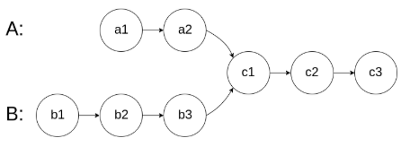 | 对于`A` `B`两个链表，若二者会相遇 则必然最总会达到同一个节点，且我们发现 `A` 与 `B`的长度之差一定在第一次相遇之前 故算法思路为 - 长链表 - 长度之差 并往下遍历，直到相同 |

#### Question 2 按组反转链表

> 测试链接 [leetcode 25 K个一组反转链表 Hard](https://leetcode.cn/problems/reverse-nodes-in-k-group/description/)

这道题思路倒是不难，难的是`Coding`实现的细节，如果不考虑$O(1)$的时间可以使用一个数组存入在进行反转，但考虑$O(1)$即进行原地反转需要考虑的细节就很多了。

  
重要

  
这道题思路不难难点在于如何写出不含bug的代码

| 算法图解                                                     | 解释                                                   |
| ------------------------------------------------------------ | ------------------------------------------------------ |
|  | 假设k=2                                                |
| 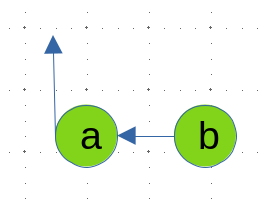 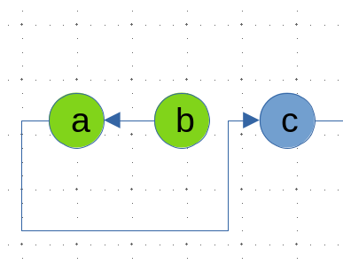 | 第一次操作的时候注意换头 两个一组，单独反转  |
| **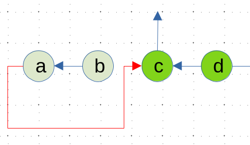** 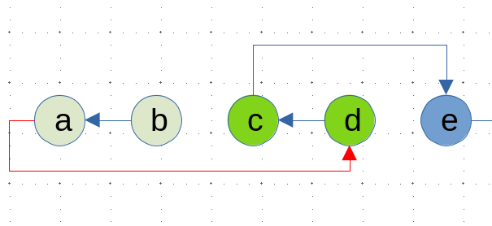 | 特别注意，这一条红色的线最终是要指向`d`                |
| 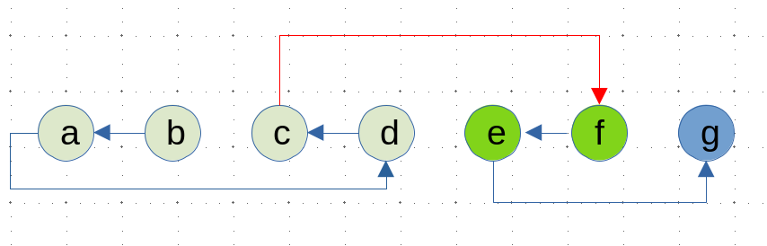 | `g` 不足2不需要改变                                    |

#### Question 3 复制带随机指针的链表

> 测试链接[leetcode 138.随机链表的复制 mid](https://leetcode.cn/problems/copy-list-with-random-pointer/description/)

这道题题意很简单，朴素思路也很简单。

- 使用`Hash`存储拷贝节点和原节点的`key-value`关系，通过遍历原节点，查`Hash`的办法确定拷贝节点的`next`和`random`指针的目标

- 不是用额外空间就需要一点技巧

  | 算法图解                                                     | 讲解                                                         |
  | ------------------------------------------------------------ | ------------------------------------------------------------ |
  | 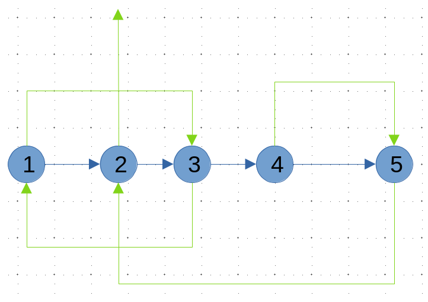 | `next`指针为蓝色 `random`指针为绿色                     |
  | 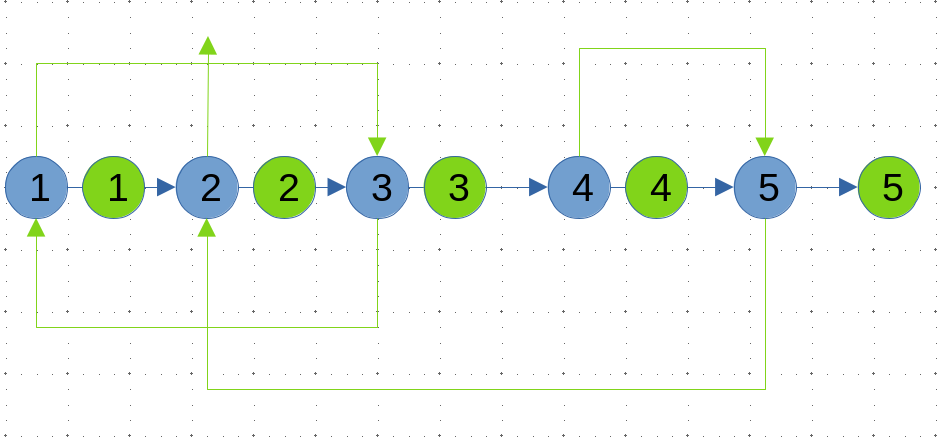 | 首先在每一个节点后面拷贝一个节点                             |
  | 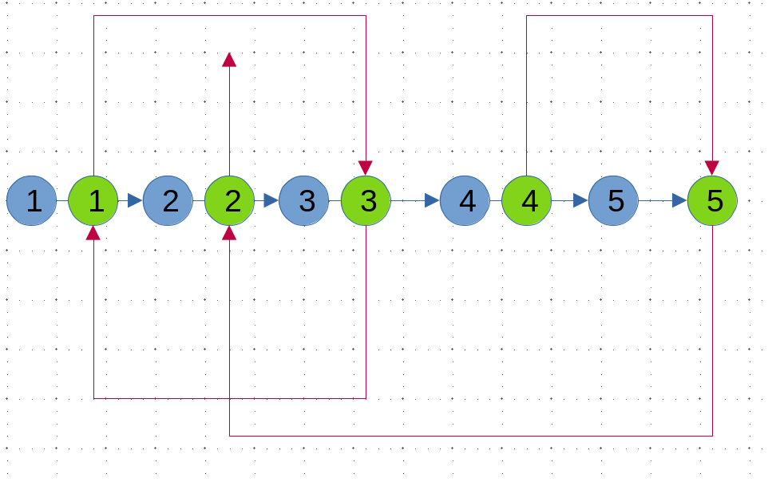 | 然后通过原来的节点的`random`指针确定 拷贝节点的`random`指针 `copy->random = original->random->next` 注意图中省去了原来的random指针，实际编码不可以改变 |
  |                                                              | 分离链表即可                                                 |

#### Question 4 判断链表是否存有回文结构

> 测试链接 [leetcode 234回文链表 easy](https://leetcode.cn/problems/palindrome-linked-list/description/)

简单思路：使用栈$O(N)$ ,读入读出一次即可判断

进阶思路：使用快慢指针

- 求中点
- 逆序另一边的链表
- 判断是否相同

| 算法图解                                                     | 解释                                                         |
| ------------------------------------------------------------ | ------------------------------------------------------------ |
| 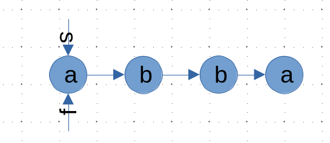 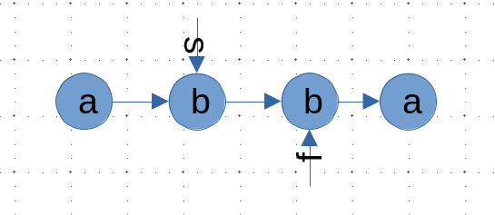 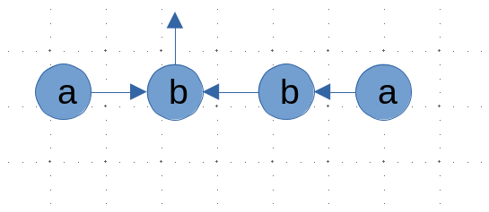 | 设置快慢双指针`s`表示满指针`f`表示快指针 其中`s`每次走一格,`f`每次走两格 当`f`为走不下去的时候`s`为中点 反转另一半链表，逐个比较就可以判断是否回文 |

  
重要

  
这道题思路不难,难点在于如何写出不含bug的代码

#### Question 5 链表第一个入环节点

> 测试链接 [leetcode 142环形链表II mid](https://leetcode.cn/problems/linked-list-cycle-ii/description/)

这是一道比较经典的快慢双指针问题($O(1)$时间复杂度的解法)

本质是一道数学题

| 算法图解                                                     | 解释                                                         |
| ------------------------------------------------------------ | ------------------------------------------------------------ |
| 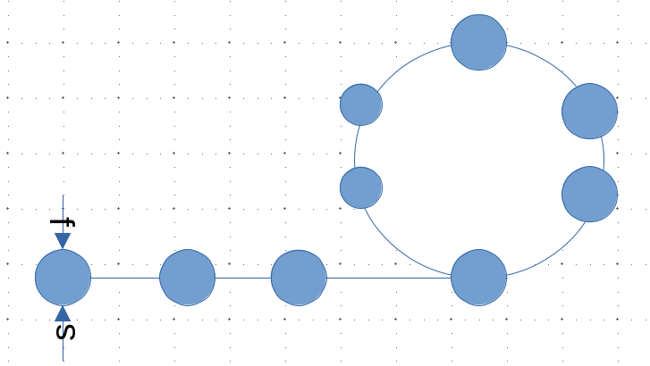 | 设置快慢双指针 快指针每次走两步 慢指针每次走一步数 |
| 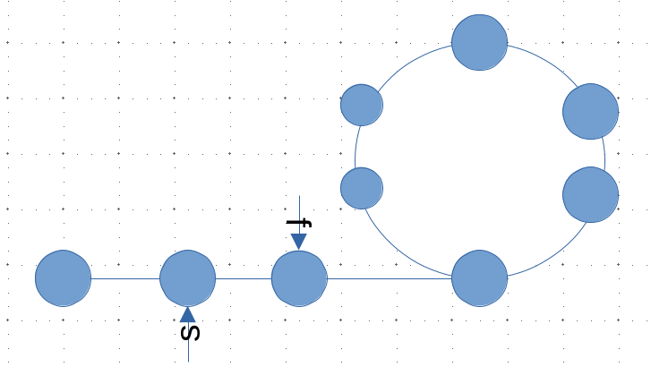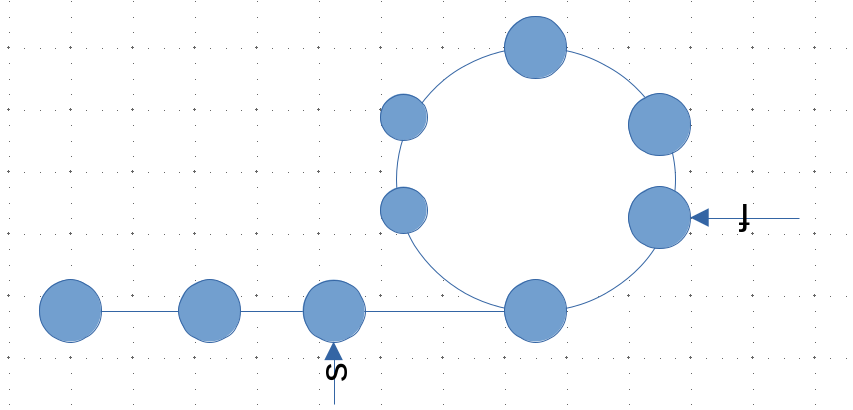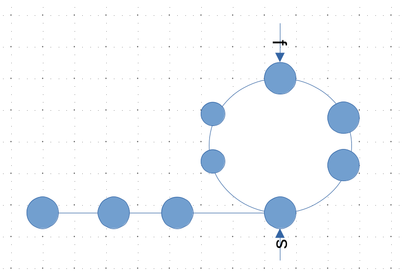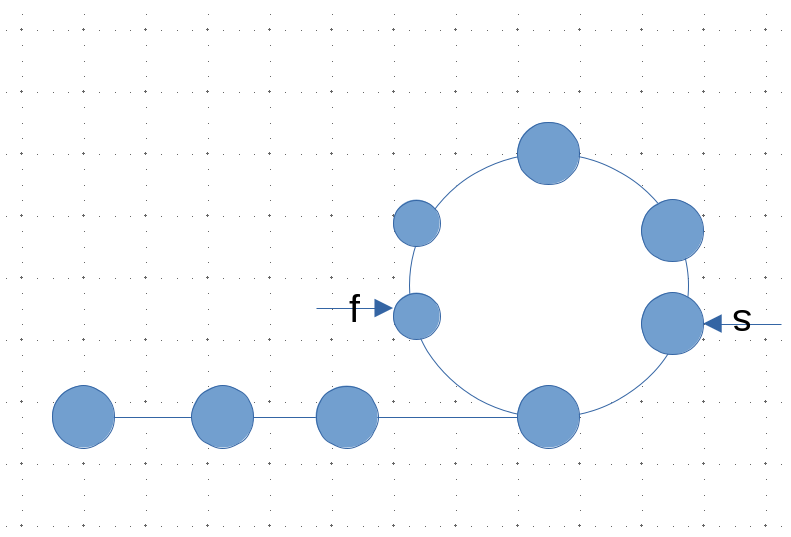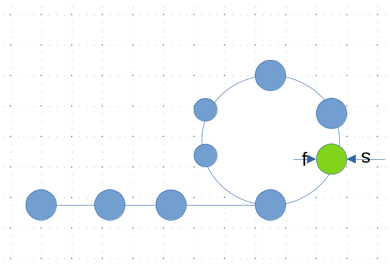 | 快慢指针必然会相遇                                           |
| 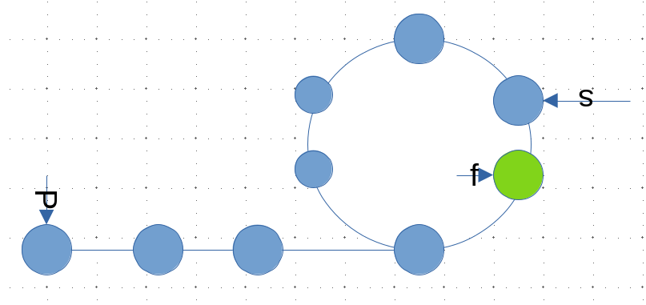 | 根据下方数学推到，从头节点和`slow` 此后`slow`和`p`每次向前`一步`，最终相遇的结点，比如是入环节点 |

数学推导

- 假设环外部分距离为`a` ,`slow`指针进入环后走了`b`与`fast`指针相遇
- 此时`fast`指针走完了`n`圈环
- `fast`走过的总距离为`a+n(b+c)+b = a+(n+1)b+nc`
- 由于任意时刻`fast`走过的距离一定为`slow`的两倍
- 则有`2a+2b = a+(n+1)b+nc` 即 `a=c+(n-1)(b+c)`

#### Question 6 链表排序

> 测试链接[leetcode 148链表排序](https://leetcode.cn/problems/sort-list/solutions/2993518/liang-chong-fang-fa-fen-zhi-die-dai-mo-k-caei/)

可以使用额外辅助空间的解法就很多了，比如使用递归版本的归并，甚至直接sort都可以，但是如果要求$O(1)$的常数空间并$O(n\log{n})$的时间复杂度并保证稳定性呢？

- 这个要求很明显只能用非递归版本的归并排序，具体算法图解看 1.2归并排序与归并分治
- 但由于是链表，些这段代码还是非常折磨的！

