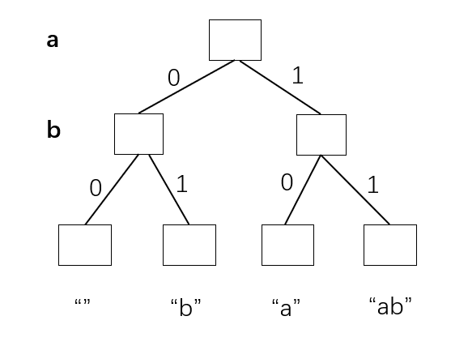
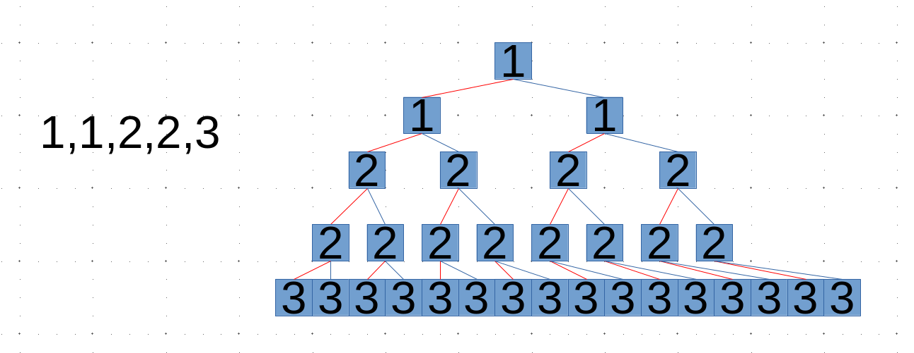

> - [x] 题目1 : 返回字符串全部子序列，子序列要求去重。时间复杂度O(2^n * n)
> - [ ] 题目2 : 返回数组的所有组合，可以无视元素顺序。时间复杂度O(2^n * n)
> - [ ] 题目3 : 返回没有重复值数组的全部排列。时间复杂度O(n! * n)
> - [ ] 题目4 : 返回可能有重复值数组的全部排列，排列要求去重。时间复杂度O(n! * n)
> - [ ] 题目5 : 用递归逆序一个栈。时间复杂度O(n^2)
> - [ ] 题目6 : 用递归排序一个栈。时间复杂度O(n^2)
> - [ ] 题目7 : 打印n层汉诺塔问题的最优移动轨迹。时间复杂度O(2^n)

### 递归的套路总结

<div style="top: 10px; left: 10px; max-width: 80%; background: #f8f9fa; border-left: 4px solid #3498db; border-radius: 4px; font-family: Arial, sans-serif; box-shadow: 0 2px 4px rgba(0,0,0,0.1); display: inline-block;">
  <div style="padding: 8px 12px; font-weight: bold; color: #3498db; white-space: nowrap;">引言</div>
  <div style="padding: 8px 12px; padding-top: 0; color: #333;">
      带路径的递归 vs 不带路径的递归(大部分dp, 状态压缩dp认为是路径简化了结构)
      <br>
      任何递归都是bfs且非常灵活，回溯这个术语可能并不重要
  </div>
</div>

-------

### 题目1 : 返回字符串全部子序列，子序列要求去重。

<div style="top: 10px; left: 10px; max-width: 80%; background: #f8f9fa; border-left: 4px solidrgb(57, 130, 179); border-radius: 4px; font-family: Arial, sans-serif; box-shadow: 0 2px 4px rgba(0,0,0,0.1); display: inline-block;">
  <div style="padding: 8px 12px; font-weight: bold; color: #3498db; white-space: nowrap;">测试链接</div>
  <div style="padding: 8px 12px; padding-top: 0; color: #333;">
      <a href="https://www.nowcoder.com/practice/92e6247998294f2c933906fdedbc6e6a">牛客.字符串的全部子序列</a>
  </div>
</div>

```cpp
class Solution {
public:
    /**
     * 代码中的类名、方法名、参数名已经指定，请勿修改，直接返回方法规定的值即可
     *
     *
     * @param s string字符串
     * @return string字符串vector
     */
    vector<string> generatePermutation(string s) {
        // write code here
        path.resize(s.size());
        dfs(s, 0, 0);
        return vector<string>(set.begin(), set.end());
    }
private:
    string path;
    unordered_set<string> set;
    void dfs(string& s, int i, int size) {
        if (i == s.size()) {
            set.insert(path.substr(0, size));
        } else {
            path[size] = s[i]; // 如果不初始化path长度这里就会越界
            dfs(s, i + 1, size + 1);
            dfs(s, i + 1, size);
        }
    }
};
```



使用`path`记录当前遍历过的节点，由于`dfs`的特性，只需要考虑最后一个被遍历的元素是否使用即可，通过传入`size`和`size+1`来实现当前元素使用与否的判断

<div style="top: 10px; left: 10px;background: #f8f9fa; border-left: 4px solid #e67e22; border-radius: 4px; font-family: Arial, sans-serif; box-shadow: 0 2px 4px rgba(0,0,0,0.1); ">
  <div style="padding: 8px 12px; font-weight: bold; color: #e74c3c;">拓展</div>
  <div style="padding: 8px 12px; padding-top: 0; color: #333;">位运算版本</div>
</div>

```cpp
vector<string> generatePermutation(string s) {
    unordered_set<string> set;
    int n = s.size();
    // 如果不需要空子串则从1开始
    for (int mask = 0; mask < (1 << n); ++mask) {
        string sub;
        for (int i = 0; i < n; ++i) {
            if (mask & (1 << i)) sub += s[i];
        }
        set.insert(sub);
    }
    return vector<string>(set.begin(), set.end());
}
```

### 题目2 : 返回数组的所有组合，可以无视元素顺序。

<div style="top: 10px; left: 10px; max-width: 80%; background: #f8f9fa; border-left: 4px solidrgb(57, 130, 179); border-radius: 4px; font-family: Arial, sans-serif; box-shadow: 0 2px 4px rgba(0,0,0,0.1); display: inline-block;">
  <div style="padding: 8px 12px; font-weight: bold; color: #3498db; white-space: nowrap;">测试链接</div>
  <div style="padding: 8px 12px; padding-top: 0; color: #333;">
      <a href="https://leetcode.cn/problems/subsets-ii/">leetcode90.子集II</a>
  </div>
</div>

方法一：暴力枚举



可以完全按照上题的思路写，但要注意`c++`默认并不支持对`vector`哈希化，需要自己写hash处理函数。

方法二：剪枝优化(课程上讲的)

排序并划分元素比如说上面这个例子`1,1,2,2,3`

- 选`0`个1,并且从第一个`2`开始递归
  - 选`0`个2,从第一个`3`开始递归
    - 选`0`个3
    - 选`1`个3
  - 选`1`个2,,从第一个`3`开始递归
    - .....
  - 选`2`个2,,从第一个`3`开始递归
    - ........
- 选`1` 个1,并且从第一个`2`开始递归
  - .....
- 选`2`个1,并且从第一个`2`开始递归
  - .......

```cpp
void dfs(vector<int>& nums, int i, int size) {
    if (i == nums.size()) {
        ans.push_back(vector<int>(path.begin(), path.begin() + size));
    } else {
        int j = i + 1;
        while (j < nums.size() && nums[i] == nums[j]) {
            // 记录与当前元素重复的元素有多少个
            j++;
        }

        // 去找一个不重复的元素
        dfs(nums, j, size);
        for (; i < j; i++) {
            path[size++] = nums[i]; 
            // 选择1个、2个、3个....个当前元素
            dfs(nums, j, size);
        }
    }
}
```

还有另一套剪枝逻辑

```cpp
void dfs(vector<int>& nums, int start) {
    result.insert(current);

    for (int i = start; i < nums.size(); i++) {
        if (i > start && nums[i] == nums[i-1]) continue; // 跳过重复元素
        current.push_back(nums[i]);
        dfs(nums, i + 1);
        current.pop_back();
    }
}
```

### 题目3 : 返回没有重复值数组的全部排列。

<div style="top: 10px; left: 10px; max-width: 80%; background: #f8f9fa; border-left: 4px solidrgb(57, 130, 179); border-radius: 4px; font-family: Arial, sans-serif; box-shadow: 0 2px 4px rgba(0,0,0,0.1); display: inline-block;">
  <div style="padding: 8px 12px; font-weight: bold; color: #3498db; white-space: nowrap;">测试链接</div>
  <div style="padding: 8px 12px; padding-top: 0; color: #333;">
      <a href="https://leetcode.cn/problems/permutations/description/">leetcode46.全排列</a>
  </div>
</div>

题目保证了数据不重复，所以是一个很直观的`dfs`例题

比如说`1, 2, 3`

- 在`0`位置可以选择`1` `2` `3`
  - 选择`1`
    - 在`1`位置可以选择`2`, `3`
      - 选择`2` 可以选择 `3`
        - 选择`3`输出 123
      - 选择`3` 可以选择`2`
        - 选择`2`输出 132
  - 选择`2`
    - ....
  - 选择`3`
    - .....
  
  这道题可以不需要开一个额外数组来做，可以通过修改原数组实现。
  
  ```cpp
  void dfs(vector<int> &nums, int i) {
      if (i == nums.size()) ans.push_back(nums); // 递归终止条件
      else {
          for (int j = i; j < nums.size(); j++) {
              swap(nums[i], nums[j]); // 选下个元素
              dfs(nums, i + 1);
              swap(nums[i], nums[j]); // 还原
          }
      }
  }
  ```
  
  **递归过程**
  
  - `nums = [1, 2, 3]` `i = j = 0` ---> `dfs(nums, 1)`
    - `nums = [1, 2, 3]` , `i = j = 1` ---> `dfs(nums, 2)`
      - `nums = [1, 2, 3]` , `i = j = 2` ---> `dfs(nums, 3)`
        - 这一次调用结束`nums = [1, 2, 3]`加入答案
      - `nums = [1, 2, 3]` , `i = 2, j = 3` 循环结束退出调用
    - `nums = [1, 3, 2]` , `i = 1, j = 2` ---> `dfs(nums, 2)`
      - `nums = [1, 3, 2]` , `i = j = 2` ---> `dfs(nums, 3)`
        - 这一次调用结束`nums = [1, 3, 2]`加入答案
      - `nums = [1, 2, 3]` , `i = 2, j = 3` 循环结束退出调用
    - `nums = [1, 2, 3]` , `i = 1, j = 3` 循环结束退出调用
  - `nums = [2, 1, 3]` `i = 0, j = 1` ---> `dfs(nums, 1)`
    - .....同上

###  题目4 : 返回可能有重复值数组的全部排列，排列要求去重。

<div style="top: 10px; left: 10px; max-width: 80%; background: #f8f9fa; border-left: 4px solidrgb(57, 130, 179); border-radius: 4px; font-family: Arial, sans-serif; box-shadow: 0 2px 4px rgba(0,0,0,0.1); display: inline-block;">
  <div style="padding: 8px 12px; font-weight: bold; color: #3498db; white-space: nowrap;">测试链接</div>
  <div style="padding: 8px 12px; padding-top: 0; color: #333;">
      <a href="https://leetcode.cn/problems/permutations/description/">leetcode47.全排列II</a>
  </div>
</div>

### 题目5 : 用递归逆序一个栈。

### 题目6 : 用递归排序一个栈。

### 题目7 : 打印n层汉诺塔问题的最优移动轨迹。

