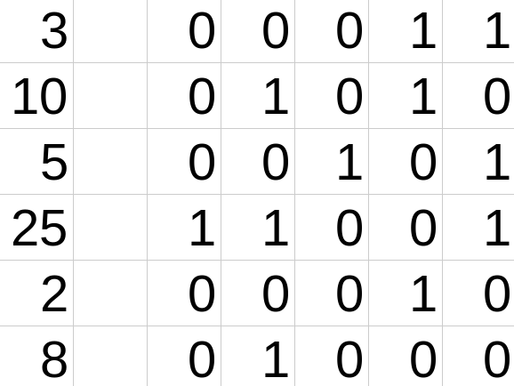
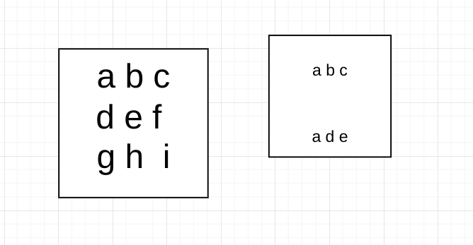
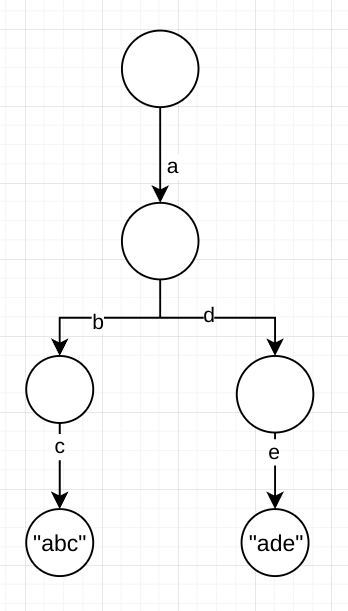

# 前缀树（字典树）

### 前缀树的基本概念

<div style="top: 10px; left: 10px; background: #f8f9fa; border-left: 4px solid #e74c3c; border-radius: 4px; font-family: Arial, sans-serif; box-shadow: 0 2px 4px rgba(0, 0, 0, 0.1); ;">
  <div style="padding: 8px 12px; font-weight: bold; color: #e74c3c;">⚠️ 重要</div>
  <div style="padding: 8px 12px; padding-top: 0; color: #333;">前缀树相关操作的复杂度</div>
</div>

- 插入操作 $O(N)$ 与 $O(N)$ 
- 搜索操作$O(N)$与$O(1)$
- 前缀查找操作$O(N)$和$O(1)$
- 删除操作$O(M)$和$O(1)$


<div style="top: 10px; left: 10px; background: #f0f7ff; border-left: 4px solid #3498db; border-radius: 4px; font-family: Arial, sans-serif; box-shadow: 0 2px 4px rgba(0, 0, 0, 0.1); ;">
  <div style="padding: 8px 12px; font-weight: bold; color: #3498db;">🔍 Trie</div>
  <div style="padding: 8px 12px; padding-top: 0; color: #333;">The Trie data structure is a tree-like structure used for storing a dynamic set of strings. It allows for efficient retrieval and storage of keys, making it highly effective in handling large datasets. Trie supports operations such as insertion, search, deletion of keys, and prefix searches. </div>
</div>

 经典的前缀树一般不在节点内存储信息（上图只是个示意）而是通过路径存储形象，节点一般存有`poss`与`end`，其中`poss`表明有多少个字符串经过该节点，`end`表示多少个字符串以该节点结束。

### 不推荐-前缀树的类实现

<div style="top: 10px; left: 10px; background: #f5f5f5; border-left: 4px solid #7f8c8d; border-radius: 4px; font-family: Arial, sans-serif; box-shadow: 0 2px 4px rgba(0, 0, 0, 0.1); ;">
  <div style="padding: 8px 12px; font-weight: bold; color: #7f8c8d;">💻 测试链接</div>
  <div style="padding: 8px 12px; padding-top: 0; color: #333;">
    <a href="https://www.nowcoder.com/practice/7f8a8553ddbf4eaab749ec988726702b">牛客.字典树的实现</a>
    </div>
</div>

```cpp
struct TrieNode {
    int pass;
    int end;
    std::array<TrieNode*, 26> next = {};
    TrieNode() : pass(0), end(0) {
        for (int i = 0; i < 26; ++i) {
            next[i] = nullptr;
        }
    }
    ~TrieNode() {
        for (int i = 0; i < 26; ++i) {
            if (next[i] != nullptr) {
                delete next[i];
            }
        }
    }
};
TrieNode *root;
```

`Trie`的节点如上所示

- `pass`表明有多少个字符串经过了该节点
- `end`表明有多少个字符串以该节点结尾
- `next[]`使用指针数组存储一个节点的26条路径
  - `a`->0,`b`->1 .... z->`25` 
  - 注意这里硬编码了数组大小

**基本操作**

- 初始化`Trie`类
  ```cpp
      Trie() {
          root = new TrieNode();
      }
  ```

- 插入操作(insert)
  ```cpp
  // 插入操作
  void insert(string word) {
      TrieNode *node = root;
      node->pass++; // 根节点的 pass 增加
      for (int i = 0; i < word.size(); i++) {
          int path = word[i] - 'a'; // 计算字符对应的路径（0~25）
          if (node->next[path] == nullptr) {
              node->next[path] = new TrieNode(); // 如果子节点不存在，创建新节点
          }
          node = node->next[path]; // 移动到子节点
          node->pass++; // 当前节点的 pass 增加
      }
      node->end++; // 单词最后一个字符的 end 增加
  }
  ```

- 查询操作
  ```cpp
  int search(string word) {
      TrieNode *node = root;
      for (int i = 0; i < word.size(); i++) {
          int path = word[i] - 'a';
          if(node->next[path] == nullptr) return 0; // 未遍历完word且下一个字符未加入Trie则返回0
          node = node->next[path];
      }
      return node->end;
  }
  ```

- 查询前缀操作
  ```cpp
  int search_prefix(const string &prev) {
      TrieNode *node = root;
      for (int i = 0; i < prev.size(); i++) {
          int path = prev[i] - 'a';
          if (node->next[path] == nullptr) return 0;
          node = node->next[path];
      }
      return node->pass; // 返回经过该节点的字符串个数
  }
  ```

- 删除操作

  - 如果有，删除一次
  - 如果没有，什么都不做

  ```cpp
  void erase(const string &word) {
      // 只有该字符串存在于Trie中才需要操作
      if (search(word) > 0) {
          TrieNode *node = root;
          node->pass--;
          for (int i = 0; i < word.size(); i++) {
              int path = word[i] - 'a';
              if(--node->next[path]->pass == 0) {
                  delete node->next[path];
                  node->next[path] = nullptr;
                  return ;
              }
              node = node->next[path];
          }
          node->end--;
      }
  }
  ```

<div style="top: 10px; left: 10px; background: #f8f9fa; border-left: 4px solid #e74c3c; border-radius: 4px; font-family: Arial, sans-serif; box-shadow: 0 2px 4px rgba(0, 0, 0, 0.1); ;">
  <div style="padding: 8px 12px; font-weight: bold; color: #e74c3c;">⚠️ 重要</div>
  <div style="padding: 8px 12px; padding-top: 0; color: #333;">可以改用哈希表存储更多字符</div>
</div>

### 推荐-前缀树的静态数组实现

<div style="top: 10px; left: 10px; background: #f5f5f5; border-left: 4px solid #7f8c8d; border-radius: 4px; font-family: Arial, sans-serif; box-shadow: 0 2px 4px rgba(0, 0, 0, 0.1); ;">
  <div style="padding: 8px 12px; font-weight: bold; color: #7f8c8d;">💻 测试链接</div>
  <div style="padding: 8px 12px; padding-top: 0; color: #333;">
    <a href="https://www.nowcoder.com/practice/7f8a8553ddbf4eaab749ec988726702b">牛客.字典树的实现</a>
    </div>
</div>
使用如下静态数组实现

```cpp
const int MAX; // 设置一个合理数值
int trie[MAX][26]; // 记录路径信息
int Pass[MAX], End[MAX]; // 记录pass数据和end数据
// 舍弃节点0不用
int cnt = 1; // 当前节点
```

<div style="top: 10px; left: 10px; background: #f5f5f5; border-left: 4px solid #7f8c8d; border-radius: 4px; font-family: Arial, sans-serif; box-shadow: 0 2px 4px rgba(0, 0, 0, 0.1); ;">
  <div style="padding: 8px 12px; font-weight: bold; color: #7f8c8d;">💻 参考代码</div>
  <div style="padding: 8px 12px; padding-top: 0; color: #333;">
    <a href="https://www.nowcoder.com/practice/7f8a8553ddbf4eaab749ec988726702b"></a>
    </div>
</div>

```cpp
// 插入操作：将单词插入到Trie树中
void insert(const string &word) {
    int cur = 1;  // 从根节点(节点1)开始
    Pass[cur]++;  // 根节点的Pass计数+1（表示经过根节点的路径数+1）
    
    // 遍历单词的每个字符
    for (int i = 0; i < word.size(); i++) {
        int path = word[i] - 'a';  // 将字符转换为0-25的索引(对应26个字母)
        
        // 如果当前字符对应的子节点不存在，则创建新节点
        if (trie[cur][path] == 0) {
            trie[cur][path] = ++cnt;  // 分配新节点，cnt递增
        }
        
        cur = trie[cur][path];  // 移动到子节点
        Pass[cur]++;  // 当前节点的Pass计数+1（表示经过该节点的路径数+1）
    }
    
    End[cur]++;  // 单词结束节点的End计数+1（表示以该节点结尾的单词数+1）
}

// 查询操作：检查单词是否存在于Trie树中
int search(const string &word) {
    int cur = 1;  // 从根节点(节点1)开始
    
    // 遍历单词的每个字符
    for (int i = 0; i < word.size(); i++) {
        int path = word[i] - 'a';  // 将字符转换为0-25的索引
        
        // 如果当前字符对应的子节点不存在，则单词不存在
        if (trie[cur][path] == 0) {
            return 0;  // 返回0表示单词不存在
        }

        cur = trie[cur][path];  // 移动到子节点
    }
    
    // 检查当前节点是否是某个单词的结束节点
    return End[cur];  // 返回End计数(0表示不存在，>0表示存在)
}

// 查询前缀操作：统计以给定前缀开头的单词数量
int search_prefix(const string &pre) {
    int cur = 1;  // 从根节点(节点1)开始
    
    // 遍历前缀的每个字符
    for (int i = 0; i < pre.size(); i++) {
        int path = pre[i] - 'a';  // 将字符转换为0-25的索引
        
        // 如果当前字符对应的子节点不存在，则前缀不存在
        if (trie[cur][path] == 0) {
            return 0;  // 返回0表示前缀不存在
        }
        
        cur = trie[cur][path];  // 移动到子节点
    }
    
    // 返回经过该前缀节点的路径数(Pass计数)
    return Pass[cur];
}

// 删除操作：从Trie树中删除单词
void erase(const string &word) {
    // 先检查单词是否存在
    if (search(word)) {
        int cur = 1;  // 从根节点(节点1)开始
        Pass[cur]--;  // 根节点的Pass计数-1
        
        // 遍历单词的每个字符
        for (int i = 0; i < word.size(); i++) {
            int path = word[i] - 'a';  // 将字符转换为0-25的索引
            
            // 减少当前节点的Pass计数
            if (--Pass[trie[cur][path]] == 0) {
                // 如果Pass计数减为0，表示没有其他单词经过该节点
                // 可以安全删除该节点(设置为0)
                trie[cur][path] = 0;
                return;  // 删除完成，直接返回
            }
            
            cur = trie[cur][path];  // 移动到子节点
        }
        
        End[cur]--;  // 单词结束节点的End计数-1
    }
    // 如果单词不存在，则不做任何操作
}
```

### 前缀树的相关习题

<div style="top: 10px; left: 10px; background: #f5f5f5; border-left: 4px solid #7f8c8d; border-radius: 4px; font-family: Arial, sans-serif; box-shadow: 0 2px 4px rgba(0, 0, 0, 0.1); ;">
  <div style="padding: 8px 12px; font-weight: bold; color: #7f8c8d;">💻 测试链接</div>
  <div style="padding: 8px 12px; padding-top: 0; color: #333;">
    <a href="https://www.nowcoder.com/practice/c552d3b4dfda49ccb883a6371d9a6932">Q1:牛客.接头密钥</a>
      <br>
      <a href="https://leetcode.cn/problems/maximum-xor-of-two-numbers-in-an-array/">Q2:leetcode421.数组中两个数的最大异或值</a>
      <br>
      <a href="https://leetcode.cn/problems/word-search-ii/">Q3:leetcode212.单词搜索II</a>
    </div>
</div>
#### 接头密钥

这道题的关键点在于意识到这是一个`前缀`问题，并且要相当吧`int`->`string`来构建前缀树

<div style="top: 10px; left: 10px; background: #f0fff4; border-left: 4px solid #2ecc71; border-radius: 4px; font-family: Arial, sans-serif; box-shadow: 0 2px 4px rgba(0, 0, 0, 0.1);">
  <div style="padding: 8px 12px; font-weight: bold; color: #2ecc71;">💡 提示</div>
  <div style="padding: 8px 12px; padding-top: 0; color: #333;">注意数字之间的差值的范围可能很广，如果每个数字都创建维度，此时静态数组会过于大。考虑分解一个整数为多个数字用一条路径存储。</div>
</div>

举例：对于`123`这个答案按照如图的方式存储在trie中。


- 使用`1` `2` `3`和`#` 构成这个字符串
  - `#`表明一个数字的结束

#### 数组中两个数的最大异或值

<div style="top: 10px; left: 10px;background: #f9f0ff; border-left: 4px solid #9b59b6; border-radius: 4px; font-family: Arial, sans-serif; box-shadow: 0 2px 4px rgba(0, 0, 0, 0.1);">
  <div style="padding: 8px 12px; font-weight: bold; color: #9b59b6;">🔄 朴素解法</div>
  <div style="padding: 8px 12px; padding-top: 0; color: #333;">朴素想法，遍历数组并记录异化运算(^)的最大结果</div>
</div>

- 但注意到数据范围为$[1,2*10^5]$ 按照朴素想法$O(N^2)$的复杂度会超出时间限制
- 但leetcode的数据也太水了，可以过`41/45` 

<div style="top: 10px; left: 10px; background: #f0faf0; border-left: 4px solid #27ae60; border-radius: 4px; font-family: Arial, sans-serif; box-shadow: 0 2px 4px rgba(0, 0, 0, 0.1); ;">
  <div style="padding: 8px 12px; font-weight: bold; color: #27ae60;">⚡ 优化版本</div>
  <div style="padding: 8px 12px; padding-top: 0; color: #333;">使用前缀树\哈希表</div>
</div>

下面两个方法都可以使时间复杂度降低至$O(\log{V}N)$,其中`V`是最大的数值，$\log{V}$最高不过32位所以这个复杂度为$O(N)$

##### 方法一：使用贪心+前缀树(相对好想但速度慢一些)

leetcode的测试结果为`253ms(65.7%)` 与 `85.66MB (67.23%)`

算法步骤

- 将所有的数字都加入前缀树 $O(N)$
- 遍历一遍所有数字 $O(N)$
  - 对于某个数字，从最高位至最低位依次遍历一次，记但前位置的状态为`s`
  - 去字典树里面查找是否存在`w = s^1`，若存在则将答案更新
    - `ans |=(s ^ w) << i ` 本质是将`1`移动 i 位
    - 否则保持`w` 
      - `w ^= 1` 此时`w == s` 并 `ans |= (s ^ w) << i `等价于`ans |= (s ^ s) << i = 0 << i` 相当于把`0`移动到对应位置

| 算法图示                                                     | 解释                                                         |
| ------------------------------------------------------------ | ------------------------------------------------------------ |
|          | 假设输入为[3, 10, 5, 25, 2, 8]                               |
|  | 构建对应的字典树                                             |
|                                                              | 遍历数组，第一个数为`3`期望获得的XOR最大值为`11100`<br />可以通过上面建立的字典树$O(\log{V})$查找是否存在对应的节点 |

##### 方法二： 使用哈希表+贪心(更快但更难想)

leetcode的测试结果为`67ms(98.45%)` 与 `75.42MB(93.82%)`

```cpp
int findMaximumXOR(vector<int>& nums) {
    // 第一步：找到数组中的最大值
    int max = 0;
    for (int num : nums) max = max > num ? max : num;
    
    int ans = 0;  // 存储最终的最大异或值
    unordered_set<int> set;  // 用于存储处理后的数字

    // 第二步：从最高有效位开始逐位确定最大异或值
    for (int i = 31 - numberOfLeadingZeros(max); i >= 0; i--) {
        int better = ans | (1 << i);  // 尝试将当前位设为1，得到可能的更大异或值
        set.clear();  // 清空集合
        for (auto num : nums) {
            num = (num >> i) << i;  // 将数字右移i位再左移i位，相当于保留i位及以上的高位，低位清0
            set.insert(num);  // 将处理后的数字加入集合
            // 检查是否存在一个数字，使得当前数字与它的异或等于better
            if (set.find(better ^ num) != set.end()) {
                ans = better;  // 如果存在，更新ans
                break;  // 找到就可以跳出循环，继续处理下一位
            }
        }
    } 
    return ans;
}
```

#### 单词搜索II

这道题最终的时间复杂度都是$O()(m*n)4^{10})$  但如果不采用任何减枝优化过不了所有测试案例。

<div style="top: 10px; left: 10px;background: #f9f0ff; border-left: 4px solid #9b59b6; border-radius: 4px; font-family: Arial, sans-serif; box-shadow: 0 2px 4px rgba(0, 0, 0, 0.1);">
  <div style="padding: 8px 12px; font-weight: bold; color: #9b59b6;">🔄 朴素解法</div>
  <div style="padding: 8px 12px; padding-top: 0; color: #333;">很经典的DFS板子</div>
</div>

- 但这道题的数据很恶心，只能过`63/65`

<div style="top: 10px; left: 10px; background: #f0faf0; border-left: 4px solid #27ae60; border-radius: 4px; font-family: Arial, sans-serif; box-shadow: 0 2px 4px rgba(0, 0, 0, 0.1); ;">
  <div style="padding: 8px 12px; font-weight: bold; color: #27ae60;">⚡ 优化版本</div>
  <div style="padding: 8px 12px; padding-top: 0; color: #333;">采用前缀树</div>
</div>

前缀树有三重优化

- 先把所有要查询的字符串加入到tire中、如果当前board上的字符根本不再tire路径上则可以直接跳过
- 可以给每一个终止节点额外一个`string`属性，进而直接输出答案
- 通过每次`dfs`修改`pass`属性，从而避免重复递归相同的字符串

| 算法图示                                             | 解释!                                                        |
| ---------------------------------------------------- | ------------------------------------------------------------ |
|  | 左侧为board、右侧为words                                     |
|  | 构建Tire                                                     |
|                                                      | 遍历board，查a发现Tire中有a的分支<br />遍历`a`的前后左右四个方向可以访问的元素<br />并放置`a`为`#` (避免重复遍历)<br />发现`b`也在Tire中，继续遍历四个方向,并置`#`<br />发现`c`也在Tire中，并且是`end=1`的节点，从而将`abd`<br />加入答案并删除这一条路，回溯。 |

### 前缀树的总结

