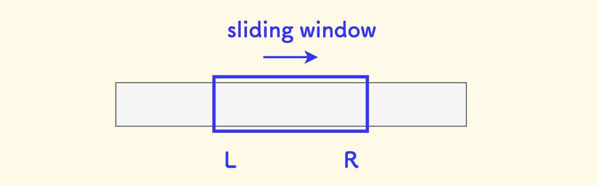

!!! abstract "主要内容"
    通过维护一个动态窗口（通常为数组/字符串的子区间）来高效解决连续区间问题。核心思想是**双指针遍历**，根据条件调整窗口左右边界，避免重复计算。适用于**子数组/子串的最值、定和、覆盖等问题**（如最长无重复子串、最小覆盖子串）。关键点包括窗口收缩/扩展的触发条件、哈希表辅助统计等，时间复杂度通常为O(n)。本质是**用空间换时间**，优化暴力解法。
示意图：
    

## Question 1 : 长度最小的子数组
!!! note "测试链接"
    <a href="https://leetcode.cn/problems/minimum-size-subarray-sum/">
    
    leetcode209.长度最小的子数组</a>

!!! info "问题描述"
    给定一个含有 n 个正整数的数组和一个正整数 target 。

    找出该数组中满足其总和大于等于 target 的长度最小的 子数组 [numsl, numsl+1, ..., numsr-1, numsr] ，并返回其长度。如果不存在符合条件的子数组，返回 0 。

??? success "参考实现"
    === "滑动窗口O(N)"
        ```cpp
        // 滑动窗口
        class Solution {
        public:
            int minSubArrayLen(int target, vector<int>& nums) {
                int i = 0, j = 0, sum = 0, ans = 0x0fffff;
                for (; i < nums.size(); i++) {
                    sum += nums[i];
                    while (sum >= target) {
                        ans = min(ans, i - j + 1);  // 记录当前窗口大小
                        sum -= nums[j++];           
                    }
                }
                return ans == 0x0fffff ? 0 : ans;
            }
        };
        ```

    === "前缀和与二分O(NlogN)"
        ```cpp
        class Solution {
        public:
            // 寻找子数组>=target的最短子数组长度
            int minSubArrayLen(int target, vector<int>& nums) {
                vector<int> prefix_sum(nums.size() + 1, 0);
                // O(NlogN)
                for (int i = 0; i < nums.size(); i++)
                    prefix_sum[i + 1] = prefix_sum[i] + nums[i];
                // 使用二分查找对于每个i查找一个最小的j O(N log N)
                int min_len = 0x0fffff;
                for (int i = 0; i <= nums.size(); i++) {
                    int find = prefix_sum[i] + target;
                    auto j = lower_bound(prefix_sum.begin(), prefix_sum.end(), find);
                    if (j != prefix_sum.end()) {
                        int len = j - prefix_sum.begin() - i;
                        min_len = min(len, min_len);
                    }
                }

            return min_len != 0x0fffff ? min_len : 0;
            }
        };
        ```

## Question 2 :
## Question 3 :
## Question 4 :
## Question 5 :
## Question 6 :
## Question 7 :
## 滑动窗口问题的总结