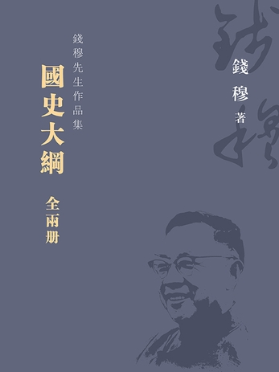

# 国史大纲

## 阅读记录

| 序号 | 章节名 | 阅读状态 | 开始日期 | 结束日期 | 评分 | 备注 |
| :--: | ---- |:------: | :------: | :------: | :--: | ---- |
| 1 | 中原华夏文化之发祥中国史之开始虞夏时代 |  |  |  |  |  |
| 2 | 黄河下游之新王朝殷商时代 |  |  |  |  |  |
| 3 | 封建帝国之创与西周灭亡 |  |  |  |  |  |
| 4 | 春秋战国之部 |  |  |  |  |  |
| 5 | 军国斗争之新局面战国始末 |  |  |  |  |  |
| 6 | 民间自由学术之兴起先秦诸子 |  |  |  |  |  |
| 7 | 大一统政府之创建秦代兴亡及汉室初起 |  |  |  |  |  |
| 8 | 统一政府文治之演进由汉武帝到王莽 |  |  |  |  |  |
| 9 | 统一政府之堕落东汉兴亡 |  |  |  |  |  |
| 10 | 士族之新地位东汉门第之兴起 |  |  |  |  |  |
| 11 | 统一政府之外对秦汉国力于对外形式 |  |  |  |  |  |
| 12 | 长期分裂之开始三国时代 |  |  |  |  |  |
| 13 | 统一政府之回光返照西晋兴亡 |  |  |  |  |  |
| 14 | 长江流域之新园地东晋南渡 |  |  |  |  |  |
| 15 | 北方之长期纷乱五胡十六国 |  |  |  |  |  |
| 16 | 南方王朝之消沉南朝宋齐梁陈 |  |  |  |  |  |
| 17 | 北方政权之新生命北朝 |  |  |  |  |  |
| 18 | 变相的封建势力魏晋南北朝之门第 |  |  |  |  |  |
| 19 | 变相的封建势力下之社会形态(上) 在西晋及南朝 |  |  |  |  |  |
| 20 | 变相的封建势力下之社会形态(下) 在五胡与北朝 |  |  |  |  |  |
| 21 | 宗教思想之弥散上古至南北朝之宗教思想|  |  |  |  |  |
| 22 | 统一盛运之再临隋室兴亡与唐初 |  |  |  |  |  |
| 23 | 新的统一盛运下政治机构 盛唐之政府组织 |  |  |  |  |  |
| 24 | 新的统一盛运下社会情态盛唐之进士府兵与农民 |  |  |  |  |  |
| 25 | 盛运中之衰象(上) 唐代租税制度与兵役制度之废弛 |  |  |  |  |  |
| 26 | 盛运中之衰象(下) 唐代政府官吏与士人之腐化 |  |  |  |  |  |
| 27 | 新的统一盛运下之对外姿态 唐初武功及中叶以后之外患 |  |  |  |  |  |
| 28 | 大时代之没落唐中叶以后政治社会之各方面 |  |  |  |  |  |
| 29 | 大时代之没落|  |  |  |  |  |
| 30 | 黑暗时代之大动摇 黄巢之乱以及五代十国 |  |  |  |  |  |
| 31 | 贫弱的新中央北宋初期|  |  |  |  |  |
| 32 | 士大夫的自觉与政治革新运动庆历熙宁变法 |  |  |  |  |  |
| 33 | 新旧党争与南北人才元祐以下 |  |  |  |  |  |
| 34 | 南北再分裂宋辽金之和展 |  |  |  |  |  |
| 35 | 暴风雨之来临 蒙古入主 |  |  |  |  |  |
| 36 | 传统政治复兴下之君王独裁(上) 明代兴亡 |  |  |  |  |  |
| 37 | 传统政治复兴下之君王独裁(下) |  |  |  |  |  |
| 38 | 南北经济文化之转移(上) 自唐之明之社会 |  |  |  |  |  |
| 39 | 南北经济文化之转移(中) |  |  |  |  |  |
| 40 | 南北经济文化之转移(下) |  |  |  |  |  |
| 41 | 社会自由讲学之再兴起 宋元明三代之学术 |  |  |  |  |  |
| 42 | 狭义的部族政治之再减(上) 清代入主 |  |  |  |  |  |
| 43 | 狭义的部族政治之再减(下) |  |  |  |  |  |
| 44 | 狭义的部族政治下之士气清代乾隆以前之学术 |  |  |  |  |  |
| 45 | 狭义的部族政治下之民变清中叶以下之变乱 |  |  |  |  |  |
| 46 | 除旧与开新 清代的覆亡与民国的创建 |  |  |  |  |  |

## 引论与读后感

### 引论