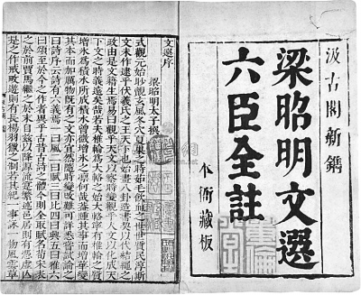

# 昭明文选

## 文选序

式观元始，<ruby>眇<rt>miǎo</rt></ruby><ruby>觌<rt>dí</rt></ruby>玄风，冬穴夏巢之时，茹毛饮血之世，世质民淳，斯文未作。逮乎伏羲氏之王天下也，始画八卦，造书契，以代结绳之政，由是文籍生焉。

《易》曰：“观乎天文，以察时变；观乎人文，以化成天下。”文之时义，远矣哉！若夫<ruby>椎<rt>zhuī</rt></ruby>轮为大<ruby>辂<rt>lù</rt></ruby>之始，大辂宁有椎轮之质？增冰为积水所成，积水曾微增冰之<ruby>凛<rt>lǐn</rt></ruby>，何哉？盖<ruby>踵<rt>zhǒng</rt></ruby>其事而增华，变其本而加厉。物既有之，文亦宜然。随时变改，难可详悉。

尝试论之曰：《诗序》云：“诗有六义焉：一曰风，二曰赋，三曰比，四曰兴，五曰雅，六曰颂。”至于今之作者，异乎古昔。古诗之体，今则全取赋名。荀、宋表之於前，贾、马继之于末。自兹以降，源流实繁。述邑居则有“凭虚”、“亡是”之作。戒<ruby>畋<rt>tián</rt></ruby>游则有《长杨》《羽猎》之制。若其纪一事，咏一物，风云草木之兴，鱼虫禽兽之流，推而广之，不可胜载矣。

又楚人屈原，含忠履洁，君匪从流，臣进逆耳，深思远虑，遂放湘南。<ruby>耿<rt>gěng</rt></ruby><ruby>介<rt>jiè</rt></ruby>之意既伤，<ruby>壹<rt>yī</rt></ruby>郁之怀靡诉。临渊有怀沙之志，吟泽有憔悴之容。<ruby>骚<rt>sāo</rt></ruby>人之文，自兹而作。

诗者，盖志之所之也。情动于中而形于言：《关<ruby>雎<rt>jū</rt></ruby>》《麟<ruby>趾<rt>zhǐ</rt></ruby>》，正始之道著；桑间濮上，亡国之音表。故风雅之道，<ruby>粲<rt>càn</rt></ruby>然可观。自炎汉中叶，厥途渐异：退傅有“在邹”之作，降将著“河梁”之篇。四言五言，区以别矣。又少则三字，多则九言，各体互兴，分<ruby>镳<rt>biāo</rt></ruby>并驱。

颂者，所以游扬德业，褒赞成功。吉甫有“穆若”之谈，季子有“至矣”之叹。舒布为诗，既言如彼；总成为颂，又亦若此。次则<ruby>箴<rt>zhēn</rt></ruby>兴于补阙，戒出于弼匡，论则析理精微，<ruby>铭<rt>míng</rt></ruby>则序事清润，美终则<ruby>诔<rt>lěi</rt></ruby>发，图像则<ruby>赞<rt>zàn</rt></ruby>兴。又诏诰教令之流，表奏笺记之列，书誓符檄之品，吊祭悲哀之作，答客指事之制，三言八字之文，篇辞引序，碑<ruby>碣<rt>jié</rt></ruby>志状，众制<ruby>锋<rt>fēng</rt></ruby>起，源流间出。<ruby>譬<rt>pì</rt></ruby>陶<ruby>匏<rt>páo</rt></ruby>异器，并为入耳之娱；<ruby>黼<rt>fǔ</rt></ruby><ruby>黻<rt>fú</rt></ruby>不同，俱为悦目之玩。作者之致，盖云备矣！

余监抚余闲，居多暇日。历观文囿，泛览辞林，未尝不心游目想，移<ruby>晷<rt>guǐ</rt></ruby>忘倦。自姬汉以来，<ruby>眇<rt>miǎo</rt></ruby>焉悠邈。时更七代，数逾千<ruby>祀<rt>sì</rt></ruby>。词人才子，则名溢于<ruby>缥<rt>piǎo</rt></ruby>囊；飞文染翰，则卷盈乎<ruby>缃<rt>xiāng</rt></ruby><ruby>帙<rt>zhì</rt></ruby>。自非略其芜秽，集其清英，盖欲兼功，太半难矣！

若夫姬公之籍，孔父之书，与日月俱悬，鬼神争奥，孝敬之准式，人伦之师友，岂可重以<ruby>芟<rt>shān</rt></ruby><ruby>夷<rt>yí</rt></ruby>，加之剪截？老、庄之作，管、孟之流，盖以立意为宗，不以能文为本，今之所撰，又以略诸。

若贤人之美辞，忠臣之抗直，谋夫之话，辨士之端，冰释泉涌，金相玉振。所谓坐<ruby>狙<rt>jū</rt></ruby>丘，议稷下，仲连之却秦军，食其之下齐国，留侯之发八难，曲逆之吐六奇，盖乃事美一时，语流千载，概见坟籍，旁出子史。若斯之流，又亦繁博。虽传之简<ruby>牍<rt>dú</rt></ruby>，而事异篇章，今之所集，亦所不取。至于记事之史，系年之书，所以褒贬是非，纪别异同，方之篇翰，亦已不同。若其赞论之综缉辞采，序述之错比文华，事出於深思，义归乎翰藻，故与夫篇什，杂而集之。

远自周室，迄于圣代，都为三十卷，名曰《文选》云耳。

凡次文之体，各以汇聚。诗赋体既不一，又以类分；类分之中，各以时代相次。

## 曹丕-典论论文
文人相轻，自古而然。傅毅之于班固，伯仲之间耳，而固小之，与弟超书曰：“武仲以能<ruby>属<rt>zhǔ</rt></ruby>文为兰台令史，下笔不能自休。”夫人善于自见，而文非一体，<ruby>鲜<rt>xiǎn</rt></ruby>能备善，是以各以所长，相轻所短。里语曰：“家有弊帚，享之千金。”斯不自见之患也。今之文人：鲁国孔融文举、广陵陈琳孔璋、山阳王<ruby>粲<rt>càn</rt></ruby>仲宣、北海徐干伟长、陈留阮<ruby>瑀<rt>yǔ</rt></ruby>元瑜、汝南应<ruby>玚<rt>chàng</rt></ruby>德琏、东平刘<ruby>桢<rt>zhēn</rt></ruby>公干，斯七子者，于学无所遗，于辞无所假，咸以自<ruby>骋<rt>chěng</rt></ruby>骥<ruby>騄<rt>lù</rt></ruby>于千里，仰齐足而并驰。以此相服，亦良难矣！盖君子审己以度人，故能免于斯累，而作论文。

王粲长于辞赋，徐干时有齐气，然粲之匹也。如粲之《初征》、《登楼》、《槐赋》、《征思》，干之《玄猿》、《漏<ruby>卮<rt>zhī</rt></ruby>》、《圆扇》、《橘赋》，虽张、蔡不过也，然于他文，未能<ruby>称<rt>chèn</rt></ruby>是。琳、瑀之章表书记，今之<ruby>隽<rt>jùn</rt></ruby>也。应玚和而不壮；刘桢壮而不密。孔融体气高妙，有过人者；然不能持论，理不胜辞；至于杂以嘲戏；及其所善，扬、班<ruby>俦<rt>chóu</rt></ruby>也。

常人贵远贱近，向声背实，又患<ruby>闇<rt>àn</rt></ruby>于自见，谓己为贤。夫文本同而末异，盖奏议宜雅，书论宜理，铭<ruby>诔<rt>lěi</rt></ruby>尚实，诗赋欲丽。此四科不同，故能之者偏也；唯通才能备其体。

文以气为主，气之清浊有体，不可力强而致。<ruby>譬<rt>pì</rt></ruby>诸音乐，曲度虽均，节奏同检，至于引气不齐，巧拙有素，虽在父兄，不能以移子弟。

盖文章，经国之大业，不朽之盛事。年寿有时而尽，荣乐止乎其身，二者必至之常期，未若文章之无穷。是以古之作者，寄身于翰墨，<ruby>见<rt>xiàn</rt></ruby>意于篇籍，不假良史之辞，不托飞驰之势，而声名自传于后。故西伯幽而演《易》，周旦显而制《礼》，不以隐约而弗务，不以康乐而加思。夫然则古人贱尺璧而重寸阴，惧乎时之过已。而人多不强力；贫贱则<ruby>慑<rt>shè</rt></ruby>于饥寒，富贵则流于逸乐，遂营目前之务，而遗千载之功。日月逝于上，体貌衰于下，忽然与万物迁化，斯志士之大痛也！

融等已逝，唯干著论，成一家言。
## 阅读记录

| 序号 | 章节名 | 阅读状态 | 开始日期 | 结束日期 | 评分 | 作者 |
| :--: | ---- |:------: | :------: | :------: | :--: | ---- |
| 0 | 昭明文选序 | 阅读中 | ~~2026-4-18~~ |  |  | 萧统 |
| 1 | [两都赋二首](./1-两都赋二首.md) | 汉赋太长了先跳过 |  |  |  | 班固(孟坚) |
| 2 | 西京赋一首 |  |  |  |  | 张衡(平子) |
| 3 | 东京赋一首 |  |  |  |  | 张衡(平子) |
| 4 | 南都赋一首 |  |  |  |  | 张衡(平子) |
| 5 | 三都赋序一首 |  |  |  |  | 左思(太冲) |
| 9 | 蜀都赋一首 |  |  |  |  | 左思(太冲) |
| 10 | 吴都赋一首 |  |  |  |  | 左思(太冲) |
| 11 | 魏都赋一首 |  |  |  |  | 左思(太冲) |
| 12 | 甘泉赋一首并序 |  |  |  |  | 扬雄(子云) |
| 13 | 藉田赋一首 |  |  |  |  | 潘岳(安仁) |
| 14 | 子虚赋一首 |  |  |  |  | 司马相如(长卿) |
| 15 | 上林赋一首 |  |  |  |  | 司马相如(长卿) |
| 16 | 羽猎赋一首并序 |  |  |  |  | 扬雄(子云) |
| 17 | 长杨赋一首并序 |  |  |  |  | 扬雄(子云) |
| 18 | 射雉赋一首 |  |  |  |  | 潘岳(安仁) |
| 19 | 北征赋一首 |  |  |  |  | 班彪(叔皮) |
| 20 | 东征赋一首 |  |  |  |  | 班昭(曹大家) |
| 21 | 西征赋一首 |  |  |  |  | 潘岳(安仁) |
| 22 | 登楼赋一首 |  |  |  |  | 王粲(仲宣) |
| 23 | 游天台山赋一首并序 |  |  |  |  | 孙绰(兴公) |
| 24 | 芜城赋一首 |  |  |  |  | 鲍照(明远) |
| 25 | 鲁灵光殿赋一首并序 |  |  |  |  | 王延寿(文考) |
| 26 | 景福殿赋一首 |  |  |  |  | 何晏(平叔) |
| 27 | 海赋一首 |  |  |  |  | 木华(玄虚) |
| 28 | 江赋一首 |  |  |  |  | 郭璞(景纯) |
| 29 | 风赋一首 |  |  |  |  | 宋玉 |
| 30 | 秋兴赋一首并序 |  |  |  |  | 潘岳(安仁) |
| 31 | 雪赋一首 |  |  |  |  | 谢惠连 |
| 32 | 月赋一首 |  |  |  |  | 谢庄(希逸) |
| 33 | 鵩鸟赋一首并序 |  |  |  |  | 贾谊 |
| 34 | 鹦鹉赋一首并序 |  |  |  |  | 祢衡(正平) |
| 35 | 鹪鹩赋一首并序 |  |  |  |  | 张华(茂先) |
| 36 | 赭白马赋一首并序 |  |  |  |  | 颜延之(延年) |
| 37 | 舞鹤赋一首 |  |  |  |  | 鲍照(明远) |
| 38 | 幽通赋一首 |  |  |  |  | 班固(孟坚) |
| 39 | 思玄赋一首 |  |  |  |  | 张衡(平子) |
| 40 | [归田赋一首](./40-归田赋.md) | 背诵中 | 2026-4-22 |  |  | 张衡(平子) |
| 41 | 闲居赋一首并序 |  |  |  |  | 潘岳(安仁) |
| 42 | 长门赋一首并序 |  |  |  |  | 司马相如(长卿) |
| 43 | 思旧赋一首并序 |  |  |  |  | 向秀(子期) |
| 44 | 叹逝赋一首并序 |  |  |  |  | 陆机(士衡) |
| 45 | 怀旧赋一首并序 |  |  |  |  | 潘岳(安仁) |
| 46 | 寡妇赋一首并序 |  |  |  |  | 潘岳(安仁) |
| 47 | 恨赋一首 |  |  |  |  | 江淹(文通) |
| 48 | [别赋一首](./48-别赋.md) |  |  |  |  | 江淹(文通) |
| 49 | 文赋一首并序 |  |  |  |  | 陆机(士衡) |
| 50 | 洞箫赋一首 |  |  |  |  | 王褒(子渊) |
| 51 | 舞赋一首并序 |  |  |  |  | 傅毅(武仲) |
| 52 | 长笛赋一首并序 |  |  |  |  | 马融(季长) |
| 53 | 琴赋一首并序 |  |  |  |  | 嵇康(叔夜) |
| 54 | 笙赋一首 |  |  |  |  | 潘岳(安仁) |
| 55 | 啸赋一首 |  |  |  |  | 成公绥(子安) |
| 56 | 高唐赋一首并序 |  |  |  |  | 宋玉 |
| 57 | 神女赋一首并序 |  |  |  |  | 宋玉 |
| 58 | 登徒子好色赋一首并序 |  |  |  |  | 宋玉 |
| 59 | 洛神赋一首并序 |  |  |  |  | 曹植(子建) |

## 读后感